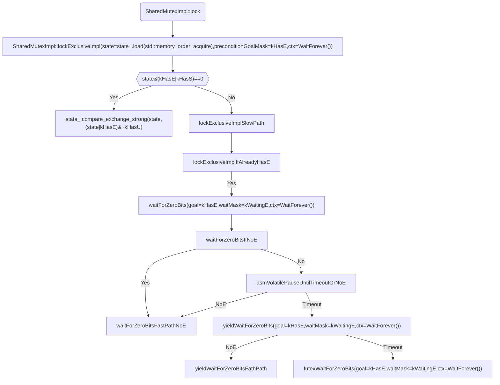

```text
+-----------------------+
|   S Count (11..31)    |
+-----------------------+
|                       |
+-----------------------+
|                       |
+-----------------------+
|                       |
+-----------------------+
|       kHasE (7)       |
+-----------------------+
|                       |
+-----------------------+
|                       |
+-----------------------+-----------+
|   kWaitingNotS (4)    |           |
+-----------------------+           |
| kWaitingEMultiple (3) | kWaitingE |
+-----------------------+           |
|  kWaitingESingle (2)  |           |
+-----------------------+-----------+
|                       |
+-----------------------+
|     kWaitingS (0)     |
+-----------------------+
```

https://man7.org/linux/man-pages/man2/futex.2.html

+ `FUTEX_WAIT`: This operation tests that the value at the futex word pointed to by the address uaddr still contains the expected value `val`, and if so, then sleeps waiting for a `FUTEX_WAKE` operation on the futex word. The load of the value of the futex word is an atomic memory access (i.e., using atomic machine instructions of the respective architecture). **This load, the comparison with the expected value, and starting to sleep are performed atomically and totally ordered with respect to other futex operations on the same futex word.** If the thread starts to sleep, it is considered a waiter on this futex word. If the futex value does not match `val`, then the call fails immediately with the error `EAGAIN`.
+ `FUTEX_WAKE`: This operation wakes at most `val` of the waiters that are waiting (e.g., inside `FUTEX_WAIT`) on the futex word at the address uaddr. Most commonly, `val` is specified as either 1 (wake up a single waiter) or `INT_MAX` (wake up all waiters). No guarantee is provided about which waiters are awoken (e.g., a waiter with a higher scheduling priority is not guaranteed to be awoken in preference to a waiter with a lower priority).
+ `FUTEX_WAIT_BITSET`: This operation is like `FUTEX_WAIT` except that `val3` is used to provide a 32-bit bit mask to the kernel. This bit mask, in which at least one bit must be set, is stored in the kernel-internal state of the waiter. See the description of `FUTEX_WAKE_BITSET` for further details.
+ `FUTEX_WAKE_BITSET`: This operation is the same as `FUTEX_WAKE` except that the `val3` argument is used to provide a 32-bit bit mask to the kernel. This bit mask, in which at least one bit must be set, is used to **select which waiters should be woken up**. The selection is done by a bitwise AND of the "wake" bit mask (i.e., the value in `val3`) and the bit mask which is stored in the kernel-internal state of the waiter (the "wait" bit mask that is set using `FUTEX_WAIT_BITSET`).  All of the waiters for which the result of the AND is nonzero are woken up; the remaining waiters are left sleeping.

unlock 时如何保证唤醒特定的线程？分类讨论：r..rw..wr..r../w..wr..rw..w..
分析代码：unlock -> wakeRegisteredWaiters(state, kWaitingE | kWaitingU | kWaitingS);
```cpp
    if ((wakeMask & kWaitingE) == kWaitingE &&
        (state & wakeMask) == kWaitingE &&
        detail::futexWake(&state_, 1, kWaitingE) > 0) {
      // somebody woke up, so leave state_ as is and clear it later
      return;
    }
```
看上去只是让 kernel 选一个 w 唤醒
怎么保证公平性呢？好像是并不公平的，写一个程序试试？
```bash
root@iZ6weflgcxqft2zyh0ij7tZ:~# cat test.cc 
#include <folly/SharedMutex.h>
#include <thread>
#include <iostream>
#include <chrono>

int main() {
  folly::SharedMutex shared_mutex;
  shared_mutex.lock();
  std::thread t1([&]() { shared_mutex.lock_shared(); std::cout << "r" << std::endl; shared_mutex.unlock_shared(); });
  // t1.start();
  std::this_thread::sleep_for(std::chrono::seconds(1));
  std::thread t2([&]() { shared_mutex.lock(); std::cout << "w" << std::endl; shared_mutex.unlock(); });
  // t2.start();
  std::this_thread::sleep_for(std::chrono::seconds(1));
  shared_mutex.unlock();
  t2.join();
  t1.join();
}
root@iZ6weflgcxqft2zyh0ij7tZ:~# g++ -std=c++17 test.cc -I/tmp/fbcode_builder_getdeps-ZrootZfollyZbuildZfbcode_builder-root/installed/folly/include /tmp/fbcode_builder_getdeps-ZrootZfollyZbuildZfbcode_builder-root/installed/folly/lib/libfolly.a /usr/lib/x86_64-linux-gnu/libglog.a /usr/lib/x86_64-linux-gnu/libgflags.a /tmp/fbcode_builder_getdeps-ZrootZfollyZbuildZfbcode_builder-root/installed/fmt-TrRlXoKNSLkeqv9x1dv4BKtTcQYtrehB7wcdtCA2FfE//lib/libfmtd.a -lunwind -o test
root@iZ6weflgcxqft2zyh0ij7tZ:~# ./test 
r
w
```
实际测试下来是公平的，很奇怪，还得再看看
waitForZeroBits(state, kHasS, kWaitingNotS, ctx)
会在这里再等一次？等到没有读锁在等？
python3 ./build/fbcode_builder/getdeps.py --allow-system-packages build --build-type Debug
debug 模式就是不公平的 hh
```bash
./test
w
r

for i in {1..10}; do ./test; done
r
w
r
w
r
w
w
r
w
r
w
r
w
r
w
r
w
r
r
w
```

What is deferred reader?
// SharedMutex's strategy of using a shared set of core-local stripes has
// a potential downside, because it means that acquisition of any lock in
// write mode can conflict with acquisition of any lock in shared mode.
// If a lock instance doesn't actually experience concurrency then this
// downside will outweight the upside of improved scalability for readers.
// To avoid this problem we dynamically detect concurrent accesses to
// SharedMutex, and don't start using the deferred mode unless we actually
// observe concurrency.  See kNumSharedToStartDeferring.
设计 rwlock 的两种模式，以及优缺点和适用场景

kDeferredSeparationFactor 是用来干什么的？
https://docs.oracle.com/cd/E77782_01/html/E77799/gpayf.html
https://peng.fyi/post/false-data-independency-cacheline-and-write-buffer/
https://www.linkedin.com/pulse/understanding-mitigating-cache-contention-false-sharing-ijaz-ahmad-uwbzf

We double it, making it
  // essentially the number of cores, so it doesn't easily run
  // out of deferred reader slots and start inlining the readers.
logical core, hyperthreading? 一个物理核等于两个逻辑核，所以才需要 double ？
https://unix.stackexchange.com/questions/88283/so-what-are-logical-cpu-cores-as-opposed-to-physical-cpu-cores

AccessSpreader
https://stackoverflow.com/questions/47006451/how-does-facebook-follyaccessspreader-work
AccessSpreader 保证了 locality 和 no contention
thread local 只能保证 no contention ，不能保证 locality
当一个新的线程被调度时，几乎可以判断会有一次 cache miss
但是如果两个线程都在做拿读锁、做一件事、放读锁；当它们交替地被调度到同一个核心上时，它们能非常好地利用 locality ，不会导致 cache miss
我想这就是 shared_mutex 不用 tls 来实现的原因
s.table[std::min(size_t(kMaxCpus), numStripes)][cpu]; 这里没写错，是 size_t ，不是 sizeof
AccessSpreader 是二维数组的原因是，如何给每个 cpu 分配一个槽位取决于两个因素：有多少个槽位，有多少个 cpu（供需关系）
假设槽位比 cpu 还多，那么分配原则就很简单；otherwise ，就要考虑到 cpu 之间的距离

auto slotPtr = deferredReader(bestSlot ^ i);
这段代码可能是有点问题的，应该是 bestSlot * i ？
AccessSpreader 在选择槽位的时候，要考虑两个因素：槽位的数量 & cpu 的数量，这两件事都决定了槽位分配策略，所以 s.table 才是一个二维数组
slot = bestSlot ^ i; -> slot = bestSlot * i;?
kDeferredSearchDistance = 2 所以 i 只有可能是 0 或者 1 ，所以两者区别不大
或者说，正因为 i 只有可能是 0 或者 1 ，这里用 ^ 才显得正确？
bestSlot * (i + 1) 看上去正常一点，bestSlot ^ i 相当于每个人都会去尝试一下 1 ，有点奇怪
c++ ^ 是 Bitwise XOR
https://en.wikipedia.org/wiki/Operators_in_C_and_C%2B%2B
0 ^ 0 = 0, 0 ^ 1 = 1
1 ^ 0 = 1, 1 ^ 1 = 0
https://zh.wikipedia.org/zh-cn/%E4%BA%8C%E8%A3%9C%E6%95%B8#:~:text=%E8%A1%A5%E7%A0%81%EF%BC%88%E8%8B%B1%E8%AF%AD%EF%BC%9A2's%20complement,%E5%9C%A8%E8%AE%A1%E7%AE%97%E6%9C%BA%E7%A7%91%E5%AD%A6%E4%B8%AD%E4%BD%BF%E7%94%A8%E3%80%82
2's complement
x ^ 1 类似于等到了补码
// does x xor 0x1 get the 2's complement of x?
No, x ^ 0x1 does not get the 2's complement of x. Instead, it toggles the least significant bit of x. To compute the 2's complement of x, you need to invert all the bits of x and then add 1.
这个计算很奇怪，既不是 bestSlot + 1 ，又不是 bestSlot - 1 ，是有的时候 +1 ，有的时候又 -1
  // If AccessSpreader assigns indexes from 0..k*n-1 on a system where some
  // level of the memory hierarchy is symmetrically divided into k pieces
  // (NUMA nodes, last-level caches, L1 caches, ...), then slot indexes
  // that are the same after integer division by k share that resource.
上面这段话的意思是说，如果我们有 k 个资源（供给），n 个 cpu （需求），假设分配给某个 cpu 分配的资源 id 是 0..((k*n)-1)
那么这个 cpu 会去使用 id % k 对应的资源
那么所有 id % k 相同的 cpu 实际上都在使用同一份资源，我想，这是在解释 bestSlot （也就是 current ）的算法
We can use AccessSpreader::current(n)
  // without managing our own spreader if kMaxDeferredReaders <=
  // AccessSpreader::kMaxCpus, which is currently 128.
这里是说，AccessSpreader 提供了已有的算法，最多可以支持 128 个需求者，如果我们的需求者数量（ kMaxDeferredReaders ）小于 128
我们干脆就复用 AccessSpreader 好了
  // In order to give each L1 cache its own playground, we need
  // kMaxDeferredReaders >= #L1 caches. 
如果 deferred readers 数量比 L1 cache 多，那么是多个 deferred readers 对应一个 L1 cache
如果 deferred readers 数量比 L1 cache 少，那么是多个 L1 cache 都有可能缓存相同的 deferreed readers ，导致 contention
  // On x86_64 each DeferredReaderSlot is 8 bytes, so we need
  // kMaxDeferredReaders
  // * kDeferredSeparationFactor >= 64 * #L1 caches / 8 == 128.  If
  // kDeferredSearchDistance * kDeferredSeparationFactor <=
  // 64 / 8 then we will search only within a single cache line, which
  // guarantees we won't have inter-L1 contention.
避免 L1 cache 竞争的最简单思路是 padding 64 - 8 bytes ，但这样有点浪费
有没有可能 L1 cache 上存 64 / 8 = 8 个 deferred readers ，但这 8 个 deferred readers 我们只让同一个 cpu 用，这样就不会有 cacheline 冲突了，同时也最大化利用空间
但是 folly 在这里没有使用这种效率最大化的方案，而是选择了每条 cacheline 使用其中的 2 个 deferred readers ，剩余的 6 个 readers 当作 paddings
为什么？
kDeferredSearchDistance * kDeferredSeparationFactor <= 64 / 8 说的就是尽量只使用同一条 cacheline 上的 deferred readers
kMaxDeferredReaders * （kDeferredSeparationFactor * 8） >= 64 * #L1 caches == 128.
说的是另一个约束，即如果加上 padding （ （kDeferredSeparationFactor -1）*8 就是 padding），deferred readers 占用的空间要超过 L1 cacheline 的总量；
不然，无论如何分配，也都是多个 cacheline 对应同一个 deferred readers ，导致竞争？（notice L1 cachline 的数量只有 cpu 数量的一半）
因为 L1 cacheline 只有 cpu 数量的一半，所以这里并不是给每个 cpu 一个 deferred reader ，而是给每个 cacheline 一个 deferred reader
当 kMaxDeferredReaders 一定的时候，kDeferredSeparationFactor 基本也定了，那么 kDeferredSearchDistance 也决定了
下一个问题就是，kMaxDeferredReaders 完全可以更大，大到是原来的 8 倍？
btw. bestSlot ^ i 就是在找同一条 cacheline 上的 n 个 deferred readers
folly 可能还是在假设，一个 cpu 一个 deferred reader 就足够了，这个假设在协程上是站不住脚的？

1. folly 需要表达 request/requirement 的语法
2. 编译 warning
```text
In file included from /root/folly/folly/FBString.h:43,
                 from /root/folly/folly/ExceptionString.h:21,
                 from /root/folly/folly/ExceptionString.cpp:17:
/root/folly/folly/lang/Exception.h: In instantiation of ‘T* folly::exception_ptr_get_object(const std::__exception_ptr::exception_ptr&) [with T = std::exception]’:
/root/folly/folly/ExceptionString.cpp:45:57:   required from here
/root/folly/folly/lang/Exception.h:457:24: warning: the address of ‘_ZTISt9exception’ will never be NULL [-Waddress]
  457 |   auto const object = !target ? nullptr : exception_ptr_get_object(ptr, target);
      |                        ^~~~~~
In file included from /usr/include/c++/12/exception:38,
                 from /root/folly/folly/ExceptionString.h:19:
/usr/include/c++/12/bits/exception.h:61:9: note: ‘_ZTISt9exception’ declared here
   61 |   class exception
      |         ^~~~~~~~~
[9/937] Building CXX object CMakeFiles/folly_base.dir/folly/ExceptionWrapper.cpp.o
In file included from /root/folly/folly/FBString.h:43,
                 from /root/folly/folly/Demangle.h:19,
                 from /root/folly/folly/ExceptionWrapper.h:31,
                 from /root/folly/folly/ExceptionWrapper.cpp:17:
/root/folly/folly/lang/Exception.h: In instantiation of ‘T* folly::exception_ptr_get_object(const std::__exception_ptr::exception_ptr&) [with T = std::exception]’:
/root/folly/folly/ExceptionWrapper-inl.h:153:50:   required from here
/root/folly/folly/lang/Exception.h:457:24: warning: the address of ‘_ZTISt9exception’ will never be NULL [-Waddress]
  457 |   auto const object = !target ? nullptr : exception_ptr_get_object(ptr, target);
      |                        ^~~~~~
In file included from /usr/include/c++/12/exception:38,
                 from /root/folly/folly/ExceptionWrapper.h:21:
/usr/include/c++/12/bits/exception.h:61:9: note: ‘_ZTISt9exception’ declared here
   61 |   class exception
      |         ^~~~~~~~~
[16/937] Building CXX object CMakeFiles/folly_base.dir/folly/File.cpp.o
In file included from /root/folly/folly/FBString.h:43,
                 from /root/folly/folly/Demangle.h:19,
                 from /root/folly/folly/ExceptionWrapper.h:31,
                 from /root/folly/folly/File.h:30,
                 from /root/folly/folly/File.cpp:17:
/root/folly/folly/lang/Exception.h: In instantiation of ‘T* folly::exception_ptr_get_object(const std::__exception_ptr::exception_ptr&) [with T = std::exception]’:
/root/folly/folly/ExceptionWrapper-inl.h:153:50:   required from here
/root/folly/folly/lang/Exception.h:457:24: warning: the address of ‘_ZTISt9exception’ will never be NULL [-Waddress]
  457 |   auto const object = !target ? nullptr : exception_ptr_get_object(ptr, target);
      |                        ^~~~~~
In file included from /usr/include/c++/12/new:41,
                 from /usr/include/c++/12/bits/new_allocator.h:34,
                 from /usr/include/x86_64-linux-gnu/c++/12/bits/c++allocator.h:33,
                 from /usr/include/c++/12/bits/allocator.h:46,
                 from /usr/include/c++/12/string:41,
                 from /root/folly/folly/File.h:27:
/usr/include/c++/12/bits/exception.h:61:9: note: ‘_ZTISt9exception’ declared here
   61 |   class exception
      |         ^~~~~~~~~
[24/937] Building CXX object CMakeFiles/folly_base.dir/folly/Try.cpp.o
In file included from /root/folly/folly/FBString.h:43,
                 from /root/folly/folly/Demangle.h:19,
                 from /root/folly/folly/ExceptionWrapper.h:31,
                 from /root/folly/folly/Try.h:24,
                 from /root/folly/folly/Try.cpp:17:
/root/folly/folly/lang/Exception.h: In instantiation of ‘T* folly::exception_ptr_get_object(const std::__exception_ptr::exception_ptr&) [with T = std::exception]’:
/root/folly/folly/ExceptionWrapper-inl.h:153:50:   required from here
/root/folly/folly/lang/Exception.h:457:24: warning: the address of ‘_ZTISt9exception’ will never be NULL [-Waddress]
  457 |   auto const object = !target ? nullptr : exception_ptr_get_object(ptr, target);
      |                        ^~~~~~
In file included from /usr/include/c++/12/exception:38,
                 from /root/folly/folly/Try.h:19:
/usr/include/c++/12/bits/exception.h:61:9: note: ‘_ZTISt9exception’ declared here
   61 |   class exception
      |         ^~~~~~~~~
[43/937] Building CXX object CMakeFiles/folly_base.dir/folly/Subprocess.cpp.o
In file included from /root/folly/folly/FBString.h:43,
                 from /root/folly/folly/Demangle.h:19,
                 from /root/folly/folly/Conv.h:128,
                 from /root/folly/folly/Exception.h:25,
                 from /root/folly/folly/Subprocess.h:112,
                 from /root/folly/folly/Subprocess.cpp:21:
/root/folly/folly/lang/Exception.h: In instantiation of ‘T* folly::exception_ptr_get_object(const std::__exception_ptr::exception_ptr&) [with T = std::exception]’:
/root/folly/folly/ExceptionWrapper-inl.h:153:50:   required from here
/root/folly/folly/lang/Exception.h:457:24: warning: the address of ‘_ZTISt9exception’ will never be NULL [-Waddress]
  457 |   auto const object = !target ? nullptr : exception_ptr_get_object(ptr, target);
      |                        ^~~~~~
In file included from /usr/include/c++/12/exception:38,
                 from /root/folly/folly/Subprocess.h:105:
/usr/include/c++/12/bits/exception.h:61:9: note: ‘_ZTISt9exception’ declared here
   61 |   class exception
      |         ^~~~~~~~~
[69/937] Building CXX object CMakeFiles/folly_base.dir/folly/debugging/exception_tracer/SmartExceptionTracer.cpp.o
In file included from /root/folly/folly/FBString.h:43,
                 from /root/folly/folly/Demangle.h:19,
                 from /root/folly/folly/ExceptionWrapper.h:31,
                 from /root/folly/folly/debugging/exception_tracer/SmartExceptionTracer.h:19,
                 from /root/folly/folly/debugging/exception_tracer/SmartExceptionTracer.cpp:17:
/root/folly/folly/lang/Exception.h: In instantiation of ‘T* folly::exception_ptr_get_object(const std::__exception_ptr::exception_ptr&) [with T = std::exception]’:
/root/folly/folly/ExceptionWrapper-inl.h:153:50:   required from here
/root/folly/folly/lang/Exception.h:457:24: warning: the address of ‘_ZTISt9exception’ will never be NULL [-Waddress]
  457 |   auto const object = !target ? nullptr : exception_ptr_get_object(ptr, target);
      |                        ^~~~~~
In file included from /usr/include/c++/12/exception:38,
                 from /root/folly/folly/ExceptionWrapper.h:21:
/usr/include/c++/12/bits/exception.h:61:9: note: ‘_ZTISt9exception’ declared here
   61 |   class exception
```


