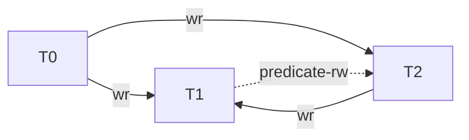
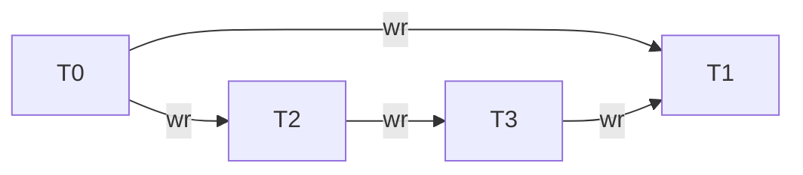
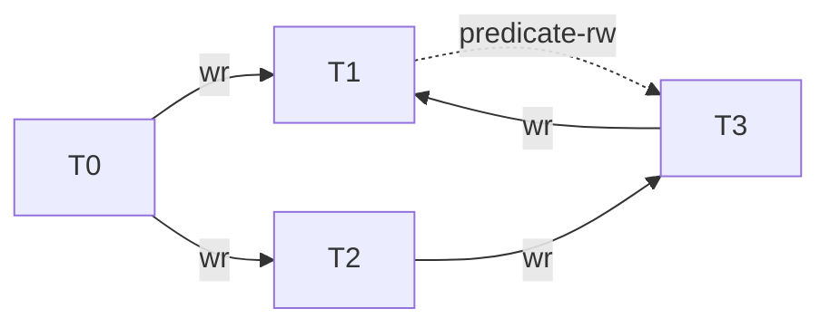
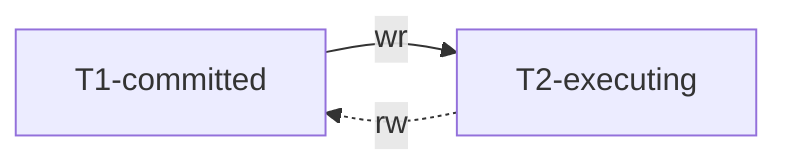
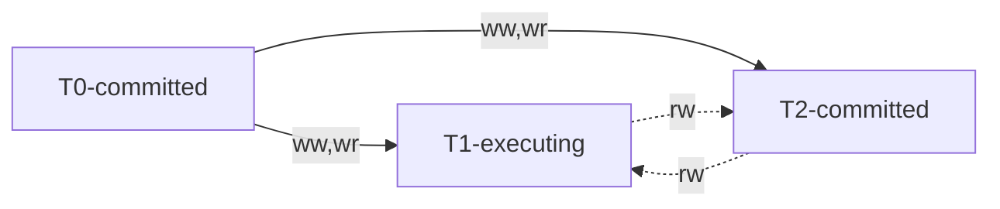
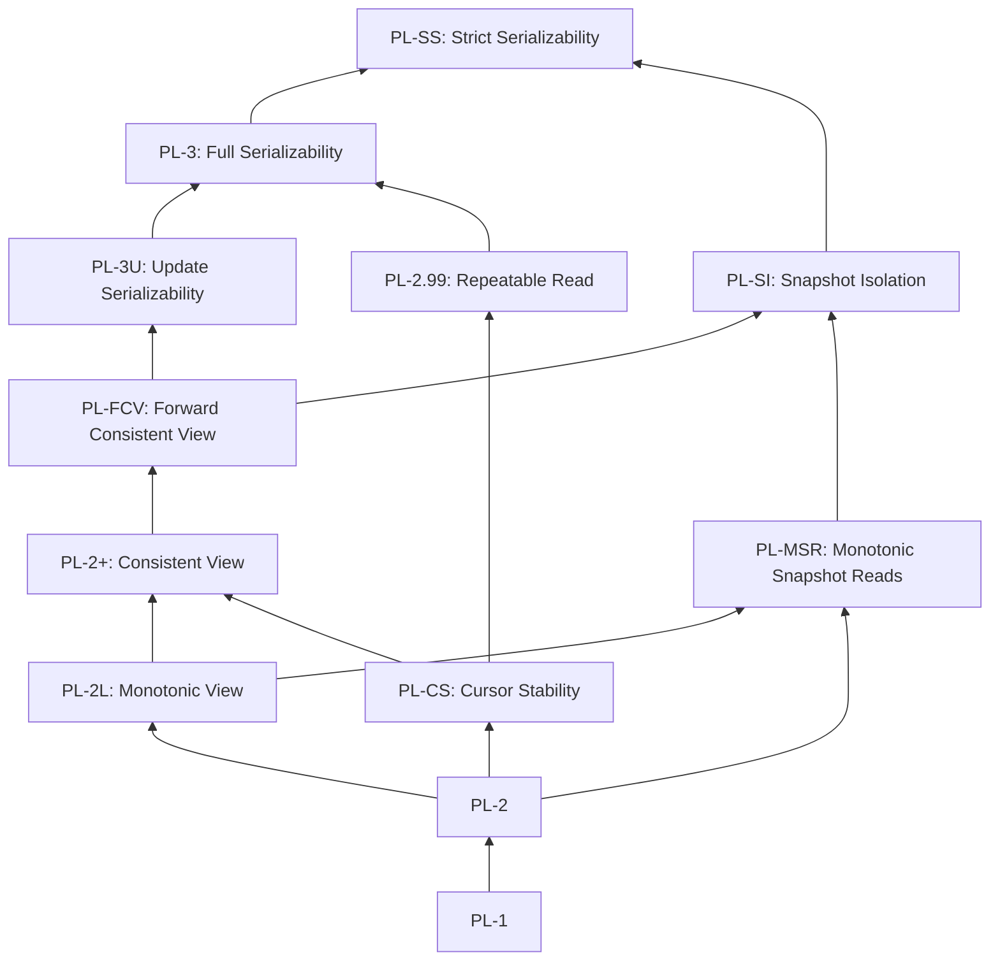

# Proposed Specifications for Existing Isolation Levels

## System Model and Terminology

### Database Model

+ When a transaction writes an object $x$, it creates a new version of $x$. A transaction $T_i$ can modify an object multiple times; its first update of object $x$ is denoted by $x_{i.1}$ , the second by $x_{i.2}$, and so on. Version $x_i$ denotes the final modification of $x$ performed by $T_i$ before it commits or aborts. That is, $x_i \equiv x_{i.n} \, \textrm{where} \, n = \max \{j \mid x_{i.j} \, \textrm{exists} \}$.
+ There are three kinds of objects versions:
  + During initialization, a transaction $T_i$ creates all objects that will ever exist in the database; at this point, each object $x$ has an initial version, $x_{init}$, called the unborn version.
  + When an application transaction inserts an object $x$, we model it as the creation of a visible version for $x$.
  + When a transaction $T_i$ deletes an object $x$, we model it as the creation of a special dead version, $x_{dead}$.
  + Create, update, and delete operations can be modeled as update operations with the above conventions.
+ All objects in the database have a unique identity that is not based on field values.
  + Suppose transaction $T_i$ deletes $x$ and a later transaction $T_j$ checks if this tuple exists and inserts a new tuple. Transaction $T_j$'s insert operation overwrites the unborn version of an object $y$ that has not been used before and creates a visible version of $y$.
  + If two transactions try to insert a tuple with the same field values, the system selects two distinct objects for insertion. The decision whether both tuples can be inserted is left to the application and the database system, i.e., our model does not require that the database contains unique tuples.

### Transaction Histories

A history $H$ cover a set of transactions consists of two parts:

+ a partial order of events $E$ that reflects the operations (e.g., read, write, abort, commit) of those transactions,
  + The notion $w_i(x_{i.m}, v)$ denotes transaction $T_i$ performs a write operation on object $x$ as its $m^{th}$ modification (within the transaction $T_i$) with value $v$.
  + The notion $r_j(x_{i.m}, v)$ denotes transaction $T_j$ performs a read operation on a version of object $x$ that was written by transaction $T_i$ at its $m^{th}$ modification with value $v$ ($T_i$ could be the same as $T_j$).
  + The partial order of events E in a history obeys the following constraints:
    + It preserves the order of all events within a transaction including the commit and abort events.
    + If an event $r_j(x{i.m})$ exists in E, it should be preceded by $w_i(x_{i.m})$ in $E$, i.e., a transaction $T_j$ cannot read version $x_i$ of object $x$ before it has been produced by $T_i$.
    + If an event $w_i(x_{i.m})$ is followed by $r_i(x_j)$ without an intervening event $w_i(x_{i.n})$ in $E$, $x_j$ must be $x{i.m}$. This condition ensures that if a transaction modifies object $x$ and later reads $x$, it will observe its last update to $x$.
  + We would add extra conditions as they are needed at each isolation level.
+ and a version order, $\ll$, that is a total order on committed object versions.
  + There is no constraint on versions due to uncommitted or aborted transactions.
  + The version order of committed object versions obeys the following constraints:
    + The version order of each object $x$ contains exactly one initial version, $x_{init}$, and at most one dead version, $x_{dead}$.
    + $x_{init}$ is $x$'s first version in its version order and $x_{dead}$ is its last version (if it exists); all visible
      versions are placed between $x_{init}$ and $x_{dead}$.
    + If $r_j(x_i)$ occurs in a history, then $x_i$ is a visible version. This condition ensures that transactions can only read visible versions.

The version order in a history $H$ can be different from the order of write or commit events in $H$.

+ e.g., $H_{write-order}: w_1(x_1) w_2(x_2) c_1 c_2 \quad [x_2 \ll x_1]$.
  + The database system chooses the version order $x_2 \ll x_1$ even though $T_1$ writes $x_1$ before $T_2$ writes $x_2$.
  + The fact that $T_1$ commits before $T_2$ does not determine the version order either.
+ This flexibility is needed to allow certain optimistic and multi-version implementations.

### Predicates

#### Version Set

When a transaction executes a read or write based on a predicate $P$, the system selects a version for **each** object in $P$’s relations (where a relation corresponds to a MySQL table). The set of selected versions is called the Version set of this predicate-based operation and is denoted by $\operatorname{Vset}(P)$.

Versions of objects in $P$'s relations are selected before determining whether they match $P$ or not. Therefore, $\operatorname{Vset}(P)$ includes versions of all objects in $P$'s relations, regardless of whether they are matched by $P$ or not. $\operatorname{Vset}(P)$ will be very large since it includes unborn and possibly dead versions of some objects.

#### Predicate-based Reads

We denote a predicate-based read as $r_i(P:\operatorname{Vset}(P))$.

After the predicate-base read, $T_i$ can execute operations on the matched objects, e.g., it could read $x_1$'s value. These reads will show up as **separate** events in the history. If $T_i$ does not read $x_1$, we do not add a read event to the history. Thus, the history only shows reads of versions that were actually observed by transaction $T_i$.

#### Predicate-based Modifications

We denote a medicate-based modification as $w_i(P:\operatorname{Vset}(P))$.

Note that a predicate-based modification can also be modeled as a predicate-based read followed
by a set of writes on the matched objects:

+ e.g., $r_i(P:\operatorname{Vset}(P)) w_i(x_i)$. The paper "Generalized Isolation Level Definitions" employs this approach to define isolation levels.
+ Under the same constraints on histories, this technique provides weaker guarantees (than the approach given above) to predicate-based modifications at lower isolation levels.
+ However, it is possible to introduce additional constraints on histories to provide same guarantees.

### Conflicts and Serialization Graphs

We define three kinds of direct conflicts that capture conflicts of two different **committed** transactions on the same object or intersecting predicates:

+ Directly Read-Depends, $T_i \stackrel{wr}{\longrightarrow} T_j$.
  + Directly item-read-depends: We say that $T_j$ directly item-read-depends on $T_i$ if $T_i$ installs some
    object version $x_i$ and $T_j$ reads $x_i$.
  + Directly predicate-read-depends: Transaction $T_j$ directly predicate-read-depends on $T_i$ if $T_j$ performs an operation $r_j(P:\operatorname{Vset}(P))$ and $x_i \in \operatorname{Vset}(P)$.
    + Transaction $T_j$ directly predicate-read-depends on the initialization transaction $T_{init}$ since $T_j$ observes the unborn versions of objects that have yet not been inserted in $P$'s relations.
    + If $T_j$ observes a dead version of some object, it directly read-depends on the transaction that deleted that object.
+ Directly Anti-Depends, $T_i \stackrel{rw}{\longrightarrow} T_j$.
  + Directly item-anti-depends: We say that $T_j$ directly item-anti-depends on transaction $T_i$ if $T_i$ reads some object version $x_k$ and $T_j$ installs $x$'s **next** version (after $x_k$) in the **version order**.
  + Directly predicate-anti-depends: We say that $T_j$ directly predicate-anti-depends on $T_i$ if $T_j$ overwrites an operation $r_i(P:\operatorname{Vset}(P))$. That is, if $T_j$ installs a **later (but not necessarily the next)** version of some object that **changes the matches** of a predicate-based read performed by $T_i$.
    + Overwriting a predicate-based operation: We say that a transaction $T_j$ overwrites an operation $r_i(P:\operatorname{Vset}(P))$ (or $w_i(P:\operatorname{Vset}(P))$) based on predicate $P$ if $T_j$ installs $x_j$ such that $x_k \ll x_j$, $x_k \in \operatorname{Vset}(P)$ and $x_k$ matches $P$ whereas $x_j$ does not match $P$ or vice-versa. That is, $T_j$ makes a modification that changes the set of objects matched by $T_i$'s predicate-based operation.
+ Directly Write-Depends, $T_i \stackrel{ww}{\longrightarrow} T_j$.
  + Directly item-write-depends: We say that $T_j$ directly item-write-depends on transaction $T_i$ if $T_i$ installs a version $x_i$ and $T_j$ installs $x$'s **next** version (after $x_i$) in the version order.
  + Directly predicate-write-depends: We say that $T_j$ directly predicate-write-depends on $T_i$ if either
    1. $T_j$ executes an operation $w_j(Q:\operatorname{Vset}(Q))$ and $x_i \in \operatorname{Vset}(Q)$. In other words, the system selects a version $x_i$ in $T_j$'s predicate-based write.
    2. $T_j$ overwrites an operation $w_i(P:\operatorname{Vset}(P))$. This means that $T_j$ installs a later version of an object that changes the matches of a predicate-based write performed by $T_i$.

The definition of predicate-write-dependencies is similar to the definitions of predicate-read-dependencies (the first part) and predicate-anti-dependencies (the second part).

We can define the direct serialization graph (DSG) of a given history $H$ as follows:

+ Each node in $\operatorname{DSG}(H)$ corresponds to a committed transaction in $H$.
+ Directed edges correspond to different types of direct conflicts.

#### Refine: Direct Predicate-Anti-Dependency

If $T_j$ installs a **later** version of an object that changes the matches of a predicate-based read performed by $T_i$, but it is not the **next** version of that object in the version order, this still results in direct predicate-anti-dependency between $T_i$ and $T_j$. Here's an example from the thesis.

When $T_1$ performs its query there are exactly two employees, $x$ and $y$, both in Sales. $T_1$ sums up the salaries of these employees and compares it with the sum-of-salaries maintained for this department. However, before it performs the final check, $T_2$ inserts a new employee in the Sales department, updates the sum-of-salaries, and commits. Thus, when $T_1$ reads the new sum-of-salaries value, it finds an inconsistency.

$H_{phantom}$ is ruled out by PL-3 because the direct serialization graph contains a cycle with a predicate-anti-dependency edge.

\begin{align*}
H_{phantom}: r_1(Dept=Sales:x_0,10;y0,10) &\\
             r_2(Sum_0,20)                &\\
             w_2(z_2=10)                  &\\
             w_2(Sum_2,30)                &\\
             c_2                          &\\
             r_1(Sum_2,30)                &\\
             c_1                          &\\
[Sum_0 \ll Sum_2, z_{init} \ll z_2]
\end{align*}

Let's consider a modification to $H_{phantom}$:

+ Change $Sum$ to $SumMoreThan15$.
+ Add transaction $T_3$, which increases employee $z$'s salary from 10 to 20 and updates the sum-of-salaries after $T_2$ is committed.

\begin{align*}
H_{phantom}: r_1(Dept=Sales:x_0,10;y0,10;z_{init}) &\\
             r_2(SumMoreThan15_0,0)                &\\
             w_2(z_2=10)                           &\\
             w_2(SumMoreThan15_2,0)                &\\
             c_2                                   &\\
             r_3(SumMoreThan15_2,0)                &\\
             r_3(z_2=10)                           &\\
             w_3(z_3=20)                           &\\
             w_3(SumMoreThan15_3,20)               &\\
             c_3                                   &\\
             r_1(SumMoreThan15_3,20)               &\\
             c_1                                   &\\
[SumMoreThan15_0 \ll SumMoreThan15_2 \ll SumMoreThan15_3, z_{init} \ll z_2 \ll z_3]
\end{align*}

If the answer is no, since $z_3$ is not the next version of $z_{init}$, there is no predicate-anti-dependency relationship between $T_1$ and $T_3$, and there is no cycle in the direct serialization graph. However, this scenario is nonsensical because $T_1$ would get an inconsistent result.

To ensure the correctness of the theory, a predicate-anti-dependency between $T_1$ and $T_3$ should exist, even if $z_3$ is not considered the next version of $z_{init}$.

## Isolation Levels for Committed Transactions

| Phenomena                    | Histories Described in tr-95-51                                  | Histories Described in adya-phd | Isolation Levels in tr-95-51 |
| -                            | -                                                                | -                               | -                            |
| Dirty Write                  | P0: `w1[x]...w2[x]...((c1 or a1) and (c2 or a2) in any order)`   |                                 |                              |
|                              |                                                                  | G0                              | PL-1                         |
| Dirty Read                   | P1: `w1[x]...r2[x]...((c1 or a1) and (c2 or a2) in any order)`   |                                 |                              |
|                              | A1: `w1[x]...r2[x]...(a1 and c2 in any order)`                   |                                 |                              |
|                              |                                                                  | G1a + G1b + G1c                 | PL-2                         |
|                              |                                                                  | G1a + G1b + G1c + G1-predA      | PL-2'                        |
|                              |                                                                  | G1a + G1b + G1c + G1-predB      | PL-2''                       |
| Non-repeatable or Fuzzy Read | P2: `r1[x]...w2[x]...((c1 or a1) and (c2 or a2) in any order)`   |                                 |                              |
|                              | A2: `r1[x]...w2[x]...c2...r1[x]...c1`                            |                                 |                              |
| Phantom                      | P3: `r1[P]...w2[y in P]...((c1 or a1) and (c2 or a2) any order)` |                                 |                              |
|                              | A3: `r1[P]...w2[y in P]...c2...r1[P]...c1`                       |                                 |                              |
| Lost Update                  | P4: `r1[x]...w2[x]...w1[x]...c1`                                 |                                 |                              |
|                              |                                                                  | G2                              | PL-3                         |

### Isolation Level PL-1

**G0: Write Cycles.** A history $H$ exhibits phenomenon G0 if $\operatorname{DSG}(H)$ contains a directed cycle consisting entirely of write-dependency edges.

PL-1, which disallows G0, is considered to be more permissive than Read Uncommitted, which disallows P0, since G0 allows concurrent transactions to modify the same object while P0 does not. Thus, non-serializable interleaving of write operations is possible among uncommitted transactions as long as such interleavings are disallowed among committed transactions (e.g., by aborting some transactions).

According to tr-95-51, Dirty Writes (P0) are considered problematic for two main reasons:

+ They can violate database consistency. Assume there is a constraint between `x` and `y` (e.g., `x` = `y`), and `T1` and `T2` each maintain the consistency of the constraint if run alone. However, the constraint can easily be violated if the two transactions write `x` and `y` in **different orders**, which can only happen if there are Dirty writes.
+ Without protection from P0, the system can't undo updates by restoring before images. Consider the history: `w1[x] w2[x] a1`. You don’t want to undo `w1[x]` by restoring its before-image of `x`, because that would wipe out `w2`'s update. But if you don't restore its before-image, and transaction `T2` later aborts, you can't undo `w2[x]` by restoring its before-image either!

However, these two reasons have been criticized in adya-phd:

+ ... as such interleavings are disallowed among committed transactions (e.g., by aborting some transactions).
+ We believe that $H_{recovery}$ is a valid history and our consistency condition for no-dirty-writes (G0) allows it. Implementations can handle the aborts of `T1` and `T2` in a variety of ways. For example, when `T1` aborts, the system can let `x2` be the version that is stored in the database. If `T2` also aborts, the system reverts the value of `x` to `x0`. Furthermore, some client-server systems such as Thor do not install modifications into the committed state until the commit point of transactions. In such systems, we do not even have to revert the value of `x` when either transaction aborts.

### Isolation Level PL-2

+ PL-2: Disallow G1a, G1b and G1c.
+ PL-2': Disallow G1a, G1b, G1c and G1-predA.
+ PL-2'': Disallow G1a, G1b, G1c and G1-predB.

#### G1a: Aborted Reads

A history $H$ exhibits phenomenon G1a if it contains an aborted transaction $T_i$ and a committed transaction $T_j$ such that $T_j$ has read some object (maybe via a predicate) modified by $T_i$. Phenomenon G1a can be represented using the following history fragments:

+ $w_i(x_{i.m}) \ldots r_j(x_{i.m}) \ldots (a_i \text{ and } c_j \text{ in any order })$
+ $w_i(x_{i.m}) \ldots r_j(P:x_{i.m}, \dots) \ldots (a_i \text{ and } c_j \text{ in any order })$

Proscribing G1a ensures that if $T_j$ reads from $T_i$ and $T_i$ aborts, $T_j$ must also abort; these aborts are also called cascaded aborts. In a real implementation, the condition also implies that if $T_j$ reads from an uncommitted transaction $T_i$, $T_j$'s commit must be delayed until $T_i$'s commit has succeeded.

#### G1b: Intermediate Reads

A history $H$ exhibits phenomenon G1b if it contains a committed transaction $T_j$ that has read a version of object $x$ (maybe via a predicate) written by transaction $T_i$ that was not $T_i$'s final modification of $x$. The following history fragments represent this phenomenon:

+ $w_i(x_{i.m}) \ldots r_j(x_{i.m}) \ldots w_i(x_{i.n}) c_j$
+ $w_i(x_{i.m}) \ldots r_j(P:x_{i.m}, \ldots) \ldots w_i(x_{i.n}) c_j$

Like our other conditions, G1b does not constrain the behavior of uncommitted transactions.

#### G1c: Circular Information Flow

A history $H$ exhibits phenomenon G1c if $\operatorname{DSG}(H)$ contains a directed cycle consisting entirely of dependency edges, where a dependency edge is defined as either a read-dependency edge or a write-dependency edge.

#### G1

Our condition that captures the essence of no-dirty-reads is G1, which is comprised of G1a, G1b, and G1c. We define isolation level PL-2 as one in which phenomenon G1 is disallowed. (Note that G1c includes G0. We could have defined a weaker version of G1c that only concerned cycles having at least one read-dependency edge, but it seems simpler not to do this.)

Proscribing G1 is clearly weaker than proscribing P1 since G1 allows transactions to read from uncommitted transactions.

#### G1-predA: Non-atomic Predicate-based Reads

A history $H$ exhibits phenomenon G1-predA if $H$ contains distinct committed transactions $T_j$ and $T_i$, and operations $w_j(Q:\operatorname{Vset}(Q)), w_j(x_j) \ldots w_j(y_j)$ and $r_i(P:\operatorname{Vset}(P))$ such that $w_j(x_j)$ and $w_j(y_j)$ are events generated due to $w_j(Q:\operatorname{Vset}(Q))$, $x_j \in \operatorname{Vset}(P)$, and $w_j(y_j)$ **overwrites** (refer to the following explanation for more details) $r_i(P:\operatorname{Vset}(P))$.

PL-2' can be defined as a level that disallows G1a, G1b, G1c, and G1-predA.

+ In the context of overwriting a predicate-based operation:

  > We say that a transaction $T_j$ overwrites an operation $r_i(P:\operatorname{Vset}(P))$ (or $w_i(P:\operatorname{Vset}(P))$) based on predicate $P$ if $T_j$ installs $x_j$ such that $x_k \ll x_j$, $x_k \in \operatorname{Vset}(P)$ and $x_k$ matches $P$ whereas $x_j$ does not match $P$ or vice-versa. That is, $T_j$ makes a modification that changes the set of objects matched by $T_i$'s predicate-based operation.

+ Based on my understanding, in the context of G1-predA, it is possible that $w_j(x_j)$ overwrites $r_i(P:\operatorname{Vset}(P))$ if $x_k \ll x_j$, $x_k \in \operatorname{Vset}(P)$, regardless of whether $x_j$ is a modification that changes the set of objects matched by $P$. However, it is important to note that this is only my interpretation and I am not entirely certain if it aligns with the author's intention. If my understanding is indeed correct, the author's assertion makes sense:

  > Disallowing G1-predA guarantees that if $T_i$'s predicate-based read observes an update by $T_j$'s predicate-based write, it does not see any version older than the ones installed by $T_j$'s write. Thus, disallowing G1-predA ensures that all read/write operations are indivisible with respect to each other.

+ When the meaning of "overwrite" varies, it becomes difficult to definitively determine the relationship between PL-2' and PL-3. Is PL-3 remains more restrictive than PL-2' under these conditions?

#### G1-predB: Non-atomic Predicate-based Reads with respect to Transactions

A history $H$ exhibits phenomenon G1-predB if $H$ contains distinct committed transactions $T_i$ and $T_j$ such that $T_i$ **overwrites** (refer to the following explanation for more details) an operation $r_j(P:\operatorname{Vset}(P))$ and there exists a version $x_i$ in $\operatorname{Vset}(P)$.

\begin{align*}
H_{atomic-read}: w_1(\text{Dept=Sales}:x_0;y_0;z_0)               &\\
                 w_1(x_1)                                         &\\
                 w_1(y_1)                                         &\\
                 w_1(z_1)                                         &\\
                 r_2(\text{Dept=Sales or Dept=Legal}:x_1;y_1;z_0) &\\
                 r_2(x_1)                                         &\\
                 r_2(y_1)                                         &\\
                 c1                                               &\\
                 c2                                               &\\
[x0 \ll x1, y0 \ll y1, z0 \ll z1]
\end{align*}

In this case, $z_0$ represents an employee record in the legal department, and $w_1(z_1)$ is a regular write, not one generated by $w_1(\text{Dept=Sales}:x_0;y_0;z_0)$. Disallowing G1-predB will prohibit $H_{atomic-read}$, but it would be allowed if only G1-predA is disallowed. This is because G1-predA requires $w_1(z_1)$ to be generated by $w_1(\text{Dept=Sales}:x_0;y_0;z_0)$, while G1-predB has no such requirement.

In my opinion, the overwriting concept in G1-predB appears similar to that in G1-predA. This is reflected in the fact that:

+ Disallowing G1-predB will prohibit $H_{atomic-read}$, implies
+ $T_1$ overwrites $r_2(\text{Dept=Sales or Dept=Legal}:x_1;y_1;z_0)$, implies
+ $w_1(z_1)$ overwrites $r_2(\text{Dept=Sales or Dept=Legal}:x_1;y_1;z_0)$, implies
+ Overwriting in G1-predB does not require $w_1(z_1)$ is a modification that changes the set of objects matched by $\text{Dept=Sales or Dept=Legal}$.

### Isolation Level PL-3

**G2: Anti-dependency Cycles.** A history $H$ exhibits phenomenon G2 if $\operatorname{DSG}(H)$ contains a directed cycle having one or more **anti-dependency** edges.

We define PL-3 as an isolation level that proscribes G1 and G2. Thus, all cycles are precluded at this level.

### PL-3 provides conflict-serializability

The author claims that PL-3 provides conflict-serializability, but there is no detailed verification provided:

> The conditions given in [BHG87] provides view-serializability whereas our specification for PL-3 provides conflict-serializability (this can shown using theorems presented in [GR93, BHG87]).
>
> $\operatorname{DSG}(H)$ is acyclic, and G1a, and G1b are satisfied for a history $H$ iff $H$ is conflict-serializable.

The Wormhole Theorem, as described in section 7.5.8.1 of "Transaction Processing: Concepts and Techniques" by J. N. Gray and A. Reuter (Morgan Kaufmann Publishers Inc., 1993), states:

> A history achieves isolation if and only if it contains no wormhole transactions.
>
> + Proof: (Isolated => no wormholes). This proof is by contradiction.
>   1. Suppose $H$ is an isolated history of the execution of the set of transactions $\left\{T_i \mid i=1, \ldots, n\right\}$. By definition, then, $H$ is equivalent to some serial execution history, $SH$, for that same set of transactions.
>   2. Without loss of generality, assume that the transactions are numbered so that $SH = T_1 \| T_2 \| \ldots \| T_n$.
>   3. Suppose, for the sake of contradiction, that $H$ has a wormhole; that is, there is some sequence of transactions $T, T^\prime, T^{\prime\prime}, \ldots, T^{\prime\prime\prime}$ such that each is BEFORE the other (i.e., $T \ll_H T^\prime$), and the last is BEFORE the first (i.e., $T^{\prime\prime\prime} \ll_H T$).
>   4. Let $i$ be the minimum transaction index such that $T_i$ is in this wormhole, and let $T_j$ be its predecessor in the wormhole (i.e., $T_j \ll_H T_i$).
>   5. By the minimality of $i$, $T_j$ comes completely AFTER $T_i$ in the execution history $SH$ (recall assumption of step 2), so that $T_j \ll_{SH} T_i$ is impossible (recall that $SH$ is a serial history). But since $H$ and $SH$ are equivalent, $\ll_{H} = \ll_{SH}$; therefore, $T_j \ll_H T_i$ is also impossible. This contradiction proves that if $H$ isisolated, it has no wormholes.
> + Proof: (No wormholes => isolated). This proof is by induction on the number of transactions, $n$, that appear in the history, $H$. The induction hypothesis is that any $n$ transaction history $H$ having no wormholes is isolated (equivalent to some serial history, $SH$, for that set of transactions).
>   + If $n < 2$, then any history is a serial history, since only zero or one transaction appears in the history. In addition, any serial history is an isolated history. The basis of the induction, then, is trivially true.
>   + Suppose the induction hypothesis is true for $n-1$ transactions, and consider some history $H$ of $n$ transactions that has no wormholes.
>     1. Pick any transaction $T$, then pick any other transaction $T^\prime$, such that $T \ll T^\prime$, and continue this construction as long as possible, building the sequence $S = (T, T^\prime, \ldots)$. Either $S$ is infinite, or it is not. If $S$ is infinite, then some transaction $T^{\prime\prime}$ must appear in it twice. This, in turn, implies that $T^{\prime\prime} \ll T^{\prime\prime}$; thus, $T^{\prime\prime}$ is a wormhole of $H$. But since $H$ has no wormholes, $S$ cannot be infinite. The last transaction in $S$ - call it $T^*$ - has the property $\operatorname{AFTER}(T^*) = \varnothing$, since the sequence cannot be continued past $T^*$.
>     2. Consider the history, $H^\prime = \left\langle\left\langle t_i, a_i, o_i\right\rangle \in H \mid t_i \neq T^*\right\rangle$. $H^\prime$ is the history $H$ with all the actions of transaction $T^*$ removed. By the choice of $T^*$, $\operatorname{DEP}(H^\prime) = \left\{\langle T, \langle o, i\rangle, T^\prime\rangle \in \operatorname{DEP}(H) \mid T^\prime \neq T^*\right\}$.
>        1. $H^\prime$ has no wormholes (since $H$ has no wormholes, and $\operatorname{DEP}(H) \supseteq \operatorname{DEP}(H^\prime)$). The induction hypothesis, then, applies to $H^\prime$. Hence, $H^\prime$ is isolated and has an equivalent serial history ${SH}^\prime = T_1 \| T_2 \| \ldots \| T_{n-1}$ for some numbering of the other transactions.
>        2. The serial history $SH = {SH}^\prime \| T^* = T_1 \| T_2 \| \ldots \| T_{n-1} \| T^*$ is equivalent to $H$. To prove this, it must be shown that $\operatorname{DEP}(SH) = \operatorname{DEP}(H)$. By construction, $\eqref{the-wormhole-theorem:no-wormholes-infer-isolated:by-construction}$. By definition, $\operatorname{DEP}({SH}^\prime) = \operatorname{DEP}(H^\prime)$. Using Equation $\eqref{the-wormhole-theorem:no-wormholes-infer-isolated:h-prime-depend}$ to substitute into Equation $\eqref{the-wormhole-theorem:no-wormholes-infer-isolated:by-construction}$ gives: $\eqref{the-wormhole-theorem:no-wormholes-infer-isolated:final}$. Thus, the identity $DEP(SH)= DEP(H)$ is established, and the induction step is proven.
>   + The notion $\langle t_i, a_i, o_i\rangle$ represents that transaction $t_i$ performs action $a_i$ (e.g., read) on object $o_i$. The notion $\left\langle T, \langle o, i\rangle, T^\prime\right\rangle$ represents that $T^\prime$ depends on $T$, where $o$ is the object creating the dependency, and $i$ indicates the version of $o$ being read or written by $T^\prime$.
>
> \begin{align}
>   \operatorname{DEP}(SH)
> = \operatorname{DEP}({SH}^\prime \| T^*)
> =   \operatorname{DEP}({SH}^\prime)
>   \cup
>     \left\{
>       \left\langle T^\prime, \langle o, i\rangle, T^*\right\rangle
>       \in \operatorname{DEP}(H)
>     \right\}
> \label{the-wormhole-theorem:no-wormholes-infer-isolated:by-construction}
> \end{align}
>
> \begin{align}
>     \operatorname{DEP}({SH}^\prime)
>   = \operatorname{DEP}(H^\prime)
>   = \left\{
>         \left\langle T, \langle o, i\rangle, T^\prime\right\rangle
>         \in \operatorname{DEP}(H)
>       \mid
>         T^\prime \neq T^*
>     \right\}
> \label{the-wormhole-theorem:no-wormholes-infer-isolated:h-prime-depend}
> \end{align}
>
> \begin{align}
>   \operatorname{DEP}(SH)
> =   \left\{
>         \left\langle T, \langle o, i\rangle, T^\prime\right\rangle
>         \in \operatorname{DEP}(H)
>       \mid
>        T^\prime \neq T^*
>     \right\}
>   \cup
>     \left\{
>       \left\langle T^\prime, \langle o, i\rangle, T^*\right\rangle
>       \in \operatorname{DEP}(H)
>     \right\}
> = \operatorname{DEP}(H)
> \label{the-wormhole-theorem:no-wormholes-infer-isolated:final}
> \end{align}

The Serializability Theorem, as described in Section 2.3 of "Concurrency Control and Recovery in Database Systems" by Philip A. Bernstein, Vassos Hadzilacos, and Nathan Goodman, states:

> A history $H$ is serializable iff $\operatorname{SG}(H)$ is acyclic.
>
> + Proof: (Acyclic => serializable).
>   1. Suppose $H$ is a history over $T = \left\{T_1, T_2, \ldots, T_n\right\}$. Without loss of generality, assume $\operatorname{C}(T) = \left\{T_1, T_2, \ldots, T_m \mid m \le n\right\}$ are all of the transactions in $T$ that are committed in $H$. Thus $T_1, T_2, \ldots, T_m$ are the nodes of $\operatorname{SG}(H)$.
>   2. Since $\operatorname{SG}(H)$ is acyclic it may be topologically sorted (See Section A.3 of the Appendix for a definition of "topological sort of a directed acyclic graph"). Let $i_1, i_2, \ldots, i_m$ be a permutation of $1, 2, \ldots, m$ such that $T_{i_1}, T_{i_2}, \ldots, T_{i_m}$ is a topological sort of $\operatorname{SG}(H)$. Let $H_s$ be the serial history $T_{i_1}, T_{i_2}, \ldots, T_{i_m}$.
>   3. We claim that $\operatorname{C}(H) \equiv H_s$. To see this, let $p_i \in T_i$ and $q_j \in T_j$, where $T_i$, $T_j$ are committed in $H$. Suppose $p_i$, $q_j$ conflict and $p_i \lt_H q_j$. By definition of $\operatorname{SG}(H)$, $T_i \rightarrow T_j$ is an edge in $\operatorname{SG}(H)$. Therefore in any topological sort of $\operatorname{SG}(H)$, $T_i$ must appear before $T_j$. Thus in $H_s$ all operations of $T_i$ appear before any operation of $T_j$, and in particular, $p_i \lt_H q_j$. We have proved that any two conflicting operations are ordered in $\operatorname{C}(H)$ in the same way as $H_s$. Thus $\operatorname{C}(H) \equiv H_s$ and, because $H_s$ is serial by construction, $H$ is serializable as was to be proved.
> + Proof: (Serializable => acyclic).
>   1. Suppose history $H$ is serializable. Let $H_s$ be a serial history equivalent to $\operatorname{C}(H)$. Consider an edge $T_i \rightarrow T_j$ in $\operatorname{SG}(H)$. Thus there are two conflicting operations $p_i$, $q_j$ of $T_i$, $T_j$ (respectively), such that $p_i \lt_H q_j$. Because $\operatorname{C}(H) \equiv H$, $p_i \lt_{H_s} q_j$. Because $H_s$ is serial and $p_i$ in $T_i$ precedes $q_j$ in $T_j$, it follows that $T_i$ appears before $T_j$ in $H_s$. Thus, we've shown that if $T_i \rightarrow T_j$ is in $\operatorname{SG}(H)$ then $T_i$ appears before $T_j$ in $H_s$.
>   2. Now suppose there is a cycle in $\operatorname{SG}(H)$, and without loss of generality let that cycle be $T_1 \rightarrow T_2 \rightarrow \ldots \rightarrow T_k \rightarrow T_1$. These edges imply that in $H_s$, $T_1$ appears before $T_2$ which appears before $T_3$ appears before $\ldots$ before $T_k$ which appears before $T_1$. Thus, the existence of the cycle implies that each of $T_1, T_2, \ldots, T_k$ appears before itself in the serial history $H_s$, an absurdity. So no cycle can exist in $\operatorname{SG}(H)$. That is, $\operatorname{SG}(H)$ is an acyclic directed graph, as was to be proved.

### Isolation Level PL-2.99

**G2-item: Item Anti-dependency Cycles.** A history $H$ exhibits phenomenon G2-item if $\operatorname{DSG}(H)$ contains a directed cycle having one or more **item**-anti-dependency edges.

Level PL-2.99 is defined as one that proscribes G1 and G2-item.

$H_{phantom}$ is ruled out by PL-3 but permitted by PL-2.99 because the DSG contains a cycle only if predicate anti-dependency edges are considered.

\begin{align*}
H_{phantom}: r_1(\text{Dept=Sales}:x0,10;y0,10) &\\
             r_2(Sum0,20)                       &\\
             w_2(z_2=10 \text{ in Dept=Sales})  &\\
             w_2(Sum_2,30)                      &\\
             c_2                                &\\
             r_1(Sum_2,30)                      &\\
             c_1                                &\\
[Sum_0 \ll Sum_2, z_{init} \ll z_2]
\end{align*}

## Mixing of Isolation Levels

## Correctness and Flexibility of the New Specifications

## Consistency Guarantees for Executing Transactions

All definitions presented in this chapter till now provide guarantees to committed transactions only. In this section, we discuss how the isolation levels presented in this chapter can be extended to provide guarantees to executing transactions. To ensure that there is no confusion regarding isolation levels for committed and executing transactions, we prefix all levels for executing transactions by "E".

### Motivation

+ Suppose that a programmer writes code under the assumption that certain integrity constraints will hold. If these constraints are violated, the transaction will be aborted when it tries to commit. However, before the transaction reaches its commit point, the program may behave in an unexpected manner, e.g., it may crash, go into an infinite loop, or output unexpected results on a user’s display.
+ Debugging also becomes more difficult for an application programmer; if the transaction observes a broken invariant, it may be difficult for the programmer to determine whether the invariant was violated due to a code bug or due to weak consistency guarantees provided to executing transactions by the system.

If a transaction $T_i$ requires execution-time isolation guarantee $L$, the system must ensure that $T_i$ does not detect that it is running below level $L$ at any given instant. Transaction $T_i$ can detect that it is running below level $L$ if it **reads** objects in a manner that is not allowed by that level. Since a transaction can determine whether it is executing below a certain degree only by observing the state of the database, our conditions will provide guarantees **only for reads of uncommitted transactions and not for their writes**.

For the purpose of providing consistency guarantees to an executing transaction $T_i$, we consider $T_i$'s predicate-based writes as predicate-based reads. This approach is taken so that appropriate guarantees can be provided for version sets of predicate-based writes performed by $T_i$ (ghost writes performed by $T_i$ are essentially reads).

### Isolation Levels EPL-1 and EPL-2

Isolation level PL-1 provides guarantees with respect to writes. Since our execution time guarantees are provided only for reads, level EPL-1 does not place any constraints on executing transactions.

Isolation level PL-2 guarantees that a transaction is allowed to commit if it observes values that existed in the committed state and there is unidirectional flow of information. To ensure that a transaction $T_j$ (while executing) reads from a transaction $T_i$ that does not later abort or modify the objects read by $T_j$ , we disallow reads from uncommitted transactions; furthermore, **no dirty reads also ensure unidirectional information flow**. We define EPL-2 as a level that disallows phenomenon P1.

### Isolation Level EPL-3

To specify EPL-3 for a history $H$ and an executing transaction $T_i$, we use a new graph called the **Direct Transaction Graph** that is denoted by $\operatorname{DTG}(H,T_i)$; recall that a DSG was defined for a history only. The DTG is exactly the same as DSG with one addition: it also contains a node for executing transaction $T_i$ and we add all edges corresponding to the **reads** of $T_i$ . Recall that we treat all predicate-based writes of $T_i$ as predicate-based reads so that consistency guarantees can be provided for version sets of predicate-based writes. Thus, we get some extra read-dependency and anti-dependency edges due to such "reads", e.g., if executing transaction $T_i$ performs $w_i(P:\operatorname{Vset}(P))$ and $\operatorname{Vset}(P)$ contains $x_j$, we add a read-dependency edge from $T_j$ to $T_i$ in the DTG.

\begin{align*}
H_{incons-view}: w_0(x_0) &\\
                 w_0(y_0) &\\
                 c_0      &\\
                 w_1(x_1) &\\
                 w_1(y_1) &\\
                 c_1      &\\
                 r_2(x_0) &\\
                 r_2(y_1) &\\
[x_0 \ll x1; y_0 \ll y_1]
\end{align*}

**E2: Anti-dependency Cycles at Runtime.** A history $H$ and an executing transaction $T_i$ exhibit phenomenon E2 if $\operatorname{DTG}(H,T_i)$ contains a directed cycle involving $T_i$ that consists of dependency edges and one or more anti-dependency edges.

EPL-3 is defined as an isolation level that disallows phenomena P1 and E2. It is more restrictive than PL-3:

+ P1 is more stringent than G1a: Aborted Reads, G1b: Intermediate Reads, G1c: Circular Information Flow.
  + No dirty reads also ensure unidirectional information flow.
+ E2: Anti-dependency Cycles at Runtime is more stringent than G2: Anti-dependency Cycles because E2 takes executing transactions into account.

Note that we are ignoring anti-dependency edges due to writes by uncommitted transactions. This is in accordance with our goal of providing execution time guarantees for reads only. However, it also turns out that such writes must be ignored so that optimistic schemes can be allowed. To provide EPL-3, one might be tempted to say that all cycles are disallowed in the direct transaction graph. However, this condition is overly restrictive as shown by the following history:

\begin{align*}
H_{antidep-cycle}: r_1(x_0) &\\
                   w_2(x_2) &\\
                   r_2(y_0) &\\
                   c_2      &\\
                   w_1(y_1) &\\
[x_0 \ll x_2, y_0 \ll y_1]
\end{align*}

In this example, $T_1$ and $T_2$ overwrite an object that the other transaction has read.

Transaction $T_1$ is doomed to abort since a cycle with two anti-dependency edges has been formed.

+ However, since it does not observe a non-serializable database state, there is no harm in executing it.
+ Furthermore, this situation can occur with an optimistic scheme in a client-server distributed system where $T_1$ may read $x_0$ and write $y_1$ in its client's cache before information about $T_2$'s commit arrives at $T_1$'s client.

# Specifications for Intermediate Isolation Levels

There is a wide gap between PL-2, which provides neither consistent reads nor consistent writes, and PL-3, which provides both (this is analogous to the gap between degrees 2 and 3).

# Reference

+ [Weak Consistency: A Generalized Theory and Optimistic Implementations for Distributed Transactions, by Atul Adya](https://pmg.csail.mit.edu/papers/adya-phd.pdf)
+ [J. N. Gray and A. Reuter. Transaction Processing: Concepts and Techniques. Morgan Kaufmann Publishers Inc., 1993.](https://www.oreilly.com/library/view/transaction-processing/9780080519555/)

+ [Fabrizio Musacchio: How to use LaTeX in Markdown](https://www.fabriziomusacchio.com/blog/2021-08-10-How_to_use_LaTeX_in_Markdown/#mjx-eqn-eqtest1)
