## Proposed Specifications for Existing Isolation Levels

### System Model and Terminology

#### Database Model

+ When a transaction writes an object $x$, it creates a new version of $x$. A transaction $T_i$ can modify an object multiple times; its first update of object $x$ is denoted by $x_{i.1}$ , the second by $x_{i.2}$, and so on. Version $x_i$ denotes the final modification of $x$ performed by $T_i$ before it commits or aborts. That is, $x_i \equiv x_{i.n} \, \textrm{where} \, n = \max \{j \mid x_{i.j} \, \textrm{exists} \}$.
+ There are three kinds of objects versions:
  + During initialization, a transaction $T_i$ creates all objects that will ever exist in the database; at this point, each object $x$ has an initial version, $x_{init}$, called the unborn version.
  + When an application transaction inserts an object $x$, we model it as the creation of a visible version for $x$.
  + When a transaction $T_i$ deletes an object $x$, we model it as the creation of a special dead version, $x_{dead}$.
  + Create, update, and delete operations can be modeled as update operations with the above conventions.
+ All objects in the database have a unique identity that is not based on field values.
  + Suppose transaction $T_i$ deletes $x$ and a later transaction $T_j$ checks if this tuple exists and inserts a new tuple. Transaction $T_j$'s insert operation overwrites the unborn version of an object $y$ that has not been used before and creates a visible version of $y$.
  + If two transactions try to insert a tuple with the same field values, the system selects two distinct objects for insertion. The decision whether both tuples can be inserted is left to the application and the database system, i.e., our model does not require that the database contains unique tuples.

#### Transaction Histories

A history $H$ cover a set of transactions consists of two parts:

+ a partial order of events $E$ that reflects the operations (e.g., read, write, abort, commit) of those transactions,
  + The notion $w_i(x_{i.m}, v)$ denotes transaction $T_i$ performs a write operation on object $x$ as its $m^{th}$ modification (within the transaction $T_i$) with value $v$.
  + The notion $r_j(x_{i.m}, v)$ denotes transaction $T_j$ performs a read operation on a version of object $x$ that was written by transaction $T_i$ at its $m^{th}$ modification with value $v$ ($T_i$ could be the same as $T_j$).
  + The partial order of events E in a history obeys the following constraints:
    + It preserves the order of all events within a transaction including the commit and abort events.
    + If an event $r_j(x_{i.m})$ exists in E, it should be preceded by $w_i(x_{i.m})$ in $E$, i.e., a transaction $T_j$ cannot read version $x_i$ of object $x$ before it has been produced by $T_i$.
    + If an event $w_i(x_{i.m})$ is followed by $r_i(x_j)$ without an intervening event $w_i(x_{i.n})$ in $E$, $x_j$ must be $x{i.m}$. This condition ensures that if a transaction modifies object $x$ and later reads $x$, it will observe its last update to $x$.
  + We would add extra conditions as they are needed at each isolation level.
+ and a version order, $\ll$, that is a total order on committed object versions.
  + There is no constraint on versions due to uncommitted or aborted transactions.
  + The version order of committed object versions obeys the following constraints:
    + The version order of each object $x$ contains exactly one initial version, $x_{init}$, and at most one dead version, $x_{dead}$.
    + $x_{init}$ is $x$'s first version in its version order and $x_{dead}$ is its last version (if it exists); all visible
      versions are placed between $x_{init}$ and $x_{dead}$.
    + If $r_j(x_i)$ occurs in a history, then $x_i$ is a visible version. This condition ensures that transactions can only read visible versions.

The version order in a history $H$ can be different from the order of write or commit events in $H$.

+ e.g., $H_{write-order}: w_1(x_1) w_2(x_2) c_1 c_2 \quad [x_2 \ll x_1]$.
  + The database system chooses the version order $x_2 \ll x_1$ even though $T_1$ writes $x_1$ before $T_2$ writes $x_2$.
  + The fact that $T_1$ commits before $T_2$ does not determine the version order either.
+ This flexibility is needed to allow certain optimistic and multi-version implementations.

#### Predicates

##### Version Set

When a transaction executes a read or write based on a predicate $P$, the system selects a version for **each** object in $P$’s relations (where a relation corresponds to a MySQL table). The set of selected versions is called the Version set of this predicate-based operation and is denoted by $\operatorname{Vset}(P)$.

Versions of objects in $P$'s relations are selected before determining whether they match $P$ or not. Therefore, $\operatorname{Vset}(P)$ includes versions of all objects in $P$'s relations, regardless of whether they are matched by $P$ or not. $\operatorname{Vset}(P)$ will be very large since it includes unborn and possibly dead versions of some objects.

##### Predicate-based Reads

We denote a predicate-based read as $r_i(P:\operatorname{Vset}(P))$.

After the predicate-base read, $T_i$ can execute operations on the matched objects, e.g., it could read $x_1$'s value. These reads will show up as **separate** events in the history. If $T_i$ does not read $x_1$, we do not add a read event to the history. Thus, the history only shows reads of versions that were actually observed by transaction $T_i$.

##### Predicate-based Modifications

We denote a medicate-based modification as $w_i(P:\operatorname{Vset}(P))$.

Note that a predicate-based modification can also be modeled as a predicate-based read followed
by a set of writes on the matched objects:

+ e.g., $r_i(P:\operatorname{Vset}(P)) w_i(x_i)$. The paper "Generalized Isolation Level Definitions" employs this approach to define isolation levels.
+ Under the same constraints on histories, this technique provides weaker guarantees (than the approach given above) to predicate-based modifications at lower isolation levels.
+ However, it is possible to introduce additional constraints on histories to provide same guarantees.

#### Conflicts and Serialization Graphs

We define three kinds of direct conflicts that capture conflicts of two different **committed** transactions on the same object or intersecting predicates:

+ Directly Read-Depends, $T_i \stackrel{wr}{\longrightarrow} T_j$.
  + Directly item-read-depends: We say that $T_j$ directly item-read-depends on $T_i$ if $T_i$ installs some
    object version $x_i$ and $T_j$ reads $x_i$.
  + Directly predicate-read-depends: Transaction $T_j$ directly predicate-read-depends on $T_i$ if $T_j$ performs an operation $r_j(P:\operatorname{Vset}(P))$ and $x_i \in \operatorname{Vset}(P)$.
    + Transaction $T_j$ directly predicate-read-depends on the initialization transaction $T_{init}$ since $T_j$ observes the unborn versions of objects that have yet not been inserted in $P$'s relations.
    + If $T_j$ observes a dead version of some object, it directly read-depends on the transaction that deleted that object.
+ Directly Anti-Depends, $T_i \stackrel{rw}{\longrightarrow} T_j$.
  + Directly item-anti-depends: We say that $T_j$ directly item-anti-depends on transaction $T_i$ if $T_i$ reads some object version $x_k$ and $T_j$ installs $x$'s **next** version (after $x_k$) in the **version order**.
  + Directly predicate-anti-depends: We say that $T_j$ directly predicate-anti-depends on $T_i$ if $T_j$ overwrites an operation $r_i(P:\operatorname{Vset}(P))$. That is, if $T_j$ installs a **later (but not necessarily the next)** version of some object that **changes the matches** of a predicate-based read performed by $T_i$.
    + Overwriting a predicate-based operation: We say that a transaction $T_j$ overwrites an operation $r_i(P:\operatorname{Vset}(P))$ (or $w_i(P:\operatorname{Vset}(P))$) based on predicate $P$ if $T_j$ installs $x_j$ such that $x_k \ll x_j$, $x_k \in \operatorname{Vset}(P)$ and $x_k$ matches $P$ whereas $x_j$ does not match $P$ or vice-versa. That is, $T_j$ makes a modification that changes the set of objects matched by $T_i$'s predicate-based operation.
+ Directly Write-Depends, $T_i \stackrel{ww}{\longrightarrow} T_j$.
  + Directly item-write-depends: We say that $T_j$ directly item-write-depends on transaction $T_i$ if $T_i$ installs a version $x_i$ and $T_j$ installs $x$'s **next** version (after $x_i$) in the version order.
  + Directly predicate-write-depends: We say that $T_j$ directly predicate-write-depends on $T_i$ if either
    1. $T_j$ executes an operation $w_j(Q:\operatorname{Vset}(Q))$ and $x_i \in \operatorname{Vset}(Q)$. In other words, the system selects a version $x_i$ in $T_j$'s predicate-based write.
    2. $T_j$ overwrites an operation $w_i(P:\operatorname{Vset}(P))$. This means that $T_j$ installs a later version of an object that changes the matches of a predicate-based write performed by $T_i$.

The definition of predicate-write-dependencies is similar to the definitions of predicate-read-dependencies (the first part) and predicate-anti-dependencies (the second part).

We can define the direct serialization graph (DSG) of a given history $H$ as follows:

+ Each node in $\operatorname{DSG}(H)$ corresponds to a committed transaction in $H$.
+ Directed edges correspond to different types of direct conflicts.

##### Refine: Direct Predicate-Anti-Dependency

If $T_j$ installs a **later** version of an object that changes the matches of a predicate-based read performed by $T_i$, but it is not the **next** version of that object in the version order, this still results in direct predicate-anti-dependency between $T_i$ and $T_j$. Here's an example from the thesis.

When $T_1$ performs its query there are exactly two employees, $x$ and $y$, both in Sales. $T_1$ sums up the salaries of these employees and compares it with the sum-of-salaries maintained for this department. However, before it performs the final check, $T_2$ inserts a new employee in the Sales department, updates the sum-of-salaries, and commits. Thus, when $T_1$ reads the new sum-of-salaries value, it finds an inconsistency.

$H_{phantom}$ is ruled out by PL-3 because the direct serialization graph contains a cycle with a predicate-anti-dependency edge.

\begin{align*}
H_{phantom}: r_1(Dept=Sales:x_0,10;y0,10) &\\
             r_2(Sum_0,20)                &\\
             w_2(z_2=10)                  &\\
             w_2(Sum_2,30)                &\\
             c_2                          &\\
             r_1(Sum_2,30)                &\\
             c_1                          &\\
[Sum_0 \ll Sum_2, z_{init} \ll z_2]
\end{align*}

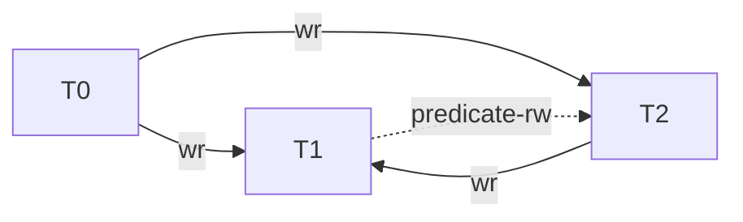

Let's consider a modification to $H_{phantom}$:

+ Change $Sum$ to $SumMoreThan15$.
+ Add transaction $T_3$, which increases employee $z$'s salary from 10 to 20 and updates the sum-of-salaries after $T_2$ is committed.

\begin{align*}
H_{phantom}: r_1(Dept=Sales:x_0,10;y0,10;z_{init}) &\\
             r_2(SumMoreThan15_0,0)                &\\
             w_2(z_2=10)                           &\\
             w_2(SumMoreThan15_2,0)                &\\
             c_2                                   &\\
             r_3(SumMoreThan15_2,0)                &\\
             r_3(z_2=10)                           &\\
             w_3(z_3=20)                           &\\
             w_3(SumMoreThan15_3,20)               &\\
             c_3                                   &\\
             r_1(SumMoreThan15_3,20)               &\\
             c_1                                   &\\
[SumMoreThan15_0 \ll SumMoreThan15_2 \ll SumMoreThan15_3, z_{init} \ll z_2 \ll z_3]
\end{align*}

If the answer is no, since $z_3$ is not the next version of $z_{init}$, there is no predicate-anti-dependency relationship between $T_1$ and $T_3$, and there is no cycle in the direct serialization graph. However, this scenario is nonsensical because $T_1$ would get an inconsistent result.

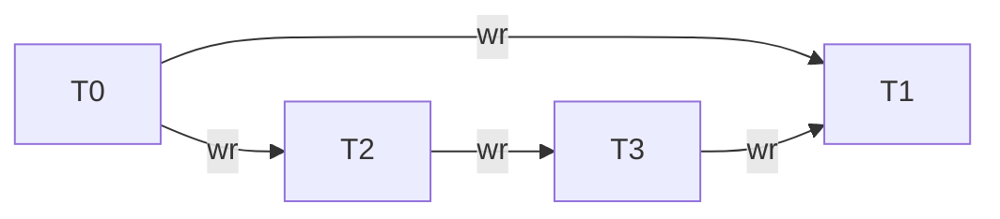

To ensure the correctness of the theory, a predicate-anti-dependency between $T_1$ and $T_3$ should exist, even if $z_3$ is not considered the next version of $z_{init}$.

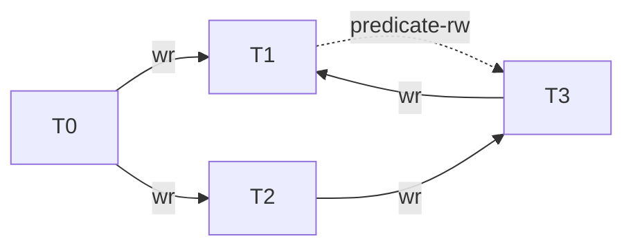

### Isolation Levels for Committed Transactions

| Phenomena                    | Histories Described in tr-95-51                                  | Histories Described in adya-phd | Isolation Levels in tr-95-51 |
| -                            | -                                                                | -                               | -                            |
| Dirty Write                  | P0: `w1[x]...w2[x]...((c1 or a1) and (c2 or a2) in any order)`   |                                 |                              |
|                              |                                                                  | G0                              | PL-1                         |
| Dirty Read                   | P1: `w1[x]...r2[x]...((c1 or a1) and (c2 or a2) in any order)`   |                                 |                              |
|                              | A1: `w1[x]...r2[x]...(a1 and c2 in any order)`                   |                                 |                              |
|                              |                                                                  | G1a + G1b + G1c                 | PL-2                         |
|                              |                                                                  | G1a + G1b + G1c + G1-predA      | PL-2'                        |
|                              |                                                                  | G1a + G1b + G1c + G1-predB      | PL-2''                       |
| Non-repeatable or Fuzzy Read | P2: `r1[x]...w2[x]...((c1 or a1) and (c2 or a2) in any order)`   |                                 |                              |
|                              | A2: `r1[x]...w2[x]...c2...r1[x]...c1`                            |                                 |                              |
| Phantom                      | P3: `r1[P]...w2[y in P]...((c1 or a1) and (c2 or a2) any order)` |                                 |                              |
|                              | A3: `r1[P]...w2[y in P]...c2...r1[P]...c1`                       |                                 |                              |
| Lost Update                  | P4: `r1[x]...w2[x]...w1[x]...c1`                                 |                                 |                              |
|                              |                                                                  | G2                              | PL-3                         |

#### Isolation Level PL-1

**G0: Write Cycles.** A history $H$ exhibits phenomenon G0 if $\operatorname{DSG}(H)$ contains a directed cycle consisting entirely of write-dependency edges.

PL-1, which disallows G0, is considered to be more permissive than Read Uncommitted, which disallows P0, since G0 allows concurrent transactions to modify the same object while P0 does not. Thus, non-serializable interleaving of write operations is possible among uncommitted transactions as long as such interleavings are disallowed among committed transactions (e.g., by aborting some transactions).

According to tr-95-51, Dirty Writes (P0) are considered problematic for two main reasons:

+ They can violate database consistency. Assume there is a constraint between `x` and `y` (e.g., `x` = `y`), and `T1` and `T2` each maintain the consistency of the constraint if run alone. However, the constraint can easily be violated if the two transactions write `x` and `y` in **different orders**, which can only happen if there are Dirty writes.
+ Without protection from P0, the system can't undo updates by restoring before images. Consider the history: `w1[x] w2[x] a1`. You don’t want to undo `w1[x]` by restoring its before-image of `x`, because that would wipe out `w2`'s update. But if you don't restore its before-image, and transaction `T2` later aborts, you can't undo `w2[x]` by restoring its before-image either!

However, these two reasons have been criticized in adya-phd:

+ ... as such interleavings are disallowed among committed transactions (e.g., by aborting some transactions).
+ We believe that $H_{recovery}$ is a valid history and our consistency condition for no-dirty-writes (G0) allows it. Implementations can handle the aborts of `T1` and `T2` in a variety of ways. For example, when `T1` aborts, the system can let `x2` be the version that is stored in the database. If `T2` also aborts, the system reverts the value of `x` to `x0`. Furthermore, some client-server systems such as Thor do not install modifications into the committed state until the commit point of transactions. In such systems, we do not even have to revert the value of `x` when either transaction aborts.

#### Isolation Level PL-2

+ PL-2: Disallow G1a, G1b and G1c.
+ PL-2': Disallow G1a, G1b, G1c and G1-predA.
+ PL-2'': Disallow G1a, G1b, G1c and G1-predB.

##### G1a: Aborted Reads

A history $H$ exhibits phenomenon G1a if it contains an aborted transaction $T_i$ and a committed transaction $T_j$ such that $T_j$ has read some object (maybe via a predicate) modified by $T_i$. Phenomenon G1a can be represented using the following history fragments:

+ $w_i(x_{i.m}) \ldots r_j(x_{i.m}) \ldots (a_i \text{ and } c_j \text{ in any order })$
+ $w_i(x_{i.m}) \ldots r_j(P:x_{i.m}, \dots) \ldots (a_i \text{ and } c_j \text{ in any order })$

Proscribing G1a ensures that if $T_j$ reads from $T_i$ and $T_i$ aborts, $T_j$ must also abort; these aborts are also called cascaded aborts. In a real implementation, the condition also implies that if $T_j$ reads from an uncommitted transaction $T_i$, $T_j$'s commit must be delayed until $T_i$'s commit has succeeded.

##### G1b: Intermediate Reads

A history $H$ exhibits phenomenon G1b if it contains a committed transaction $T_j$ that has read a version of object $x$ (maybe via a predicate) written by transaction $T_i$ that was not $T_i$'s final modification of $x$. The following history fragments represent this phenomenon:

+ $w_i(x_{i.m}) \ldots r_j(x_{i.m}) \ldots w_i(x_{i.n}) c_j$
+ $w_i(x_{i.m}) \ldots r_j(P:x_{i.m}, \ldots) \ldots w_i(x_{i.n}) c_j$

Like our other conditions, G1b does not constrain the behavior of uncommitted transactions.

##### G1c: Circular Information Flow

A history $H$ exhibits phenomenon G1c if $\operatorname{DSG}(H)$ contains a directed cycle consisting entirely of dependency edges, where a dependency edge is defined as either a read-dependency edge or a write-dependency edge.

##### G1

Our condition that captures the essence of no-dirty-reads is G1, which is comprised of G1a, G1b, and G1c. We define isolation level PL-2 as one in which phenomenon G1 is disallowed. (Note that G1c includes G0. We could have defined a weaker version of G1c that only concerned cycles having at least one read-dependency edge, but it seems simpler not to do this.)

Proscribing G1 is clearly weaker than proscribing P1 since G1 allows transactions to read from uncommitted transactions.

##### G1-predA: Non-atomic Predicate-based Reads

A history $H$ exhibits phenomenon G1-predA if $H$ contains distinct committed transactions $T_j$ and $T_i$, and operations $w_j(Q:\operatorname{Vset}(Q)), w_j(x_j) \ldots w_j(y_j)$ and $r_i(P:\operatorname{Vset}(P))$ such that $w_j(x_j)$ and $w_j(y_j)$ are events generated due to $w_j(Q:\operatorname{Vset}(Q))$, $x_j \in \operatorname{Vset}(P)$, and $w_j(y_j)$ **overwrites** (refer to the following explanation for more details) $r_i(P:\operatorname{Vset}(P))$.

PL-2' can be defined as a level that disallows G1a, G1b, G1c, and G1-predA.

+ In the context of overwriting a predicate-based operation:

  > We say that a transaction $T_j$ overwrites an operation $r_i(P:\operatorname{Vset}(P))$ (or $w_i(P:\operatorname{Vset}(P))$) based on predicate $P$ if $T_j$ installs $x_j$ such that $x_k \ll x_j$, $x_k \in \operatorname{Vset}(P)$ and $x_k$ matches $P$ whereas $x_j$ does not match $P$ or vice-versa. That is, $T_j$ makes a modification that changes the set of objects matched by $T_i$'s predicate-based operation.

+ Based on my understanding, in the context of G1-predA, it is possible that $w_j(x_j)$ overwrites $r_i(P:\operatorname{Vset}(P))$ if $x_k \ll x_j$, $x_k \in \operatorname{Vset}(P)$, regardless of whether $x_j$ is a modification that changes the set of objects matched by $P$. However, it is important to note that this is only my interpretation and I am not entirely certain if it aligns with the author's intention. If my understanding is indeed correct, the author's assertion makes sense:

  > Disallowing G1-predA guarantees that if $T_i$'s predicate-based read observes an update by $T_j$'s predicate-based write, it does not see any version older than the ones installed by $T_j$'s write. Thus, disallowing G1-predA ensures that all read/write operations are indivisible with respect to each other.

+ When the meaning of "overwrite" varies, it becomes difficult to definitively determine the relationship between PL-2' and PL-3. Is PL-3 remains more restrictive than PL-2' under these conditions?

##### G1-predB: Non-atomic Predicate-based Reads with respect to Transactions

A history $H$ exhibits phenomenon G1-predB if $H$ contains distinct committed transactions $T_i$ and $T_j$ such that $T_i$ **overwrites** (refer to the following explanation for more details) an operation $r_j(P:\operatorname{Vset}(P))$ and there exists a version $x_i$ in $\operatorname{Vset}(P)$.

\begin{align*}
H_{atomic-read}: w_1(\text{Dept=Sales}:x_0;y_0;z_0)               &\\
                 w_1(x_1)                                         &\\
                 w_1(y_1)                                         &\\
                 w_1(z_1)                                         &\\
                 r_2(\text{Dept=Sales or Dept=Legal}:x_1;y_1;z_0) &\\
                 r_2(x_1)                                         &\\
                 r_2(y_1)                                         &\\
                 c1                                               &\\
                 c2                                               &\\
[x_0 \ll x_1, y_0 \ll y_1, z_0 \ll z_1]
\end{align*}

In this case, $z_0$ represents an employee record in the legal department, and $w_1(z_1)$ is a regular write, not one generated by $w_1(\text{Dept=Sales}:x_0;y_0;z_0)$. Disallowing G1-predB will prohibit $H_{atomic-read}$, but it would be allowed if only G1-predA is disallowed. This is because G1-predA requires $w_1(z_1)$ to be generated by $w_1(\text{Dept=Sales}:x_0;y_0;z_0)$, while G1-predB has no such requirement.

In my opinion, the overwriting concept in G1-predB appears similar to that in G1-predA. This is reflected in the fact that:

+ Disallowing G1-predB will prohibit $H_{atomic-read}$, implies
+ $T_1$ overwrites $r_2(\text{Dept=Sales or Dept=Legal}:x_1;y_1;z_0)$, implies
+ $w_1(z_1)$ overwrites $r_2(\text{Dept=Sales or Dept=Legal}:x_1;y_1;z_0)$, implies
+ Overwriting in G1-predB does not require $w_1(z_1)$ is a modification that changes the set of objects matched by $\text{Dept=Sales or Dept=Legal}$.

#### Isolation Level PL-3

**G2: Anti-dependency Cycles.** A history $H$ exhibits phenomenon G2 if $\operatorname{DSG}(H)$ contains a directed cycle having one or more **anti-dependency** edges.

We define PL-3 as an isolation level that proscribes G1 and G2. Thus, all cycles are precluded at this level.

#### PL-3 provides conflict-serializability

The author claims that PL-3 provides conflict-serializability, but there is no detailed verification provided:

The conditions given in [BHG87] provides view-serializability whereas our specification for PL-3 provides conflict-serializability (this can shown using theorems presented in [GR93, BHG87]).

$\operatorname{DSG}(H)$ is acyclic, and G1a, and G1b are satisfied for a history $H$ iff $H$ is conflict-serializable.

The Wormhole Theorem, as described in section 7.5.8.1 of "Transaction Processing: Concepts and Techniques" by J. N. Gray and A. Reuter (Morgan Kaufmann Publishers Inc., 1993), states:

A history achieves isolation if and only if it contains no wormhole transactions.

+ Proof: (Isolated => no wormholes). This proof is by contradiction.
  1. Suppose $H$ is an isolated history of the execution of the set of transactions $\left\{T_i \mid i=1, \ldots, n\right\}$. By definition, then, $H$ is equivalent to some serial execution history, $SH$, for that same set of transactions.
  2. Without loss of generality, assume that the transactions are numbered so that $SH = T_1 \| T_2 \| \ldots \| T_n$.
  3. Suppose, for the sake of contradiction, that $H$ has a wormhole; that is, there is some sequence of transactions $T, T^\prime, T^{\prime\prime}, \ldots, T^{\prime\prime\prime}$ such that each is BEFORE the other (i.e., $T \ll_H T^\prime$), and the last is BEFORE the first (i.e., $T^{\prime\prime\prime} \ll_H T$).
  4. Let $i$ be the minimum transaction index such that $T_i$ is in this wormhole, and let $T_j$ be its predecessor in the wormhole (i.e., $T_j \ll_H T_i$).
  5. By the minimality of $i$, $T_j$ comes completely AFTER $T_i$ in the execution history $SH$ (recall assumption of step 2), so that $T_j \ll_{SH} T_i$ is impossible (recall that $SH$ is a serial history). But since $H$ and $SH$ are equivalent, $\ll_{H} = \ll_{SH}$; therefore, $T_j \ll_H T_i$ is also impossible. This contradiction proves that if $H$ isisolated, it has no wormholes.
+ Proof: (No wormholes => isolated). This proof is by induction on the number of transactions, $n$, that appear in the history, $H$. The induction hypothesis is that any $n$ transaction history $H$ having no wormholes is isolated (equivalent to some serial history, $SH$, for that set of transactions).
  + If $n < 2$, then any history is a serial history, since only zero or one transaction appears in the history. In addition, any serial history is an isolated history. The basis of the induction, then, is trivially true.
  + Suppose the induction hypothesis is true for $n-1$ transactions, and consider some history $H$ of $n$ transactions that has no wormholes.
    1. Pick any transaction $T$, then pick any other transaction $T^\prime$, such that $T \ll T^\prime$, and continue this construction as long as possible, building the sequence $S = (T, T^\prime, \ldots)$. Either $S$ is infinite, or it is not. If $S$ is infinite, then some transaction $T^{\prime\prime}$ must appear in it twice. This, in turn, implies that $T^{\prime\prime} \ll T^{\prime\prime}$; thus, $T^{\prime\prime}$ is a wormhole of $H$. But since $H$ has no wormholes, $S$ cannot be infinite. The last transaction in $S$ - call it $T^*$ - has the property $\operatorname{AFTER}(T^*) = \varnothing$, since the sequence cannot be continued past $T^*$.
    2. Consider the history, $H^\prime = \left\langle\left\langle t_i, a_i, o_i\right\rangle \in H \mid t_i \neq T^*\right\rangle$. $H^\prime$ is the history $H$ with all the actions of transaction $T^*$ removed. By the choice of $T^*$, $\operatorname{DEP}(H^\prime) = \left\{\langle T, \langle o, i\rangle, T^\prime\rangle \in \operatorname{DEP}(H) \mid T^\prime \neq T^*\right\}$.
       1. $H^\prime$ has no wormholes (since $H$ has no wormholes, and $\operatorname{DEP}(H) \supseteq \operatorname{DEP}(H^\prime)$). The induction hypothesis, then, applies to $H^\prime$. Hence, $H^\prime$ is isolated and has an equivalent serial history ${SH}^\prime = T_1 \| T_2 \| \ldots \| T_{n-1}$ for some numbering of the other transactions.
       2. The serial history $SH = {SH}^\prime \| T^* = T_1 \| T_2 \| \ldots \| T_{n-1} \| T^*$ is equivalent to $H$. To prove this, it must be shown that $\operatorname{DEP}(SH) = \operatorname{DEP}(H)$. By construction, $\eqref{the-wormhole-theorem:no-wormholes-infer-isolated:by-construction}$. By definition, $\operatorname{DEP}({SH}^\prime) = \operatorname{DEP}(H^\prime)$. Using Equation $\eqref{the-wormhole-theorem:no-wormholes-infer-isolated:h-prime-depend}$ to substitute into Equation $\eqref{the-wormhole-theorem:no-wormholes-infer-isolated:by-construction}$ gives: $\eqref{the-wormhole-theorem:no-wormholes-infer-isolated:final}$. Thus, the identity $DEP(SH)= DEP(H)$ is established, and the induction step is proven.
  + The notion $\langle t_i, a_i, o_i\rangle$ represents that transaction $t_i$ performs action $a_i$ (e.g., read) on object $o_i$. The notion $\left\langle T, \langle o, i\rangle, T^\prime\right\rangle$ represents that $T^\prime$ depends on $T$, where $o$ is the object creating the dependency, and $i$ indicates the version of $o$ being read or written by $T^\prime$.

\begin{align}
  \operatorname{DEP}(SH)
= \operatorname{DEP}({SH}^\prime \| T^*)
=   \operatorname{DEP}({SH}^\prime)
  \cup
    \left\{
      \left\langle T^\prime, \langle o, i\rangle, T^*\right\rangle
      \in \operatorname{DEP}(H)
    \right\}
\label{the-wormhole-theorem:no-wormholes-infer-isolated:by-construction}
\end{align}

\begin{align}
    \operatorname{DEP}({SH}^\prime)
  = \operatorname{DEP}(H^\prime)
  = \left\{
        \left\langle T, \langle o, i\rangle, T^\prime\right\rangle
        \in \operatorname{DEP}(H)
      \mid
        T^\prime \neq T^*
    \right\}
\label{the-wormhole-theorem:no-wormholes-infer-isolated:h-prime-depend}
\end{align}

\begin{align}
&\phantom{=} \operatorname{DEP}(SH)           \\
          &= \phantom{\cup}&
               \left\{
                   \left\langle T, \langle o, i\rangle, T^\prime\right\rangle
                   \in \operatorname{DEP}(H)
                 \mid
                  T^\prime \neq T^*
               \right\}             \nonumber \\
             &\phantom{=} &\cup
               \left\{
                 \left\langle T^\prime, \langle o, i\rangle, T^*\right\rangle
                 \in \operatorname{DEP}(H)
               \right\}             \nonumber \\
          &= \operatorname{DEP}(H)  \nonumber
\label{the-wormhole-theorem:no-wormholes-infer-isolated:final}
\end{align}

The Serializability Theorem, as described in Section 2.3 of "Concurrency Control and Recovery in Database Systems" by Philip A. Bernstein, Vassos Hadzilacos, and Nathan Goodman, states:

A history $H$ is serializable iff $\operatorname{SG}(H)$ is acyclic.

+ Proof: (Acyclic => serializable).
  1. Suppose $H$ is a history over $T = \left\{T_1, T_2, \ldots, T_n\right\}$. Without loss of generality, assume $\operatorname{C}(T) = \left\{T_1, T_2, \ldots, T_m \mid m \le n\right\}$ are all of the transactions in $T$ that are committed in $H$. Thus $T_1, T_2, \ldots, T_m$ are the nodes of $\operatorname{SG}(H)$.
  2. Since $\operatorname{SG}(H)$ is acyclic it may be topologically sorted (See Section A.3 of the Appendix for a definition of "topological sort of a directed acyclic graph"). Let $i_1, i_2, \ldots, i_m$ be a permutation of $1, 2, \ldots, m$ such that $T_{i_1}, T_{i_2}, \ldots, T_{i_m}$ is a topological sort of $\operatorname{SG}(H)$. Let $H_s$ be the serial history $T_{i_1}, T_{i_2}, \ldots, T_{i_m}$.
  3. We claim that $\operatorname{C}(H) \equiv H_s$. To see this, let $p_i \in T_i$ and $q_j \in T_j$, where $T_i$, $T_j$ are committed in $H$. Suppose $p_i$, $q_j$ conflict and $p_i \lt_H q_j$. By definition of $\operatorname{SG}(H)$, $T_i \rightarrow T_j$ is an edge in $\operatorname{SG}(H)$. Therefore in any topological sort of $\operatorname{SG}(H)$, $T_i$ must appear before $T_j$. Thus in $H_s$ all operations of $T_i$ appear before any operation of $T_j$, and in particular, $p_i \lt_H q_j$. We have proved that any two conflicting operations are ordered in $\operatorname{C}(H)$ in the same way as $H_s$. Thus $\operatorname{C}(H) \equiv H_s$ and, because $H_s$ is serial by construction, $H$ is serializable as was to be proved.
+ Proof: (Serializable => acyclic).
  1. Suppose history $H$ is serializable. Let $H_s$ be a serial history equivalent to $\operatorname{C}(H)$. Consider an edge $T_i \rightarrow T_j$ in $\operatorname{SG}(H)$. Thus there are two conflicting operations $p_i$, $q_j$ of $T_i$, $T_j$ (respectively), such that $p_i \lt_H q_j$. Because $\operatorname{C}(H) \equiv H$, $p_i \lt_{H_s} q_j$. Because $H_s$ is serial and $p_i$ in $T_i$ precedes $q_j$ in $T_j$, it follows that $T_i$ appears before $T_j$ in $H_s$. Thus, we've shown that if $T_i \rightarrow T_j$ is in $\operatorname{SG}(H)$ then $T_i$ appears before $T_j$ in $H_s$.
  2. Now suppose there is a cycle in $\operatorname{SG}(H)$, and without loss of generality let that cycle be $T_1 \rightarrow T_2 \rightarrow \ldots \rightarrow T_k \rightarrow T_1$. These edges imply that in $H_s$, $T_1$ appears before $T_2$ which appears before $T_3$ appears before $\ldots$ before $T_k$ which appears before $T_1$. Thus, the existence of the cycle implies that each of $T_1, T_2, \ldots, T_k$ appears before itself in the serial history $H_s$, an absurdity. So no cycle can exist in $\operatorname{SG}(H)$. That is, $\operatorname{SG}(H)$ is an acyclic directed graph, as was to be proved.

#### Isolation Level PL-2.99

**G2-item: Item Anti-dependency Cycles.** A history $H$ exhibits phenomenon G2-item if $\operatorname{DSG}(H)$ contains a directed cycle having one or more **item**-anti-dependency edges.

Level PL-2.99 is defined as one that proscribes G1 and G2-item.

$H_{phantom}$ is ruled out by PL-3 but permitted by PL-2.99 because the DSG contains a cycle only if predicate anti-dependency edges are considered.

\begin{align*}
H_{phantom}: r_1(\text{Dept=Sales}:x0,10;y0,10) &\\
             r_2(Sum0,20)                       &\\
             w_2(z_2=10 \text{ in Dept=Sales})  &\\
             w_2(Sum_2,30)                      &\\
             c_2                                &\\
             r_1(Sum_2,30)                      &\\
             c_1                                &\\
[Sum_0 \ll Sum_2, z_{init} \ll z_2]
\end{align*}


### Mixing of Isolation Levels

### Correctness and Flexibility of the New Specifications

### Consistency Guarantees for Executing Transactions

All definitions presented in this chapter till now provide guarantees to committed transactions only. In this section, we discuss how the isolation levels presented in this chapter can be extended to provide guarantees to executing transactions. To ensure that there is no confusion regarding isolation levels for committed and executing transactions, we prefix all levels for executing transactions by "E".

#### Motivation

+ Suppose that a programmer writes code under the assumption that certain integrity constraints will hold. If these constraints are violated, the transaction will be aborted when it tries to commit. However, before the transaction reaches its commit point, the program may behave in an unexpected manner, e.g., it may crash, go into an infinite loop, or output unexpected results on a user’s display.
+ Debugging also becomes more difficult for an application programmer; if the transaction observes a broken invariant, it may be difficult for the programmer to determine whether the invariant was violated due to a code bug or due to weak consistency guarantees provided to executing transactions by the system.

If a transaction $T_i$ requires execution-time isolation guarantee $L$, the system must ensure that $T_i$ does not detect that it is running below level $L$ at any given instant. Transaction $T_i$ can detect that it is running below level $L$ if it **reads** objects in a manner that is not allowed by that level. Since a transaction can determine whether it is executing below a certain degree only by observing the state of the database, our conditions will provide guarantees **only for reads of uncommitted transactions and not for their writes**.

For the purpose of providing consistency guarantees to an executing transaction $T_i$, we consider $T_i$'s predicate-based writes as predicate-based reads. This approach is taken so that appropriate guarantees can be provided for version sets of predicate-based writes performed by $T_i$ (ghost writes performed by $T_i$ are essentially reads).

#### Isolation Levels EPL-1 and EPL-2

Isolation level PL-1 provides guarantees with respect to writes. Since our execution time guarantees are provided only for reads, level EPL-1 does not place any constraints on executing transactions.

Isolation level PL-2 guarantees that a transaction is allowed to commit if it observes values that existed in the committed state and there is unidirectional flow of information. To ensure that a transaction $T_j$ (while executing) reads from a transaction $T_i$ that does not later abort or modify the objects read by $T_j$ , we disallow reads from uncommitted transactions; furthermore, **no dirty reads also ensure unidirectional information flow**. We define EPL-2 as a level that disallows phenomenon P1.

#### Isolation Level EPL-3

To specify EPL-3 for a history $H$ and an executing transaction $T_i$, we use a new graph called the **Direct Transaction Graph** that is denoted by $\operatorname{DTG}(H,T_i)$; recall that a DSG was defined for a history only. The DTG is exactly the same as DSG with one addition: it also contains a node for executing transaction $T_i$ and we add all edges corresponding to the **reads** of $T_i$ . Recall that we treat all predicate-based writes of $T_i$ as predicate-based reads so that consistency guarantees can be provided for version sets of predicate-based writes. Thus, we get some extra read-dependency and anti-dependency edges due to such "reads", e.g., if executing transaction $T_i$ performs $w_i(P:\operatorname{Vset}(P))$ and $\operatorname{Vset}(P)$ contains $x_j$, we add a read-dependency edge from $T_j$ to $T_i$ in the DTG.

\begin{align*}
H_{incons-view}: w_0(x_0) &\\
                 w_0(y_0) &\\
                 c_0      &\\
                 w_1(x_1) &\\
                 w_1(y_1) &\\
                 c_1      &\\
                 r_2(x_0) &\\
                 r_2(y_1) &\\
[x_0 \ll x_1; y_0 \ll y_1]
\end{align*}

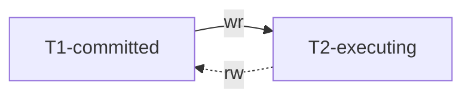

**E2: Anti-dependency Cycles at Runtime.** A history $H$ and an executing transaction $T_i$ exhibit phenomenon E2 if $\operatorname{DTG}(H,T_i)$ contains a directed cycle involving $T_i$ that consists of dependency edges and one or more anti-dependency edges.

EPL-3 is defined as an isolation level that disallows phenomena P1 and E2. It is more restrictive than PL-3:

+ P1 is more stringent than G1a: Aborted Reads, G1b: Intermediate Reads, G1c: Circular Information Flow.
  + No dirty reads also ensure unidirectional information flow.
+ E2: Anti-dependency Cycles at Runtime is more stringent than G2: Anti-dependency Cycles because E2 takes executing transactions into account.

Note that we are ignoring anti-dependency edges due to writes by uncommitted transactions. This is in accordance with our goal of providing execution time guarantees for reads only. However, it also turns out that such writes must be ignored so that optimistic schemes can be allowed. To provide EPL-3, one might be tempted to say that all cycles are disallowed in the direct transaction graph. However, this condition is overly restrictive as shown by the following history:

\begin{align*}
H_{antidep-cycle}: r_1(x_0) &\\
                   w_2(x_2) &\\
                   r_2(y_0) &\\
                   c_2      &\\
                   w_1(y_1) &\\
[x_0 \ll x_2, y_0 \ll y_1]
\end{align*}

In this example, $T_1$ and $T_2$ overwrite an object that the other transaction has read.

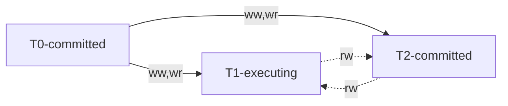

Transaction $T_1$ is doomed to abort since a cycle with two anti-dependency edges has been formed.

+ However, since it does not observe a non-serializable database state, there is no harm in executing it.
+ Furthermore, this situation can occur with an optimistic scheme in a client-server distributed system where $T_1$ may read $x_0$ and write $y_1$ in its client's cache before information about $T_2$'s commit arrives at $T_1$'s client.

## Specifications for Intermediate Isolation Levels

There is a wide gap between PL-2, which provides neither consistent reads nor consistent writes, and PL-3, which provides both (this is analogous to the gap between degrees 2 and 3).

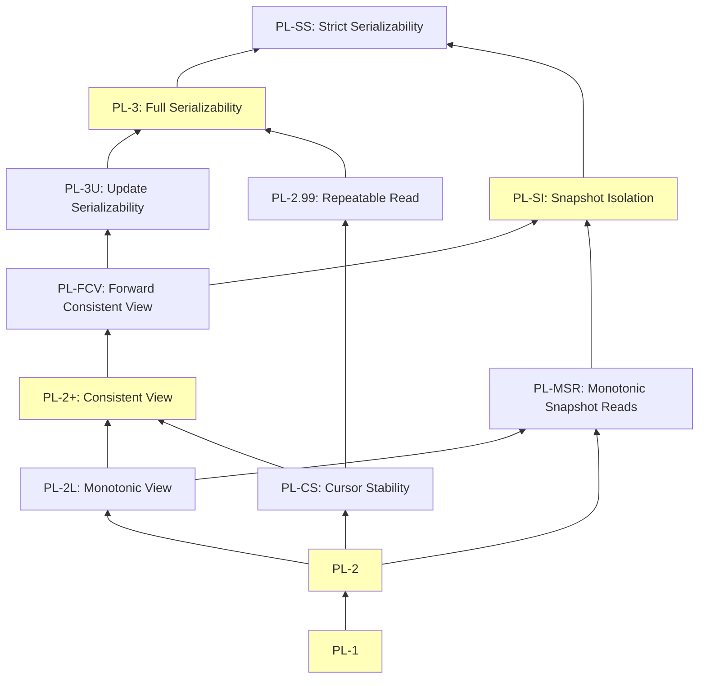

### Isolation Level PL-2+

Isolation level PL-2+ is motivated by the fact that certain applications only need to observe a consistent state of the database and serializability may not be required. In simpler terms, PL-2+ delivers consistent reads, a feature not offered by PL-2.

Consider the following history $H_{broken}$ where transaction $T_1$ observes an inconsistent state of the database. The consistency constraint, $x + y \le 0$, is preserved by $T_2$. However, transaction $T_1$ observes a state reflecting both before and after results of $T_2$ and erroneously concludes that the constraint is broken.

\begin{align*}
H_{broken}: r_1(x_0,-50) &\\
            r_2(x_0,-50) &\\
            r_2(y_0,100) &\\
            w_2(x_2,100) &\\
            w_2(y_2,-50) &\\
            c_2          &\\
            r_1(y_2,-50) &\\
            c_1          &\\
[x_0 \ll x_2, y_0 \ll y_2]
\end{align*}

The following $\operatorname{DSG}(H_{broken})$ shows that history $H_{broken}$ is allowed by PL-2 because the only cycle in $\operatorname{DSG}(H_{broken})$ involves an anti-dependency edge (for simplicity, $T_0$ is not shown); however, it is disallowed by PL-3. Note that P0 and P1 also allow $H_{broken}$.

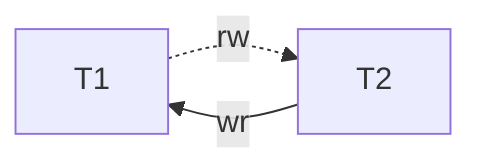

The author introduces the no-depend-misses property, demonstrated by Chan and Gray to guarantee transaction $T_j$ does not observe violated integrity constraints if update transactions are serializable (i.e., commit at PL-3). The author then proves that disallowing G-single is equivalent to no-depend-misses, and presents PL-2+, which ensures consistent reads but not consistent writes.

#### Specification

**Basic-Consistency.** A transaction $T_j$ is provided basic-consistency if the values read by $T_j$ are the result of a serial execution of **some subset of committed update transactions** and each update transaction in the serial execution **executes the same steps** as it did in the concurrent execution.

In my understanding, "executing the same steps" implies that, within **a subset of update transactions**, each update transaction in the serial execution **observes the same versions of objects** and **produces the same versions (values) of objects** as it did in the concurrent execution of all update transactions.

It's important to note that we can't select arbitrary subsets of committed update transactions for $T_j$. Basic consistency necessitates each update transaction in the serial execution to **execute same steps** (possibly **observe the same versions of objects** and **produce the same versions (values) of objects**) as in the concurrent execution. Consequently, update transaction $T_i$ must yields the same write operations in both serial and concurrent executions if it observes the same state. However, if $T_i$ observes a different state in the serial executions due to an incorrect subset of committed update transactions, it may not execute the same write operations. For example, if $T_j$ observes the updates of $T_i$, it must not "miss the effects" of a transaction $T_k$ whose updates were observed by $T_i$, i.e., basic-consistency requires that if the subset of transactions chosen for $T_j$'s observed view includes $T_i$, it must include $T_k$ as well.

We assume that the committed database state is consistent if the integrity constraints as defined by an application are valid. Furthermore, if an update transaction $T_i$ observes valid integrity constraints and runs alone to completion, we assume that it transforms the committed database state such that the integrity constraints continue to hold after $T_i$ commits.

As discussed in [W. E. Weihl. Distributed Version Management for Read-only Actions](https://dl.acm.org/doi/pdf/10.1145/323596.323607), basic-consistency ensures that $T_j$ observes a consistent state of the database because the result of a serial execution of update transactions always results in a consistent state.

**Missing Transaction Updates.** A transaction $T_j$ misses the effects of a transaction $T_i$ if $T_i$ installs $x_i$ and an event $r_j(x_k)$ exists such that $x_k \ll x_i$, i.e., $T_j$ reads a version of $x$ that is older than the version that was installed by $T_i$.

**No-Depend-Misses**. If $T_j$ depends on $T_i$, it does not miss the effects of $T_i$. This property (along with P1) has been shown by [W. E. Weihl. Distributed Version Management for Read-only Actions](https://ieeexplore.ieee.org/document/1702133) to ensure that transaction $T_j$ does not observe violated integrity constraints if update transactions are serializable (i.e., commit at PL-3). We give a synopsis of this proof in [Relationship between PL-2+ and Basic-Consistency](#relationship-between-pl-2+-and-basic-consistency).

**G-single**: Single Anti-dependency Cycles. A history $H$ exhibits phenomenon G-single if $\operatorname{DSG}(H)$ contains a directed cycle with **exactly one anti-dependency edge**.

We now prove Theorem 2+, which states that disallowing G-single is equivalent to no-depend-misses:

+ Disallowing G-single implies no-depend-misses.
  + Suppose that a history $H$ does not exhibit G-single but the no-depend-misses property is violated. Then there exist transactions $T_i$ and $T_j$ such that $T_j$ depends on $T_i$, yet it misses some effect of $T_i$; recall that missing $T_i$'s effects implies that history $H$ contains events $r_j(x_k)$ and $w_i(x_i)$ such that $xk \ll xi$. This situation is shown in the following figure where $T_u$ overwrites $x_k$ and hence there is an anti-dependency edge from $T_j$ to $T_u$; a "*" denotes 0 or more edges and a "+" denotes 1 or more edges. In this figure, $T_i$ could be the same as $T_u$, i.e., $T_i$ could have overwritten the version that $T_j$ read. Thus, the DSG has a cycle with one anti-dependency edge, which is a contradiction. Therefore, if history $H$ does not exhibit phenomenon G-single, it satisfies the no-depend-misses property.
+ No-depend-misses implies that phenomenon G-single cannot occur.
  + Suppose that a history $H$ satisfies no-depend-misses but exhibits phenomenon G-single. The existence of a cycle with one anti-dependency edge implies that there must be transactions $T_i$ and $T_j$ such that $T_i$ depends on $T_j$ and also $T_j$ **directly** anti-depends on $T_i$. Because of the direct anti-dependency, there must be some object $x$ such that $T_j$ overwrote the version of $x$ that $T_i$ read, i.e., $T_i$ missed $T_j$'s effects even though it depends on $T_j$. But this contradicts the no-depend-misses property. Therefore, if $H$ satisfies the no-depend-misses property, phenomenon G-single cannot occur in $H$.

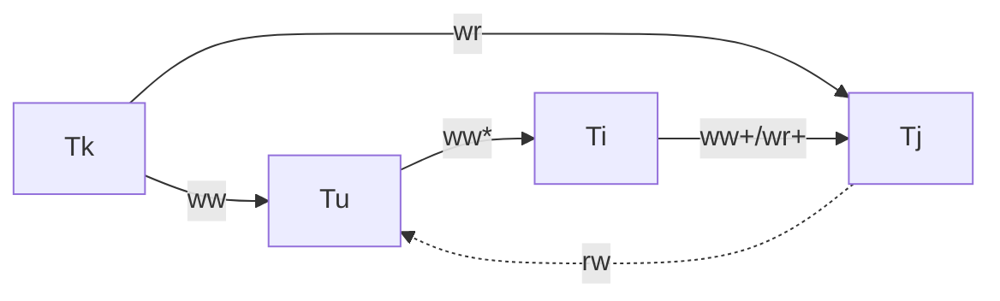

Level PL-2+ proscribes G1 and G-single. Intuitively, PL-2+ provides consistency because cycles with one anti-dependency edge occur exactly when some transaction both observes and misses modifications of another transaction.

#### Relationship between PL-2+ and Basic-Consistency

<p id=relationship-between-pl-2+-and-basic-consistency>

We now show that PL-2+ is the **weakest** level that ensures basic-consistency provided update transactions modify the database consistently and are serializable.

Theorem: In a history that contains a set of transactions $\Phi$, **such that** all update transactions in $\Phi$ are serializable, each transaction is provided basic-consistency iff it is committed with at least PL-2+ guarantees.

We will prove this theorem with respect to the reads of a transaction $Q$ in $\Phi$; $Q$'s writes are not considered since basic-consistency is only concerned with what a transaction observes. Of course, if $Q$ is an update transaction, it must be serializable (by assumption).

+ PL-2+ is sufficient: Given that all update transactions in $\Phi$ are serializable and $Q$ is committed at level PL-2+ (at least), $Q$ must be provided basic-consistency.
  + Suppose that transaction $Q$ depends on a sequence of transactions $T_{i_1}, T_{i_2}, \ldots, T_{i_m}$ in $\Phi$ (these transactions are serialized from left to right); we call these transactions $Q$'s depend-set. Transaction $Q$ misses the effects of the rest of the transactions in $\Phi$; these transactions are called $Q$'s missed-set; $Q$ **may anti-depend on** some of the transactions in its missed-set.
  + We can prove $Q$ is provided basic-consistency with the following two steps:
    + Each update transaction in $Q$'s depend-set executes the same steps (observes the same versions of objects and produces the same versions (values) of objects) as it did in the concurrent execution.
      + Consider any transaction $T_{i_p}$ in $Q$'s depend-set; $T_{i_p}$'s depend-set is a subset of $Q$'s depend-set because depends is a transitive relationship. Since $T_{i_p}$ does not depend on any transaction $T_{k_h}$ in $Q$'s missed-set, $T_{k_h}$ has no impact on $T_{i_p}$'s behavior, i.e., $T_{i_p}$'s modifications (which are based on its reads) are unaffected by the presence or absence of any transaction in $Q$'s missed-set. Considering a history with only $T_{i_1}, T_{i_2}, \ldots, T_{i_m}$ (in this order), the database state observed by any transaction in this history remains unchanged.
    + The values read by $Q$ are the result of a serial execution of its depend-set.
      + Since $Q$ commits with at least PL-2+ guarantees, none of the transactions in its depend-set could have aborted (property G1a).
      + Furthermore, $Q$ must read the final modifications of each object (property G1b).
      + Since $Q$ commits with at least PL-2+ guarantees, G-single cannot occur for $Q$. We have proven that disallowing G-single is equivalent to no-depend-misses, then $Q$ does not miss the effects of $T_{i_1}, T_{i_2}, \ldots, T_{i_m}$.
+ PL-2+ is necessary: Given that all update transactions in $\Phi$ are serializable (i.e., commit at PL-3), $Q$ is provided basic-consistency only if it is committed with at least PL-2+ guarantees.
  + We have to prove that $Q$ will not be provided basic-consistency if it is committed below PL-2+. For this purpose, we will show that if any phenomenon of PL-2+ is allowed, it results in violation of basic-consistency.
    + Phenomena G1a and G1b: The definition of basic-consistency requires a transaction to read from a set of committed transactions. Thus, G1a and G1b must be disallowed for providing basic-consistency.
    + Phenomenon G1c: Phenomenon G1c can occur only when update transactions form a cycle consisting of dependency edges. However, since we are given that all update transactions in $\Phi$ are serializable and we are only concerned with $Q$'s reads, phenomenon G1c cannot occur in the history.
    + Phenomenon G-single: $H_{n-cycle}$ is a counter-example which shows that basic-consistency can be violated if G-single is allowed. Each transaction $T_i$ maintains the invariant $x<y$ but $Q$ observes it as broken.
      + The author provides a counter-example, but this does not form a complete proof. It is still uncertain whether any histories exist that are both disallowed by G-single and do not violate basic-consistency. Further research is required to definitively answer this question.

\begin{align*}
H_{n-cycle}: r_1(x_0,5)     &\\
             r_1(y_0,7)     &\\
             w_1(x_1,10)    &\\
             w_1(y_1,14)    &\\
             \ldots         &\\
             w_n(x_n,5*2^n) &\\
             w_n(y_n,7*2^n) &\\
             r_Q(y0,7)      &\\
             r_Q(x_n,5*2^n) &\\
[x_0 \ll \ldots x_n, y_0 \ll \ldots y_n]
\end{align*}

#### Why G-single Emphasizes Exactly One Anti-dependency Edge

Why does G-single specifically emphasize having exactly one anti-dependency edge, rather than allowing one or more anti-dependency edges? As an example, let's consider $H_{anti-dependency-edges}$. Notice that all update transactions in $H_{anti-dependency-edges}$ are serializable.

\begin{align*}
H_{anti-dependency-edges}: w_0(x_0) &\\
                           w_0(y_0) &\\
                           c_0      &\\
                           r_1(x_0) &\\
                           r_2(x_0) &\\
                           r_2(y_0) &\\
                           w_2(x_2) &\\
                           c_2      &\\
                           r_3(y_0) &\\
                           w_3(y_3) &\\
                           c_3      &\\
                           r_1(y_3) &\\
                           c1       &\\
[x_0 \ll x_2, y_0 \ll y_3]
\end{align*}

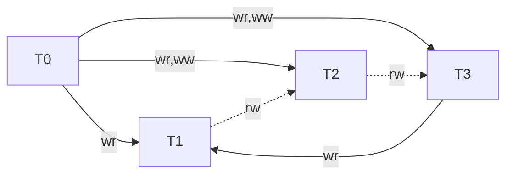

Based on the wormhole theorem, a cycle in $\operatorname{DSG}(H_{anti-dependency-edges})$ containing two anti-dependency edges, indicates $H_{anti-dependency-edges}$ is non-serializable. Despite $T_1$ reading object versions that might not be present in any serializable schedule, basic consistency is preserved.

By removing $T_1$ and $T_2$ from $H_{anti-dependency-edges}$, we obtain $H_{anti-dependency-edges}^\prime$. We can demonstrate that the final state $\{x_0, y_3\}$ of $H_{anti-dependency-edges}^\prime$ satisfies the integrity constraints as follows:

+ $T_3$ is a valid transaction in $H_{anti-dependency-edges}^\prime$ because:
  + $T_3$ must be valid or invalid in both $H_{anti-dependency-edges}$ and $H_{anti-dependency-edges}^\prime$ since it reads and writes the same versions of objects in both histories:
    + $T_3$ observes $\{y_0\}$ in both $H_{anti-dependency-edges}$ and $H_{anti-dependency-edges}^\prime$.
    + We assume that if a transaction reads the same versions of objects, it must execute the same steps and write the same versions of objects. Based on this assumption, $T_3$ writes $\{y_3\}$ in both $H_{anti-dependency-edges}$ and $H_{anti-dependency-edges}^\prime$.
  + $T_3$ is a valid transaction in $H_{anti-dependency-edges}$.
+ $\{x_0, y_3\}$ is a a state that satisfies the integrity constraints:
  + We assume that:
    + The committed database state is consistent if the integrity constraints as defined by an application are valid.
    + Furthermore, if a valid update transaction $T_i$ observes valid integrity constraints and runs alone to completion, it transforms the committed database state such that the integrity constraints continue to hold after $T_i$ commits.
  + Therefore:
    + $\{x_0, y_0\}$ is a state that satisfies the integrity constraints in both $H_{anti-dependency-edges}$ and $H_{anti-dependency-edges}^\prime$.
    + Since $T_3$ observes a state that satisfies the integrity constraints and runs independently to completion, and it is a **valid** transaction, the integrity constraints must hold after $T_3$ commits.

Drawing inspiration from the above example, let's consider a history $H$ that consists of serializable update transactions and exactly one read transaction $Q$ committed at PL-2+. Let $H^\prime$ be a subset of $H$ containing $Q$ and the depend-set of $Q$. If $Q$ reads only the versions of objects written by its depend-set, then $H$ can be considered serializable. However, if this condition is not met, $H$ might not be serializable, and $Q$ could potentially read versions of objects not found in any serializable schedule of $H$. Despite this possibility, $Q$ still maintains basic consistency. Please note that this statement serves as an intuitive understanding derived from the example, rather than a formal proof.

From a programmer’s perspective, PL-2+ provides a useful guarantee since it allows an application to **rely on invariants without full serializability**. As demonstrated in the case of $H_{anti-dependency-edges}$, $T_1$ reads $x_0$ and $y_3$, which are not present in any serializable schedule. Nevertheless, all integrity constraints remain intact.

#### Discussion

In [Relationship between PL-2+ and Basic-Consistency](#relationship-between-pl-2+-and-basic-consistency), the assumption is that all update transactions are serializable (e.g., committed at PL-3). However, if an update transaction is not committed at PL-3 but instead at PL-2+, there is a possibility that it may update the database inconsistently. For instance, in $H_{wskew}$, transactions break the constraint $x + y < 10$ because their operations are interleaved in a non-serializable manner.

\begin{align*}
H_{wskew}: r_1(x_0,1) &\\
           r_1(y_0,5) &\\
           r_2(x_0,1) &\\
           r_2(y_0,5) &\\
           w_1(x_1,4) &\\
           c_1        &\\
           w_2(y_2,8) &\\
           c_2        &\\
[x_0 \ll x_1, y_0 \ll y_2]
\end{align*}

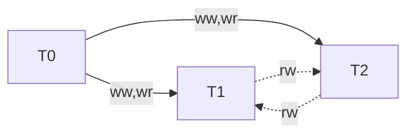

Nevertheless:

+ PL-2+ is useful for read-only transactions and update transactions where the application programmer knows that the writes will not destroy the consistency of the database, e.g., if the updates are performed to a private part of the database.
+ Level PL-2+ also rules out inconsistencies due to phantom reads, since these also give rise to cycles containing one anti-dependency edge. For example, it disallows history $H_{phantom}$.
+ Another advantage of PL-2+ over PL-2 is that it avoids the lost updates problem. For example, it disallows history $H_{lost-update}$.
+ PL-2+ provides a notion of "causal consistency" since it ensures that a transaction is placed after all transactions that causally affect it.

\begin{align*}
H_{lost-update}: r_1(x_0,10) &\\
                 r_2(x_0,10) &\\
                 w_2(x_2,15) &\\
                 c_2         &\\
                 w_1(x_1,14) &\\
                 c_1         &\\
[x_0 \ll x_2 \ll x_1]
\end{align*}

### Isolation Level PL-2L

#### Specification

A lock-based implementation of degree 2 (i.e., long write-locks and short read-locks) provides stronger guarantees than what is specified by degree 2 (READ COMMITTED). Our new isolation level, PL-2L, characterizes one such guarantee, the lock-monotonicity property.

**Lock-monotonicity.** Suppose that an event $r_i(x_j)$ exists in a history. **After** this point, $T_i$ will not miss the effects of $T_j$ and all transactions that $T_j$ depends on.

This property says that a transaction observes a **monotonically increasing prefix** of the database history as it executes (in accordance with write/read-dependencies). For example, if $T_i$ modifies objects $x$ and $y$, and $T_j$ reads $x_i$ and then $y$, this property ensures that $T_j$ observes $y_i$ or a later version of $y$ **after** reading $x_i$. However, if $T_j$ reads $y$ before it reads $x_i$, it could have read a version of $y$ that is older than $y_i$. Thus, the lock-monotonicity property is **weaker** than the no-depends-misses property and does not guarantee that $T_j$ observes a consistent database state; recall that the no-depend-misses property ensures that $T_j$ does not miss $T_i$'s effects irrespective of when $T_j$ reads $x_i$.

We use a graph called the Unfolded Serialization Graph or USG that is a variation of the DSG. The USG is specified for the transaction of interest, $T_i$, and a history, $H$, and is denoted by $\operatorname{USG}(H,T_i)$; recall that a DSG is specified over a history.

+ For the USG, we retain all nodes and edges of the DSG except for $T_i$ and the edges incident on it.
  + For each edge from node $p$ to node $q$ in $\operatorname{DSG}(H)$, where $p$ and $q$ are different from $T_i$, we draw a corresponding edge in $\operatorname{USG}(H,T_i)$.
+ Instead, we split the node for $T_i$ into multiple nodes — one node for every read/write event in $T_i$, these nodes are called read nodes and write nodes respectively.
  + Any edge that was incident on $T_i$ in the DSG is now incident on the relevant event of $T_i$ in the USG, e.g.,if $r_i(x_j)$ (or $r_i(P:x_j,\ldots)$) exists in $H$, a read-dependency edge is added from $T_j$ to $r_i(x_j)$ (or $r_i(P:x_j,\ldots)$) in the USG.
  + Finally, consecutive events in $T_i$ are connected by order edges, e.g., if an action (e.g., SQL statement) reads object $y_j$ and immediately follows a write on object $x$ in transaction $T_i$, we add an order-edge from $w_i(x_i)$ to $r_i(y_j)$. These edges are needed to maintain the order of events in a transaction; we denote such order edges between events $p$ and $q$ as $p \stackrel{\text{order}}{\longrightarrow} q$.

\begin{align*}
H_{non-2L}: w_1(x_1) &\\
            w_1(y_1) &\\
            c_1      &\\
            w_2(y_2) &\\
            w_2(x_2) &\\
            w_2(z_2) &\\
            r_3(x_2) &\\
            w_3(z_3) &\\
            r_3(y_1) &\\
            c_2      &\\
            c_3      &\\
[x_1 \ll x_2, y_1 \ll y_2, z_2 \ll z_3]
\end{align*}

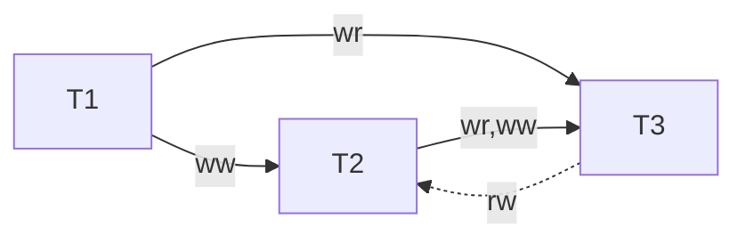

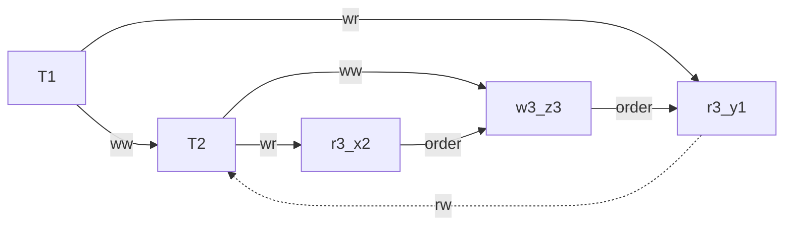

Since the lock-monotonicity property is defined from the perspective of a particular transaction $T_i$ as it executes, we define PL-2L with respect to $T_i$. Isolation Level PL-2L for transaction $T_i$ is defined such that phenomena G1 and G-monotonic are disallowed:

**G-monotonic: Monotonic Reads.** A history $H$ exhibits phenomenon G-monotonic for transaction $T_i$ if there exists a cycle in $\operatorname{USG}(H,T_i)$ containing **exactly one anti-dependency edge from a read node** $r_i(x_j)$ (or $r_i(P:x_j,\ldots)$) to some transaction node $T_k$ (and any number of order or dependency edges).

Disallowing phenomenon G-monotonic is identical to the lock-monotonicity property given above and their equivalence can be proved in a way similar to Theorem 2+ where we showed that the no-depend-misses condition and disallowing G-single are identical.

Since PL-2L is weaker than PL-2+, it's easy to find a history that breaks G-single but doesn't break G-monotonic. Indeed, by merely changing the sequence of $r_3(y_1)$ and $r_3(x_2)$ in $H_{non-2L}$, the resulting history $H_{non-2L}^\prime$ will not breach G-monotonic, yet it will still breach G-single.

\begin{align*}
H_{non-2L}^\prime: w_1(x_1) &\\
                   w_1(y_1) &\\
                   c_1      &\\
                   w_2(y_2) &\\
                   w_2(x_2) &\\
                   w_2(z_2) &\\
                   r_3(y_1) &\\
                   w_3(z_3) &\\
                   r_3(x_2) &\\
                   c_2      &\\
                   c_3      &\\
[x_1 \ll x_2, y_1 \ll y_2, z_2 \ll z_3]
\end{align*}

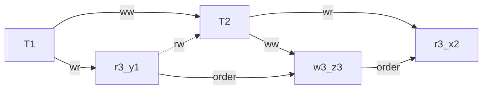

#### Consistency Guarantees for Predicate-based Reads at PL-2L

To enhance the guarantees for predicate-based reads in PL-2, the author suggests introducing two phenomenons, G1-predA and G1-predB. By disallowing G1-predA, indivisibility is ensured with respect to any predicate-based write. Similarly, disallowing G1-predB guarantees indivisibility with respect to all transaction writes of a transaction. The following consistency guarantees can also be provided to such reads:

+ If a predicate-based read observes the effects of transaction $T_i$, it observes the complete effects of $T_i$ and all transactions that $T_i$ depends on. This guarantee is provided by level PL-2L because of the following reason.
  + When a transaction $T_i$ performs a read based on a predicate $P$, we represent this read event, $r_i(P:\operatorname{Vset}(P))$, in $\operatorname{USG}(H,T_i)$ by a single read node; this node captures conflicts with respect to all object versions accessed by $r_i(P:\operatorname{Vset}(P))$. Since G-monotonic ensures that there is no single anti-dependency cycle originating from $r_i(P:\operatorname{Vset}(P))$, PL-2L ensures that this event does not miss the effects of some transaction $T_j$ that it depends on, i.e., $r_i(P:\operatorname{Vset}(P))$ observes a consistent view of the database (assuming that transactions modify the database consistently).
  + In the extreme case, when transaction $T_i$ contains only one action, the whole transaction observes a consistent database state, i.e., we get isolation level PL-2+.
  + Isolation level PL-2+ provides stronger guarantees for normal and predicate-based reads; it ensures that if a read by transaction $T_j$ observes $T_i$'s effects, **all** reads by $T_j$ observe the complete effects of $T_i$ and all transactions that $T_i$ depends on.
+ Each predicate-based read executes as a PL-3 transaction. While this guarantee is not provided by PL-2L by default, it can be achieved by treating each predicate-based read as a sub-transaction that requires PL-3. For a more in-depth understanding and details on this approach, refer to the original paper.
+ We can also provide guarantees to predicate-based writes such that the version set of such operations is consistent. For this purpose, we can treat predicate-based writes as predicate-based reads and add the corresponding edges in the USG for these operations, e.g., if transaction $T_i$ performs $w_i(P:\operatorname{Vset}(P))$ and $\operatorname{Vset}(P)$ contains $x_j$, we can treat $w_i(P:\operatorname{Vset}(P))$ as a predicate-based read, $r_i(P:\operatorname{Vset}(P))$, and add a read-dependency edge from $T_j$ to $r_i(P:\operatorname{Vset}(P))$ in the USG.

### Snapshot Isolation

Snapshot Isolation was first defined in [A Critique of ANSI SQL Isolation Levels, by Hal Berenson, Phil Bernstein, Jim Gray, Jim Melton, Elizabeth O'Neil and Patrick O'Neil](https://www.microsoft.com/en-us/research/wp-content/uploads/2016/02/tr-95-51.pdf), but the definition in is both informal and operational: it comes very close to describing how an implementation would work.

**Snapshot Isolation.** A transaction $T_1$ executing with Snapshot Isolation always reads data from a **snapshot** of committed data valid as of the (logical) time $T_1$ started, called the start-timestamp. (The snapshot could be at the time when $T_1$ started or some point in logical time before it.) Updates of other transactions active after $T_1$ started are not visible to $T_1$. When $T_1$ is ready to commit, it is assigned a commit-timestamp and allowed to commit if no other concurrent transaction $T_2$ (i.e., one whose active period (start-timestamp, commit-timestamp) overlaps with that of $T_1$) has already written data that $T_1$ intends to write; this is called the First-committer-wins rule to prevent lost updates.

Snapshot isolation offers several key features:

+ Snapshot isolation ensures that the objects read by a transaction represent a consistent state of the data at some point in time before the transaction began.
+ First-committer-wins.
+ Imagine a two-dimensional table with time on the x-axis and objects on the y-axis. Suppose a committed transaction has an active period of t1, t2, and t3, and writes to objects x and y. This results in marking the points (t1, x), (t1, y), (t2, x), ..., (t3, y) black on the table. Snapshot isolation guarantees that no point will be marked black twice. I refer to this principle as the "**no-time-objects conflicts**" rule.

#### Specification

**Time-Precedes Order.** The time-precedes order, $\prec_t$, is a partial order specified for history $H$ such that:

+ $s_i \prec_t c_i$, i.e., the start point of a transaction precedes its commit point.
+ for all $i$ and $j$, if the scheduler chooses $T_j$'s start point after $T_i$'s commit point, we have $c_i \prec_t s_j$; otherwise, we have $s_j \prec_t c_i$.

**Concurrent Transactions.** Two transactions $T_i$ and $T_j$ are concurrent if $s_i \prec_t c_j$ and $s_j \prec_t c_i$. Thus, concurrent transactions overlap; neither starts after the other one commits.

To capture the system's choice of ordering start and commit events of different transactions, we include the time-precedes order in a history (along with the version order and the partial order of events). For convenience, in our examples we will **only** show time-precedes constraints of the type $c_i \prec_t s_j$; **no relationship is shown for a pair of concurrent transactions** $T_a$ and $T_b$, i.e., $s_a \prec_t c_b$ and $s_b \prec_t c_a$ holds for these cases. Please notice an important point: the order of events in the history does not specify the relationship between commit and start points of transactions.

**Start-Depends.** $T_j$ start-depends on $T_i$ if $c_i \prec_t s_j$, i.e., if it starts after Ti commits.

**Start-ordered Serialization Graph or SSG.** For a history $H$, $\operatorname{SSG}(H)$ contains the same nodes and edges as $\operatorname{DSG}(H)$ along with start-dependency edges.

Level PL-SI proscribes G1 and G-SI, and property G-SI consists of G-SIa and G-SIb:

+ **G-SIa: Interference.** A history $H$ exhibits phenomenon G-SIa if $\operatorname{SSG}(H)$ contains a read/write-dependency edge from $T_i$ to $T_j$ **without** there also being a start-dependency edge from $T_i$ to $T_j$.
+ **G-SIb: Missed Effects.** A history $H$ exhibits phenomenon G-SIb if $\operatorname{SSG}(H)$ contains a directed cycle with **exactly one anti-dependency edge**. G-SIb is similar to condition G-single but provides stronger guarantees because of the extra start-dependency edges in the SSG.

We now show that our specification for level PL-SI is correct. A history $H$ consisting of committed transactions executes under Snapshot Isolation iff G1 and G-SI are disallowed.

+ First, we can formally redefine Snapshot Isolation using two distinct properties, Snapshot Read and Snapshot Write. These properties, when combined, provide a complete definition of Snapshot Isolation.
  + **Snapshot Write.** If $T_i$ and $T_j$ are concurrent, they cannot both modify the same object. That is, if $w_i(x_i)$ and $w_j(x_j)$ both occur in history $H$, then either $c_i \prec_t s_j$ or $c_j \prec_t s_i$. This is the first-committer-wins property.
  + **Snapshot Read.** All reads performed by a transaction $T_i$ That is, if $r_i(x_j)$ occurs in history $H$, then:
    + (1) $c_j \prec_t s_i$, and
    + (2) if $w_k(x_k)$ also occurs in $H(j \neq k)$, then either
      + (2a) $s_i \prec_t c_k$, or
      + (2b) $c_k \prec_t s_i$ and $x_k \ll x_j$
    + My understanding of snapshot reads is that transaction $T_i$ always reads the latest committed state of the database at a slightly earlier time, $s_i - \delta$. Here, $\delta$ represents an extremely short duration that can often be disregarded, as it is typically less than 1 nanosecond.
+ Next, we prove that if G1 and G-SI are disallowed for history $H$, $H$ must have executed under Snapshot Isolation.
  + Suppose Snapshot Write is not satisfied. Then $H$ contains two concurrent transactions $T_i$ and $T_j$ such that one of them, say $T_i$, overwrites $T_j$'s modification of some object $x$. This implies that a write-dependency edge exists from $T_j$ to $T_i$, but no start-dependency edge, which violates G-SIa. Therefore, the Snapshot Write property is satisfied.
  + Now suppose that the Snapshot Read property is violated.
    + Property G-SIa guarantees that a transaction can only observe modifications of transactions that committed before it started, this handles properties (1) and (2a) of Snapshot Read.
    + Now we consider the other part of Snapshot Read concerning missed updates (Snapshot Read 2b). Suppose transaction $T_i$ reads $x$ but does not observe the updates to $x$ made by transactions that committed before $T_i$ started; assume $T_k$ made the first of these updates. This means that there exists an anti-dependency edge from $T_i$ to $T_k$. Furthermore, since $c_k \prec_t s_i$, there exists a start-dependency edge from $T_k$ to $T_i$. Therefore, phenomenon G-SIb exists in the history, which is a contradiction.
+ Lastly, we prove that if a history $H$ executes under Snapshot Isolation, G1 and G-SI are disallowed.
  + It is straightforward to determine that both G1a and G1b are disallowed.
  + Suppose G-SIa is allowed, i.e., there is a read/write-dependency from some $T_i$ to $T_j$ without a corresponding start-dependency. If there is no start-dependency, $T_i$ and $T_j$ must be concurrent and neither a read-dependency (by Snapshot Read property) nor a write-dependency (by Snapshot Write property) can exist between $T_i$ and $T_j$. So we have a contradiction and G-SIa must be disallowed.
  + Suppose G1c is allowed, then $\operatorname{SSG}(H)$ contains a cycle with 0 anti-dependency edges. Let this cycle have the form $\langle T_1, T_2, T_3, \ldots, T_n, T_1\rangle$. Under PL-SI, if there is a dependency edge (i.e., start/read/write-dependency) from $T_i$ to $T_{i+1}$, we must have $c_i \prec_t s_{i+1} \prec_t c_{i+1}$ and hence $c_i \prec_t c_{i+1}$. Thus, we get $c_1 \prec_t c_2 \prec_t \ldots \prec_t c_1$, which is impossible, and therefore G1c is disallowed.
  + Suppose G-SIb is allowed, i.e., there is a cycle with exactly one anti-dependency edge. Let this cycle have the form $\langle T_1, T_2, T_3, \ldots, T_n, T_1\rangle$. Without loss of generality, suppose this edge is from $T_1$ to $T_2$ and the rest are dependency edges. Then we have: $s_1 \prec_t c_2 \prec_t c_3 \prec_t \ldots \prec_t c_n \prec_t s_1$, i.e., $s_1 \prec_t s_1$, which again is impossible, and therefore G-SIb is disallowed.
    + Under PL-SI, if there is an anti-dependency edge from $T_i$ to $T_j$, then $s_i \prec_t c_j$. This is because an anti-dependency edge implies that $T_i$ did not see $T_j$'s update. Therefore, we cannot have $c_j \prec_t s_i$. By property (2) of **Time-Precedes Order**, we must have $s_i \prec_t c_j$.
    + Under PL-SI, if there is a dependency edge (i.e., start/read/write-dependency) from $T_i$ to $T_{i+1}$, we must have $c_i \prec_t s_{i+1} \prec_t c_{i+1}$.

#### Discussion

Snapshot Isolation is incomparable with PL-3. It both accepts some non-serializable histories, and rejects certain serializable histories.

+ Snapshot Isolation accepts some non-serializable histories.
+ Snapshot Isolation rejects certain serializable histories:
  + Some serializable histories are rejected because of the Snapshot Write property. This property was introduced to rule out lost updates; however, it also prevents blind writes by concurrent transactions. (Recall that a blind write occurs when a transaction modifies an object without first reading it.) For example, $H_{blind-nonSI}$ is not permitted by Snapshot Isolation (phenomenon G-SIa occurs) but is allowed by PL-3.
  + The Snapshot Read property also rules out certain serializable histories. It prohibits a transaction $T_j$ from reading a modification made by a transaction $T_i$ that committed after the start point chosen for $T_j$ or from missing updates of transactions that committed before $T_j$'s start point. $H_{serial-nonSI}$ is an example, it is serializable in the order $T_0, T_2, T_1$ but Snapshot Isolation disallows it since $T_2$ misses $T_1$'s updates even though $c_1 \prec_t s_2$.
    + Note that the system could have chosen a different time-precedes order (e.g., in consonance with the serial order) and allowed the above history. This is similar to the case with version orders where the database system could choose a version order that allows a history to be serializable.
  + **Real Time Guarantees.** The definition of Snapshot Isolation has a notion of logical time that we have captured with the time-precedes order. If this ordering is consistent with real-time, an application can be provided useful guarantees that are not provided by PL-2+ or even PL-3.

\begin{align*}
H_{blind-nonSI}: r_1(x_0) &\\
                 r_2(x_0) &\\
                 w_1(z_1) &\\
                 w_2(z_2) &\\
                 c_1      &\\
                 c_2      &\\
[z_1 \ll z_2; c_0 \prec_t s_1, c_0 \prec_t s_2]
\end{align*}

\begin{align*}
H_{serial-nonSI}: w_1(x_1) &\\
                  c_1      &\\
                  r_2(x_0) &\\
                  c_2      &\\
[x_0 \ll x_1; c_0 \prec_t s_1, c_1 \prec_t s_2]
\end{align*}

### Forward Consistent View

We define an isolation level called Forward Consistent View or PL-FCV by precluding G1 and G-SIb. PL-FCV is strictly stronger than PL-2+ because G-SIb is strictly stronger than G-single.

In the opening of the section titled "Specifications for Intermediate Isolation Levels," the author presents a graph called "A Partial Order to Relate Various Isolation Levels." According to this graph, PL-FCV is considered weaker than PL-3, implying that all histories allowed by PL-3 should also be permitted by PL-FCV. However, I believe the author's assertion is incorrect. I identified a specific history that is permitted by PL-3 but not by PL-FCV, which contradicts the author's claim.

\begin{align*}
H_{FCV-nonSer}: w_0(x_0) &\\
                c_0      &\\
                w_1(x_1) &\\
                c_1      &\\
                r_2(x_0) &\\
                c_2      &\\
[x_0 \ll x_1; c_0 \prec_t s_1, c_0 \prec_t s_2, c_1 \prec_t s_2]
\end{align*}

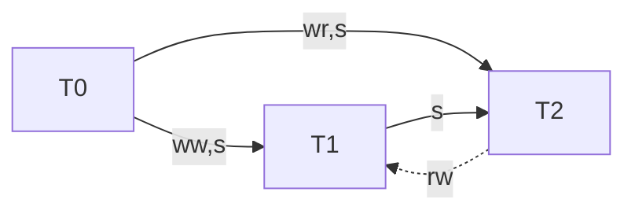

The history $H_{FCV-nonSer}$ can be serialized as $T_0, T_2, T_1$, yet it is not permitted by PL-FCV. The reason for this disallowance is related to "time": $T_2$ reads a stale version of object $x$, specifically $x_0$.

### Monotonic Snapshot Reads

### Cursor Stability

### Update Serializability

In this section, we present an isolation level, PL-3U, for **read-only transactions** that is stronger than PL-2+ but weaker than serializability.

#### Specification

**No-update-conflict-misses.** If $T_i$ depends on $T_j$, it must not miss the effects of $T_j$ and all update transactions that $T_j$ **depends or anti-depends on**. Note that the no-update-conflict-misses condition imposes stronger constraints than the no-depend-misses condition since it takes anti-dependencies into account as well. The no-update-conflict-misses condition is sufficient to ensure PL-3U for a transaction $T_i$ ($T_i$ could be a read-only transaction).

**G-update: Single Anti-Dependency Cycles with Update Transactions.** A history $H$ and transaction $T_i$ show phenomenon G-update if a DSG containing all update transactions of $H$ and transaction $T_i$ contains a cycle with **1 or more** anti-dependency edges.

A transaction $T_i$ is provided PL-3U if phenomena G1 and G-update are disallowed; we can prove the equivalence of G-update and the no-update-conflict-misses using an argument similar to the one presented for Theorem 2+.

#### Differentiating Between Levels PL-2+ and PL-3U

PL-2+ ensures that a transaction observes a **consistent** state of the database and PL-3U states that the transaction observes a **serializable** state of the database.

+ In the section "Why G-single Emphasizes Exactly One Anti-dependency Edge", I mention $H_{anti-dependency-edges}$. $T_1$ is the exactly one read transaction that commits at PL-2+ in the history. Even though the final state $x_0, y_3$ reached by serially executing a specific subset of transactions from $H_{anti-dependency-edges}$ and read by $T_1$ is not serializable, it is consistent.
+ $H_{non-3U}$ is another history that can distinguish between PL-2+ and PL-3U. $H_{non-3U}$ depicts what occurred in a stock reporting system. We know that stock prices will not change after the stock market has closed. We assume that there is an object called $\text{Market-status}$ that indicates whether the market is open or not. Suppose there are companies $X$ and $Y$ whose stock prices are always the same. Transactions $T_1$ and $T_2$ check that the market is open and update the stock prices to be 50 and 55 respectively and transaction $T_3$ closes the market. Suppose that a read-only transaction $T_q$ reads the stock market status and the stock prices of $X$ and $Y$. PL-2+ guarantees that $T_q$ will see the same prices for $X$ and $Y$, e.g., the two observed values will be 50 or both will be 55. However, with PL-2+, it is possible that $T_q$ observes the stock market to be closed and reads the stock prices to be 50, i.e., it observes T3's updates but misses the effects of transaction $T_2$ that $T_3$ anti-depends on; this is what happens in history $H_{non-3U}$.

\begin{align*}
H_{non-3U}: r_1(M_0,Open)   &\\
            w_1(X_1,50)     &\\
            w_1(Y_1,50)     &\\
            c_1             &\\
            r_2(M_0,Open)   &\\
            w_2(X_2,55)     &\\
            w_2(Y_2,55)     &\\
            c_2             &\\
            w_3(M_3,Closed) &\\
            c_3             &\\
            r_q(M_3,Closed) &\\
            r_q(X_1,50)     &\\
            r_q(Y_1,50)     &\\
            c_q             &\\
[M_0 \ll M_3, X_1 \ll X_2, Y_1 \ll Y_2]
\end{align*}

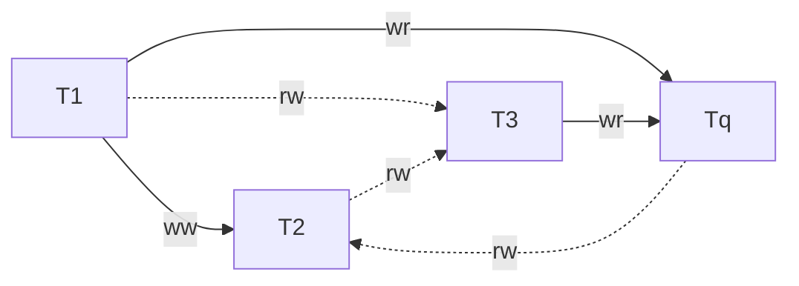

#### Differentiating Between Levels PL-3U and PL-3

Consider a variation on the above stock-market example that shows a history that executes at PL-3U but not at PL-3. Notice that we are no longer maintaining the invariant that the stock prices of $X$ and $Y$ are the same.

\begin{align*}
H_{3U}: r_1(M_0,Open) &\\
        w_1(X_1,50)   &\\
        w_1(Y_1,50)   &\\
        c_1           &\\
        r_4(M_0,Open) &\\
        w_4(X_4,70)   &\\
        c_4           &\\
        r_5(M_0,Open) &\\
        w_5(Y_5,75)   &\\
        c_5           &\\
        r_a(X_4,70)   &\\
        r_a(Y_1,50)   &\\
        c_a           &\\
        r_b(X_1,50)   &\\
        r_b(Y_5,75)   &\\
        c_b           &\\
[X_1 \ll X_4, Y_1 \ll Y_5]
\end{align*}

Transaction $T_a$ observes the updates of $T_1$ and $T_4$ but misses $T_5$'s effects. Transaction $T_b$ reads the updates of $T_1$ and $T_5$ but misses $T_4$'s effects. Thus, each read-only transaction "forces" transactions $T_4$ and $T_5$ to be serialized in the opposite order to what the other transaction requires: transaction $T_a$ forces the serialization order $\langle T_1, T_4, T_a, T_5\rangle$ whereas $T_b$ forces an order where $T_5$ must be serialized before $T_4$, e.g., $\langle T_1, T_5, T_b , T_4\rangle$.

The DSG of history $H_{3U}$ is shown below (for simplicity, we do not show $T_1$):

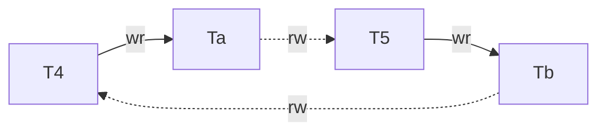

The DSG contains a cycle but if we remove either $T_a$ or $T_b$ from the graph, the cycle no longer exists. Thus, each read-only transaction is at level PL-3U but the whole system is not serializable. If clients/entities that execute $T_a$ and $T_b$ communicate with each other, they may be confused about the relative order in which the stock prices went up. Thus, this departure from serializability matters only when clients of read-only transactions communicate with each other directly; otherwise, PL-3U is as good as serializability.

### Intermediate Degrees for Running Transactions

**E-single: Single Anti-dependency Cycles at Runtime.** A history $H$ and an executing transaction $T_i$ exhibit phenomenon E-single if $\operatorname{DTG}(H,T_i)$ contains a directed cycle involving $T_i$ with exactly one anti-dependency edge.

**E-monotonic: Monotonic Reads at Runtime.** A history $H$ and an executing transaction $T_i$ exhibit phenomenon E-monotonic if there is a cycle in $\operatorname{USG}(H,T_i)$ containing exactly one anti-dependency edge from a read node $r_i(x_j)$ (or $r_i(P:x_j,\ldots)$) to some transaction node $T_k$ (and any number of order or dependency edges).

In a similar manner, other levels such EPL-SI, EPL-FCV, EPL-CS, EPL-MSR and EPL-3U can be defined by extending the relevant graph and phenomena conditions.

## Optimistic Implementations for Client-Server Systems

Our schemes have been designed for a system where database objects may be **distributed over multiple servers and clients** may cache some of the objects on their machines for better performance.

Further reading materials:

+ CLOCC, Clock-based Lazy Optimistic Concurrency Control: Work well for environments where all operations are executed by clients.
  + [A. Adya. Transaction Management for Mobile Objects Using Optimistic Concurrency Control. Master’s thesis, Massachusetts Institute of Technology, Jan. 1994.](https://citeseerx.ist.psu.edu/doc/10.1.1.72.8778)
  + [A. Adya, R. Gruber, B. Liskov, and U. Maheshwari. Efficient Optimistic Concurrency Control using Loosely Synchronized Clocks](https://users.cs.utah.edu/~stutsman/cs6963/public/papers/thor.pdf)
  + [R. Gruber. Optimism vs. Locking: A Study of Concurrency Control for Client-Server Object-Oriented Databases](https://dspace.mit.edu/handle/1721.1/10762)
+ Weak-CLOCC: Our optimistic mechanism for providing PL-2.
+ AACC, Asynchronous Avoidance-based Cache Consistency: Outperform in environments where servers may perform part of the work.
+ Mechanisms perform well in workloads where there are hotspots.
  + Field calls, [A. Reuter. Concurrency on High-Traffic Data Elements](https://dl.acm.org/doi/pdf/10.1145/588111.588126).
  + Escrow reads, [P. O'Neil. The Escrow Transactional Method](https://www.cs.umb.edu/~poneil/EscrowTM.pdf)

### Serializability for Committed Transactions: CLOCC

I aim to connect Adya's CLOCC mechanism and theoretical isolation levels framework to gain a better understanding of CLOCC and the spectrum of isolation levels in this section.

+ The master's thesis "Transaction Management for Mobile Objects Using Optimistic Concurrency Control" by Atul Adya introduces CLOCC, an optimistic concurrency control mechanism that ensures serializability.
+ Adya's PhD dissertation "Weak Consistency: A Generalized Theory and Optimistic Implementations for Distributed Transactions" presents a theoretical framework for defining isolation levels.
+ However, these two works do not seem to have been connected well in subsequent literature.

#### The Two-Phase Commit Protocol in Thor


+ When an application commits a transaction $T$, the frontend sends the following information to the coordinator server:
  + Read Object Set or ROS - Set of objects read by $T$.
  + Modified Object Set or MOS - Set of objects modified by $T$.
+ The coordinator assigns a globally unique timestamp to $T$ and initiates the 2-phase commit protocol.
  + In the first phase of the 2-phase commit protocol, the coordinator sends prepare messages to all participants. Each participant runs a serializability check and sends its vote to the coordinator. If the coordinator receives a yes vote from all participants, it decides to commit the transaction; otherwise, it aborts the transaction. It informs the frontend about the decision and the latter conveys the transaction's commit result to the application.
    + Phase 1 includes two log updates to stable storage, but the optimizations suggested by Stamos can reduce this to a single log update.
  + As part of the second phase, the coordinator informs the participants about the transaction's commit result. Each participant logs the coordinator's decision and sends an acknowledgement to the coordinator.
  + As an optimization, each participant sends invalidation messages to frontends that have cached objects modified by this transaction; these messages ask frontends to flush old copies of the modified objects from their cache. If the currently executing transaction at a frontend has read any of the objects, it is aborted. Thus, invalidation messages prevent transactions from doing wasted work.
+ To make the protocol resilient to crashes, each participant must log a prepare record on stable storage before sending its vote to the coordinator. It must also log a commit record on stable storage before sending its acknowledgement message to the coordinator. Similarly, the coordinator needs to log a commit record before informing the application about the commit/abort decision.
+ Note that the frontend waits only while the first phase of the protocol is being executed. Thus, this phase of the commit protocol is said to have executed in the foreground. The second phase proceeds in the background, i.e., the application does not wait for this phase to be completed.
+ The messages and log forces involved in committing a transaction are shown above. Numbers indicate the order of messages, i.e., message $i$ precedes message $i+1$. Messages with the same numbers can be sent in parallel. A force to the backup has a superscript $i/j$ indicating that it is done after receiving message $i$ but before sending message $j$.

#### A Theorem for ROS and MOS Tests

In a distributed system, transactions that have accessed objects at multiple servers must be **serialized in the same order** at all servers, although this order may not necessarily align with the real-world sequence of events. In CLOCC, transactions are serialized in timestamp order where timestamps are taken from real clocks. When a client wants to commit transaction $T$, it assigns a timestamp $\operatorname{ts}(T)$ that contains the client's local clock value augmented with the client's identity to make it globally unique. The timestamp of each committed transaction $T$ can be viewed as the time when $T$ executed in an equivalent serial schedule $H$. That is, if $T$ had been executed at time $\operatorname{ts}(T)$ (instantaneously), it would have read the same values as it did while running concurrently with other transactions. The timestamp is **a predictor of the commit order** for validating transactions.

+ We assume that clocks are loosely synchronized, i.e., clocks at different nodes in the network may differ by at most a small skew (say, a few tens of milliseconds). In CLOCC, loose synchronization is needed only for performance reasons and not for correctness.
+ We assume that server clocks never run backwards, and advance rapidly enough that each transaction can be assigned a distinct timestamp; these assumptions are easy to guarantee.

The start-depends conflict from Snapshot Isolation can help in understanding Read Object Set (ROS) and Modified Object Set (MOS) tests more effectively. This is particularly useful when utilizing the Start-ordered Serialization Graph. If the timestamp of transaction $T_i$ is less than the timestamp of transaction $T_j$ ($\operatorname{ts}(T_i) < \operatorname{ts}(T_j)$), then we draw a Start-Depends edge from $T_i$ to $T_j$, denoted as $T_i \stackrel{s}{\longrightarrow} T_j$.

The TM maintains sufficient validation information about prepared and committed transactions by keeping the complete history of committed and prepared transactions sorted by timestamp order. For each prepared or committed transaction $S$, it keeps an entry in the history list with the following attributes - $\operatorname{MOS}(S)$, $\operatorname{ROS}(S)$, $\operatorname{ts}(S)$ and a boolean that indicates whether $S$ is prepared or committed. When transaction $T$ reads object $x$, a tuple of the form $\langle x, \text{install_ts}\rangle$ is inserted in $\operatorname{ROS}(T)$; $\text{install_ts}$ is the timestamp of the transaction that has installed the version of $x$ read by $T$. When $T$ modifies $x$, a tuple of the form $\langle x, \text{newval}\rangle$ is added to $\operatorname{MOS}(T)$ where $\text{newval}$ is the modified value of $x$.


Suppose transaction $T$ reaches the server for validation such that $\operatorname{ts}(S_i) < \operatorname{ts}(T) < \operatorname{ts}(S_j)$. Notice that every transaction in the transaction history must be validated against $T$, not only adjacent transactions.

+ To simplify our algorithm, we arrange the read set to always contain the write set (no blind writes), i.e., if a transaction modifies an object but does not read it, the client enters the object in the read set anyway. As a result, we don't need to consider Direct Write-Depends, since accounting for Direct Read-Depends achieves the same effect when determining whether any cycles exist in the SSG. Thus, we need not consider the following four conflicts:
  + $S_i \stackrel{ww}{\longrightarrow} T$
  + $T \stackrel{ww}{\longrightarrow} S_i$
  + $T \stackrel{ww}{\longrightarrow} S_j$
  + $S_j \stackrel{ww}{\longrightarrow} T$
+ The following three conflicts are valid because they have the same directions as the start-dependence conflicts in the SSG.
  + $S_i \stackrel{wr}{\longrightarrow} T$
    + However, if transaction $S_i$ is prepared but not yet committed, transaction $T$ should not read versions of objects written by $S_i$. If $T$ reads versions of objects written by $S_i$ before $S_i$ commits, it would constitute a dirty read if the coordinator ultimately aborts $S_i$.
  + $S_i \stackrel{rw}{\longrightarrow} T$
  + $T \stackrel{rw}{\longrightarrow} S_j$
+ Since $S_i$ is prepared/committed, it could not have observed $T$'s updates (there are no dirty reads in CLOCC). In simpler terms, $T \stackrel{wr}{\longrightarrow} S_i$ is not possible. Similarly, $T \stackrel{wr}{\longrightarrow} S_j$ is not possible.
+ (1\) **ROS test.** This test validates the objects that have been read by $T$. Let $S_k$ be the transaction from which $T$ has read $x$, i.e., $\operatorname{ts}(S_k)$ is equal to the value of $\text{install_ts}$ in $x$'s ROS tuple.
  + (1a\) If $\operatorname{ts}(S_k) < \operatorname{ts}(S_i)$, then the transaction manager (TM) verifies that $S_i$ has not modified $x$. This rule disables $T \stackrel{rw}{\longrightarrow} S_i$.
  + (1b\) Furthermore, the TM also verifies that $\operatorname{ts}(T)$ is greater than $\operatorname{ts}(S_k)$. This rule disables $S_j \stackrel{wr}{\longrightarrow} T$.
+ (2\) **MOS test**. The TM validates $\operatorname{MOS}(T)$ by verifying that $T$ has not modified any object $y$ that has been read by $S_j$. This rule disables $S_j \stackrel{rw}{\longrightarrow} T$.

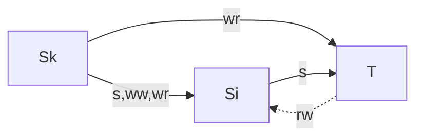

SSG when condition (1a) is violated.

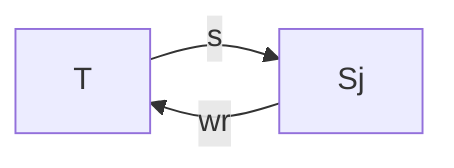

SSG when condition (1b) is violated.

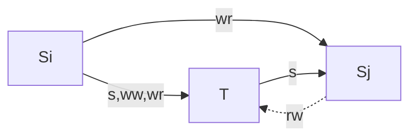

SSG when condition (2) is violated.

#### Improvements to CLOCC to Truncate the Transaction History

The last section described the validation scheme at an abstract level without considering the space or logging requirements. To cut down on space requirements, the TM needs some way of truncating the transaction history while maintaining sufficient validation information about prepared and committed transactions. **Once a transaction has committed**, its modifications are installed at the relevant servers. At this point, its entry can be deleted from the history list.

##### Validation Against Prepared Transactions

The transaction manager validates incoming transaction $T$ against the set of prepared transactions; this is called the Validation Queue Check (VQ-check).

Since there are no dirty reads in CLOCC, then transaction $T$ will not read any versions written by prepared (but not committed) transactions. Therefore, if there is a prepared transaction $S_i$ such that $\operatorname{ts}(S_i) < \operatorname{ts}(T)$ and $T$ read some objects modified by $S_i$, then there must be $T \stackrel{rw}{\longrightarrow} S_i$, which violates (1a) in the ROS test.

In conclusion, the TM performs the ROS test for $T$ against prepared transactions that have a timestamp value less than $\operatorname{ts}(T)$. To pass the ROS test, $T$ should not have read any object being modified by such a transaction.

Similarly, prepared transactions will not read any version written by $T$. Therefore, if there is a transaction $S_j$ such that $\operatorname{ts}(T) < \operatorname{ts}(S_j)$ and $S_j$ read some objects modified by $T$, then there must be $S_j \stackrel{rw}{\longrightarrow} T$, which violates (2) in the MOS test.

In conclusion, to pass the MOS test, $T$ should not modify any object that has been read by a prepared transaction whose timestamp is greater than $\operatorname{ts}(T)$.

1. ROS test: If $\operatorname{ts}(S) < \operatorname{ts}(T)$, then $\operatorname{MOS}(S) \cap \operatorname{ROS}(T) = \phi$.
2. MOS test: If $\operatorname{ts}(S) > \operatorname{ts}(T)$, then $\operatorname{ROS}(S) \cap \operatorname{MOS}(T) = \phi$.

##### Validating the ROS Against Committed Transactions

Once a transaction has committed, its modifications are installed at the relevant servers. At this point, **its entry can be deleted from the history list**. The TM captures the ROS and MOS information of committed transactions by maintaining two attributes for each object - rstamp and version. The version field of object $x$ stores the timestamp of the transaction that has installed $x$'s current base version.

The version field of object $x$ truncates modification history of $x$. It only maintains the timestamp of the transaction that has installed x's current base version. As a result, the TM does not have information about older versions of $x$; it must abort any incoming transaction that has read an older version of $x$.

For example, there is no difference between $H_1: w_1(x_1) c_1 w_5 (x_5) c_5$ and $H_2: w_1(x_1) c_1 w_3(x_3) c_3 w_5(x_5) c_5$ when $T_4: r_4(x_1) c_4$ reaches the server in the TM's sight. This is because the version fields in the two histories of $x$ are both 5. While $T_4$ should be aborted in $H_2$ but not in $H_1$, the TM must abort $T_4$ in both $H_1$ and $H_2$.

We call the process to validate the ROS against committed transactions the "version check." The pseudocode for the version check is shown as follows:

```text
% Version Check
for each object x in ROS(T) do
  if ts(T) < base_version(x) or
     install_ts(x) != base_version(x)
    Abort T
```

To perform the version check, the TM first verifies that $T$ does not read any versions from truncated transactions (otherwise the TM does not know if it is safe to commit $T$). Then, it verifies that an incoming transaction $T$ has read the current base version (which is also the latest version of committed transactions) of each object $x$ in $\operatorname{ROS}(T)$.

+ The TM aborts $T$ if `install_ts(x) < base_version(x)` because $T$ has not read the latest version of $x$. This means there exists $S_i$ such that `ts(Si) = base_version(x) < ts(T)` and $T \stackrel{rw}{\longrightarrow} S_i$, which violates ROS test (1a).
+ We use `install_ts(x) != base_version(x)` instead of `install_ts(x) >= base_version(x)` because:
  + $T$ will not read any versions from prepared but not yet committed transactions (there are no dirty reads in CLOCC).
  + `base_version(x)` is the latest version of x which is written by committed transactions.

##### Validating the MOS Against Committed Transactions

Once a transaction has committed, its modifications are installed at the relevant servers. At this point, **its entry can be deleted from the history list**. The TM captures the ROS and MOS information of committed transactions by maintaining two attributes for each object - rstamp and version. The rstamp attribute denotes the highest timestamp among committed transactions that have read that object.

The rstamp field of object $x$ truncates read history of $x$. As a result, the TM does not have information about older versions of $x$; it must abort any incoming transaction that has written an older version of $x$.

For example, there is no difference between $H_1: w_2(x_2) c_2 w_5(x_5) c_5 r_6(x_5) c_6$ and $H_2: w_2(x_2) c_2 r_4(x_2) c_4 w_5(x_5) c_5 r_6(x_5) c_6$ when $T_3: w_3(x_3) c_3$ reaches the server in the TM's sight. This is because the rstamp fields in the two histories of $x$ are both 5. While $T_3$ should be aborted in $H_2$ but not in $H_1$, the TM must abort $T_3$ in both $H_1$ and $H_2$.

We call the process to validate the MOS against committed transactions the "rstamp check." The pseudocode for the rstamp check is shown as follows:

```text
% Rstamp Check
for each object x in MOS(T) do
  if ts(T) <= rstamp(x)
    Abort T
```

+ The TM aborts $T$ if `ts(T) < rstamp(x)`. Without this check, histories like $H_2$ are possible, which violates MOS test (2).
+ Noticeably, the version of $x$ written by $T$ (which is equal to `ts(T)`) is greater than the rstamp of $x$.

#### Improvements to CLOCC to Reduce Space and Logging Overheads

##### Storing an upper bound on the read times of all objects

This bound is called the read watermark or $X_r$ for the server. Since the TM has lost the read information for each object, it must assume that all objects at the server were read at time $X_r$. Thus, to ensure that an update-at-site transaction $T$ does not invalidate a read operation of a committed transaction, the TM has to verify that $\operatorname{ts}(T)$ is greater than $X_r$. This test is called the Read-watermark Check.

However, lack of per-object information can cause spurious aborts. But we expect such aborts to be rare since loosely synchronized clocks are being used to generate timestamps; transactions reaching a server will usually have timestamp values greater than the read-watermark at that server.

##### Implementing the Version Field

Similar to the previous section, we propose using a single write-watermark $X_w$ to represent the versions of all objects and implement the Write-watermark Check.

However, it is important to note that the Version Check has two conditions: `ts(T) >= base_version(x)` and `install_ts(x) == base_version(x)`. If we simplify the second condition to `install_ts(x) == write_watermark`, then all write transactions would have to be executed sequentially.

Consider the following history $H: w_1(x_1) w_1(y_1) c_1$ and two transactions $T_3: r_3(x_1) w_3(x_3) c_3$ and $T_2: r_2(y_1) w_2(y_2) c_2$. Suppose $T_3$ and then $T_2$ arrive at the server in that order. After $T_3$ commits, $T_2$ begins processing but will abort because the write-watermark is now 3, and `install_ts(y)` is 2, which does not equal 3.

This approach would not optimistically achieve serializability. We still need a version field for each object even with the write-watermark approach, but we can use a shorter version field instead of a timestamp. Suppose that the local timestamp and server ID require $n$ and $d$ bits of storage respectively. Then, the version field has a space overhead of $n+d$ bits per object. Another way to implement this attribute is to use a $k$-bit counter where $k<n+d$, i.e., every object update causes the version field to increment by 1. The version field implemented using a counter is also referred to as the object's version number or vnum.

#### The Serial Validation Algorithm

The author is proposing two enhancements to the CLOCC database consistency method. Given this, I suggests that three tests (labeled 1a, 1b and 2) should be performed separately on committed transactions and prepared transactions. After performing the three tests on committed and prepared transactions separately, this results in six total test cases:

+ (1a-committed) The Write-watermark Check and the Version Check ensure that transaction $T$ will always read the latest versions installed by committed transactions.
+ (1b-committed) The Write-watermark Check ensures that $T$'s timestamp is later than all committed update transactions, so $\operatorname{ts}(T)$ is greater than $\operatorname{ts}(S_k)$ if $T$ reads versions of objects written by transaction $S_k$.
+ (2-committed) The Read-watermark Check ensures that transaction $T$'s timestamp is later than all committed transactions, so there does not exist any committed transaction $S_j$ whose timestamp is later than $T$ and $S_j \stackrel{rw}{\longrightarrow} T$ exists.
+ (1a-prepared) The ROS test against prepared transactions.
+ (1b-prepared) Transaction $T$ will not read any versions of objects written by prepared transactions because these versions have not yet been installed.
+ (2-prepared) The MOS test against prepared transactions.

```text
// T Enters Validation
Lock(VQ-lock)
  // Write-watermark Check
  if ts(T) < Xw
    Ask the coordinator to retry with a timestamp greater than Xw
  // Read-watermark Check
  if ts(T) < Xr and MOS(T) is not empty set
    // A non-read-only-at-site transaction has failed the read-watermark test.
    Ask the coordinator to retry with a timestamp greater than Xr
  // Version Check
  for each object x in ROS(T) do
    Read-lock(x)
      if vnum(x) != vnum(base(x))
        Abort T
    Unlock(x)
  // Validation Queue Check
    // ROS test
    if ts(S) < ts(T) and (MOS(S) and ROS(T) have at least one element in common)
      Abort T
    // MOS test
    if ts(S) > ts(T) and (MOS(T) and ROS(S) have at least one element in common)
      Ask the coordinator to raise T's timestamp
  // Validation Succeeded
  if MOS(T) is empty set
    Xr = max(Xr, T.ts)
  else
    // Add T to the VQ.
    insert_in_queue(VQ, T)
Unlock(VQ-lock)
```

#### Proposed Enhancements to CLOCC in the Current Thesis

##### Providing External Consistency

Suppose $S_j$ has a timestamp later than $T$. If $T$ has read an object that $S_j$ has modified, $T$ can still be serialized. However, as discussed in [A. Adya, R. Gruber, B. Liskov, and U. Maheshwari. Efficient Optimistic Concurrency Control using Loosely Synchronized Clocks](https://users.cs.utah.edu/~stutsman/cs6963/public/papers/thor.pdf), we abort $T$ in this case also to provide external consistency (so that transaction commit order as observed by clients is the same as the real time order).

External consistency: The serialization order is such that, if transaction $S$ committed before $T$ began (in real time), $S$ is ordered before $T$.

Since different transactions may be timestamped at different coordinators, and clocks are only loosely synchronized, a transaction $T$ that begins after some other transaction $S_j$ committed may actually receive a timestamp that is earlier than that of $S_j$ (although this situation is very unlikely). In this case, $T$ must not be committed if it read any object that $S_j$ modified, since that would violate external consistency.

The reader may wonder why transaction $T$ could commit if it did not read any object modified by transaction $S_j$ or modify any object read by $S_j$, even though $S_j$ has a later timestamp than $T$. In my understanding, this is because even if the server internally ordered $T$ before $S_j$ by timestamp order, contrary to the real-time order ($S_j$ before $T$), the clients could not conclusively prove this was the case. However, if $T$ read an older version of an object and $S_j$ modified a newer version of that same object, the clients could irrefutably prove the mistake. Since $T$ read the older version rather than the newer version written by $S_j$, the clients could conclusively prove the server ordered $T$ before $S_j$ incorrectly, despite $S_j$ executing earlier in real time.

To guarantee external consistency, the author specifies a more stringent validation test for transactions with later timestamps than the MOS condition proposed in [A. Adya. Transaction Management for Mobile Objects Using Optimistic Concurrency Control. Master’s thesis, Massachusetts Institute of Technology, Jan. 1994.](https://citeseerx.ist.psu.edu/doc/10.1.1.72.8778) The stricter test is:

```text
if ts(S) > ts(T) and
  ((MOS(T) and ROS(S) have at least one element in common) or
   (ROS(T) and MOS(S) have at least one element in common))
```

##### Other Enhancements

The author also suggests some enhancements for CLOCC, such as implementing version checks without relying on version numbers and incorporating watermark checks as an additional improvement.

### Mechanisms for Isolation Level PL-2

We implement a variant of CLOCC, called Weak-CLOCC, to achieve PL-2 isolation. The serial validation algorithm of Weak-CLOCC is similar to CLOCC's, except that Weak-CLOCC simply considers a PL-2 transaction's read set to be empty for validation checks.

Since PL-2 isolation prohibits Aborted Reads (G1a), Intermediate Reads (G1b), and Circular Information Flow (G1c), Weak-CLOCC does not consider anti-dependency edges when validating transactions. Therefore, Weak-CLOCC skips (1a) which disable $T \stackrel{rw}{\longrightarrow} S_i$ and (2) which disable $S_j \stackrel{rw}{\longrightarrow} T$, as described in the "Theorem for ROS and MOS Tests" section. Thus, Weak-CLOCC skips (1a-committed) (2-committed) (1a-prepared) (2-prepared), as described in the "Serial Validation Algorithm" section. As a result, Weak-CLOCC does not perform the Version Check, the Read-watermark Check, the ROS test and the MOS test, only performs the Write-watermark Check. Therefore, Weak-CLOCC's validation algorithm equals PL-3's if it considers transactions' read sets to be empty.

### Multistamp-Based Mechanism for PL-2+ and EPL-2+

[A. Adya and B. Liskov. Lazy Consistency Using Loosely Synchronized Clocks. In Proceedings of the ACM Symposium on Principles of Distributed Computing, pages 73–82, Santa Barbara, CA, Aug. 1997.](https://dl.acm.org/doi/pdf/10.1145/259380.259425) provides a more detailed description of the multistamp-based mechanism. There are several key points to note that will aid our understanding of the multistamp-based mechanism:

+ In the section "Serializability for Committed Transactions: CLOCC", the author mentions that a transaction $T$ is assigned a timestamp by the client, and this timestamp is the same across all servers. This implies that transactions are serialized in the same order at all servers. However, in this section, each server assigns a different timestamp to incoming transactions based on its own clock. Therefore, there is no global order of transactions across servers. Consequently, we cannot use the start-depends conflict relation and the Start-ordered Serialization Graph any longer.
+ We assume that server clocks monotonically increase and advance sufficiently quickly to assign each transaction a unique timestamp. Therefore, the timestamp order of transactions corresponds to their arrival order at a given server (though the arrival order may differ across servers).
+ The author has proven that disallowing G-single schedules is equivalent to enforcing the no-depend-misses property. Unlike the use of direct serialization graphs (DSG) and start-ordered serialization graphs (SSG) to guide the implementation of serializability for committed transactions, we would not use them to implement PL-2+. Instead, we would use the no-depend-misses property to guide the implementation of PL-2+.

#### A Theorem for Multistamp-Based Mechanism

The fundamental idea is this: if a client running transaction $U$ observes a modification made by transaction $T$, then it must already have received all the invalidations of $T$ and any transactions $T$ depended on.

The information about invalidations is conveyed to clients using multistamps. **Each committed transaction has a multistamp** that indicates its invalidations and those of all transactions it depends on. A multistamp is **a set of tuples** $\langle C, S, ts\rangle$; each tuple $\langle C, S, ts\rangle$ means that an invalidation was generated for client $C$ at server $S$ at time $ts$. The timestamp $ts$ is the value of $S$'s clock at the time it **prepared** a transaction that caused invalidations for $C$.

#### Base Algorithm

##### Processing at the Server

When a client requests a page, the server responds with a fetch response containing the page with modifications from transactions, as well as the merge of the multistamps of those transactions. There is an obvious merge operation on multistamps: if two input multistamps have a tuple for the same client/server pair, the merge retains the larger timestamp value for that pair.

+ To provide a fetch response with the multistamps of updated transactions, the server maintains a **PSTAMP** table that maps pages to multistamps: the multistamp of a page is the merge of the multistamps of all transactions that modified that page.
+ To maintain the PSTAMP table, the server also maintains a **VQ** that records **the multistamps of committed transactions**, along with information about **the reads and writes of prepared and committed transactions**. The VQ information is used to calculate the multistamp of prepared transactions and ultimately the PSTAMP table.
+ Servers store the database objects in pages on disk, objects are typically smaller than pages. Clients maintain a page cache. When a client receives an invalidation message, it discards invalid **objects but not the entire page**. To achieve this, the server maintains an **ILIST** that maps clients to invalidation information. Each element of ILIST(C) is a timestamp $ts$ and a list of object ids, indicating that these objects were invalidated for $C$ at time $ts$.

###### Commit Processing

In the **prepare** phase, if validation of transaction $T$ succeeds, participant $S$ computes multistamp $m$ as follows:

+ $S$ initializes $T$'s multistamp $m$ to be empty.
+ If the commit of $T$ would cause invalidations for any other clients, $S$:
  + Sets $ts$ to **the current time of its clock**.
  + For each potentially invalidated client $C$ (the server maintains a per-client directory listing pages cached at each client; the directory may list pages no longer actually cached, as the server has not yet been informed they were dropped):
    + $S$ adds tuple $\langle C, S, ts\rangle$ to $m$.
    + $S$ adds $\langle ts, \text{olist}\rangle$ to the ILIST for $C$, where $\text{olist}$ contains ids of all objects modified by $T$ that are in pages listed in $S$'s directory for $C$.
+ For each transaction $U$ that $T$ depends on, $S$ merges $U$'s multistamp with $m$. The dependencies are determined using $S$'s VQ.

Then $S$ sends $m$ in the vote message to the coordinator. If the coordinator decides to commit $T$, it **merges multistamps received from participants** to obtain $T$'s multistamp. This multistamp is sent to participants in the commit messages. The participants store it in VQ(T).mstamp. Furthermore, for each page $P$ modified by $T$, the participant **merges this multistamp into PSTAMP(P)**. If the coordinator decides to abort, it sends this information to the participants. The participant then removes information about $T$ from the ILIST.

###### Fetch Processing

The author states that when a server receives a fetch request for object $x$ on page $P$, if there is a prepared transaction $T_i$ that modified $x$, the server **waits for $T_i$ to complete** before responding. It then sends the fetch reply containing $P$ and PSTAMP(P). Waiting for $T_i$ to complete ensures that the client receives $T_i$'s **final multistamp** rather than an intermediate value.

The author seems to imply that $T_i$'s multistamp at participant server $S$ is an intermediate value before $S$ receives the multistamp sent by the coordinator and merged from all participants, which is $T_i$'s final multistamp. However, if $S$ instead returns $P$ without $T_i$'s modifications and PSTAMP(P) without merging $T_i$'s multistamp, would that be a valid option?

###### Invalidations

+ The server can produce an invalidation message **proactively** by traversing the ILIST **in timestamp order** from smallest to largest, stopping either when it has processed the entire list or reaches an entry for a prepared (but uncommitted) transaction. The message contains the ids of all objects in the processed entries and the **largest timestamp** from those entries.
+ Alternatively, a client may request invalidation information by providing a timestamp $ts$. The server responds with an invalidation message containing a timestamp **greater than or equal to** $ts$.
  + It is possible that some entry in the table with a timestamp less than or equal to $ts$ exists for a transaction that has not yet committed (it is still prepared); in this case, the server delays the response until the outcome for that transaction is known.
  + If $ts$ is greater than the timestamp of all entries in the ILIST, the server responds with its current time.
  + Furthermore, the server waits for its clock to advance past $ts$ if necessary. We assume server clocks monotonically increase, so no entries with timestamp less than or equal to $ts$ can be added to PSTAMP, VQ or ILIST after the clock passes $ts$.

##### Processing at the Client

A client $C$ is responsible for using multistamps to **ensure that it receives invalidations** before their absence could lead to the current transaction viewing an inconsistency.

+ $C$ maintains two tables that store information about servers it is connected to. LATEST(S) stores the timestamp of the latest invalidation message it has received from server $S$ and REQ(S) is the largest timestamp for $S$ that $C$ **is required to hear about**. If REQ(S) > LATEST(S), this means $S$ has invalidations for $C$ that $C$ has not yet heard about.
+ The client also maintains a set CURR that identifies all servers used by the currently running transaction. For each such server $S$ in CURR, it guarantees that LATEST(S) >= REQ(S). In other words, for all servers used by the current transaction, the invalidation information is **as recent as is required**.

Client $C$ does the following when a transaction first uses object $x$:

+ Adds $x$'s server $S$ to CURR.
+ Fetches $x$ if necessary. When the fetch reply arrives it processes the invalidations as described above. Then it updates the information in REQ to reflect the multistamp in the fetch response: for each multistamp entry $\langle C, R, ts\rangle$ such that $ts$ is larger than REQ(R), it stores $ts$ in REQ(R).
+ If LATEST(R) < REQ(R) for some server $R$ in CURR, it sends an invalidation request to $R$ (requesting $R$ to reply with a message timestamped same as or later than REQ(R)), waits for the response, and then processes it. This results in an extra message to server $R$ and delays the current transaction, causing a **consistency stall**.

Note that invalidation processing in steps 2 and 3 can cause the transaction to abort (if the transaction had already used an invalidated object).

##### Validation

A transaction $T_i$'s reads are validated by its client and its writes are checked by the servers using Weak-CLOCC.

+ To validate $T_i$ 's reads, its client $C$ ensures that $C$ has recent-enough information about invalidations for all servers used by $T_i$, i.e., for each server $X$ in CURR, the client checks that LATEST(X) >= REQ(X). This check is called the read-dependency check. If this condition does not hold for some servers, a consistency stall occurs and the client sends an invalidation-request messages to each server $X$ where the information was not sufficiently recent. When the client receives the replies, it processes them as in CLOCC, i.e., it **aborts** $T_i$ if the reply indicates $T_i$ has read an obsolete object; otherwise, $T_i$ passes the read-dependency check.
+ If transaction $T_i$ is read-only, there is no more work to be done and the transaction **commits locally at the client**.
+ Otherwise, the client sends the read and write sets to the servers so that the Weak-CLOCC checks can be performed, and so that $T_i$'s multistamp can be computed.

#### Truncation

We remove "old" tuples from multistamps. To account for the removed tuples, each multistamp $m$ also contains a timestamp $m.threshold$; $m.threshold$ is **greater than or equal to** timestamps of **all** tuples that have been removed from $m$. The threshold allows us to compute an effective multistamp $\operatorname{EFF}(m)$ containing a tuple $\langle C, X, ts\rangle$ for **every** client/server pair, where $ts$ is the timestamp in the tuple for client $C$ and server $X$ in $m$ if one exists and otherwise, $ts$ is $m.threshold$.

Suppose there are two servers, $X$ and $Y$, and two clients, $C$ and $D$. The non-truncated multistamp $m$ of transaction $T_i$ is:

| Client | Server | Ts         |
| :-:    | :-:    | :-:        |
| C      | Y      | 3:01:17 pm |
| D      | X      | 3:02:11 pm |
| C      | X      | 3:02:21 pm |

Then, $\operatorname{EFF}(m) = m$:

| Client | Server | Ts         |
| :-:    | :-:    | :-:        |
| C      | Y      | 3:01:17 pm |
| D      | X      | 3:02:11 pm |
| C      | X      | 3:02:21 pm |

Suppose $m$ is truncated to obtain $m^\prime$:

| Client | Server | Ts         | Threshold  |
| :-:    | :-:    | :-:        | :-:        |
|        |        |            | 3:02:11 pm |
| C      | X      | 3:02:21 pm |            |

Then, $\operatorname{EFF}(m^\prime)$ is:

| Client | Server | Ts         |
| :-:    | :-:    | :-:        |
| C      | Y      | 3:02:11 pm |
| D      | Y      | 3:02:11 pm |
| D      | X      | 3:02:11 pm |
| C      | X      | 3:02:21 pm |

We observe that for any client/server pair, the timestamp in $\operatorname{EFF}(m^\prime)$ is greater than or equal to the timestamp in $\operatorname{EFF}(m)$, i.e. the truncated multistamp is a more conservative version of the original.

The VQ and PSTAMP tables can also be truncated in a similar manner.

+ Whenever the multistamp of a transaction contains no tuples (i.e., it consists only of a threshold), it is dropped from the VQ. The VQ has an associated multistamp $VQ.threshold$ that is greater than or equal to the (effective) multistamps of all transactions dropped from VQ. When a server generates a transaction $T_i$'s multistamp ($T_i.mstamp$), it initializes $T_i.mstamp$ to be $VQ.threshold$.
+ Information is dropped from PSTAMP in the same way, with information about multistamps of dropped entries merged into $PSTAMP.threshold$.

#### Offloading Multistamp Generation to Clients

As mentioned in section "Commit Processing", the final multistamp of prepared transaction $T_i$ is calculated in the following ways:

+ Each participant server $S$ generates an intermediate multistamp with $\left\{\left\langle C, S, ts\right\rangle \right\} \cup VQ[U_1].mstamp \cup VQ[U_2].mstamp \cup \ldots$ where $C$ is a client whose cached pages may be invalidated by $T_i$ and $U_1$ is a transaction that $T_i$ depends on.
  + For each potentially invalidated client $C$, $S$ adds tuple $\langle C, S, ts\rangle$ to $m$.
  + For each transaction $U$ that $T$ depends on, $S$ merges $U$'s multistamp with $m$.
+ The coordinator merges multistamps received from participants to obtain $T_i$'s multistamp.

As mentioned in the "Fetch Processing" section, servers send fetch replies containing page $P$ and its multistamp PSTAMP(P).

So we can optimize this process through the following client-merger scheme:

+ Let clients (instead of servers) generate a portion of the intermediate multistamps. When client $C$ receives a page $P$'s multistamp, it retains it in a **CLIENTPMAP** table mapping page ids to their multistamps for pages in $C$'s cache. The CLIENTPMAP table is maintained in a manner similar to the PSTAMP table, i.e., only multistamps of recently fetched pages are kept; other multistamps are summarized using a threshold multistamp. When transaction $T_i$ ends, $C$ computes $T_i$'s initial multistamp by merging the multistamps of pages accessed by $T_i$ and sends it to the coordinator.  The initial multistamp equals the merge of $VQ[U_1].mstamp \cup VQ[U_2].mstamp \cup \ldots$ from different participants.
+ Each participant $S$ simply sends tuples generated due to $T_i$'s invalidations ($\langle C, S, ts\rangle$) in its vote to the coordinator.
+ The coordinator merges these tuples to obtain $T_i$'s final multistamp.

Our original approach for generating multistamps used exact write sets from the VQ and $T_i$'s read set. However, in the client-merger scheme, $T_i$'s initial multistamp is computed at a client **based on coarse-grained information**, i.e., pages accessed by $T_i$ (since the CLIENTMAP table is maintained at a page granularity). The loss of precision can result in larger multistamps, and hence, more truncation, leading to a higher number of consistency stalls. To alleviate this problem of false dependencies, ...

### PL-3U Mechanism for Read-only Transactions

#### A Theorem for Implementing PL-3U

The author has proven that disallowing G-update schedules is equivalent to enforcing the no-update-conflict-misses property. Unlike the use of direct serialization graphs (DSG) and start-ordered serialization graphs (SSG) to guide the implementation of serializability for committed transactions, we would not use them to implement PL-3U. Instead, we would use the no-update-conflict-misses property to guide the implementation of PL-3U.

Our implementation for committing a read-only transaction $T_q$ at PL-3U ensures that the no-update-conflict-misses condition is satisfied, i.e., if the client running $T_q$ observes a modification of transaction $T_i$, it can commit $T_q$ locally only if it has received all the invalidations of $T_i$ and any update transactions that $T_i$ **depends or anti-depends on**. Thus, multistamps need to capture **dependencies and anti-dependencies**.

#### Implementing PL-3U

We make the following change to the multistamp-based scheme for PL-2+. When a transaction $T_i$ prepares at a server $X$, the server computes the multistamp by merging the multistamps of all transactions that $T_i$ depends and anti-depends on.

If a read-only transaction $T_q$ requests level PL-3U and accesses objects from only a server $X$, it can be committed locally regardless of the values of LATEST(X) and REQ(X) (recall that single-server transactions can be committed locally at level PL-2+ as well). In this scenario, if $T_q$ observes the effects of a transaction $T_i$ from $X$, it will not miss the effects of any committed update transaction that $T_i$ depends or anti-depends on. The reason is that after $T_i$ prepares at $X$, CLOCC prevents any transaction that conflicts with $T_i$ to prepare with a timestamp earlier than $T_i$. Thus, $T_q$ can be serialized after all update transactions (such as $T_i$ ) that $T_q$ depends or anti-depends on.

As stated in the "Fetch Processing" section:

When a server receives a fetch request for object $x$ on page $P$, if there is a prepared transaction $T_i$ that modified $x$, the server **waits for $T_i$ to complete** before responding. It then sends the fetch reply containing $P$ and PSTAMP(P). Waiting for $T_i$ to complete ensures that the client receives $T_i$'s **final multistamp** rather than an intermediate value.

The author also states that if a **preparing** transaction $T_i$ anti-depends on a prepared transaction $T_j$, $T_i$'s prepare is delayed until $T_j$ commits or aborts. This ensures that the server merges $T_j$'s final multistamp into $T_i$'s multistamp.

The author seems to imply that $T_j$'s multistamp at server $S$ before receiving the coordinator's merged multistamp is an intermediate value. However, if $S$ instead returns PSTAMP(P), RPSTAMP(P) and ILIST(C) without merging $T_j$'s multistamp, would that be a valid option?

#### PL-3U in Action: An Illustrative Example

The original thesis simply distinguishes PL-3U implementation from PL-2+ implementation. However, I am unclear on how to implement a system providing PL-3 for update transactions and PL-3U for read-only transactions. I will provide more details on implementing such a mixed system.

Assume two clients, $C$ and $D$, and two servers, $S$ and $T$.

+ $S$ contains page $P$ with objects $X$ and $Y$.
+ $T$ contains page $Q$ with object $M$.

There is a history $H_{non-3U}$ allowed by PL-2+ but not PL-3U.

+ Transactions $T_1$, $T_2$, ..., $T_5$ are prepared and committed in sequential order; for example, $T_2$ is prepared after $T_1$ commits.
+ $T_1$, $T_3$ and $T_4$ are performed by client $C$.
+ $T_2$ and $T_5$ are performed by client $D$.

$T_2$ caches $X_1$ and $Y_1$, so $T_5$ reads stale data. We analyze why $T_5$ commits in PL-2+ but aborts in PL-3U.

\begin{align*}
H_{non-3U}: r_1(M_0,Open)   &\\
            w_1(X_1,50)     &\\
            w_1(Y_1,50)     &\\
            c_1             &\\
            r_2(X_1,50)     &\\
            r_2(Y_1,50)     &\\
            c_2             &\\
            r_3(M_0,Open)   &\\
            w_3(X_3,55)     &\\
            w_3(Y_3,55)     &\\
            c_3             &\\
            w_4(M_4,Closed) &\\
            c_4             &\\
            r_5(X_1,50)     &\\
            r_5(Y_1,50)     &\\
            r_5(M_4,Closed) &\\
            c_5             &\\
[M_0 \ll M_4, X_1 \ll X_3, Y_1 \ll Y_3]
\end{align*}

| T   | Client C's Cached Page | Client D's Cached Page |
| :-: | :-:                    | :-:                    |
| T1  | {P,Q}                  | {}                     |
| T2  | {P,Q}                  | {P}                    |
| T3  | {P,Q}                  | {P}                    |
| T4  | {P,Q}                  | {P}                    |
| T5  | {P,Q}                  | {P,Q}                  |

The following table shows the T.mstamp and PSTAMP calculations in a PL-2+ implementation:

| T   | T.mstamp      | PSTAMP(P)     | PSTAMP(Q)     |
| :-: | :-:           | :-:           | :-:           |
| T1  | {}            | {}            | {}            |
| T2  | {}            | {}            | {}            |
| T3  | {{C,S,11:00}, | {{C,S,11:00}, | {}            |
|     | {D,S,11:00}}  | {D,S,11:00}}  | {}            |
| T4  | {{C,T,11:10}} | {{C,S,11:00}, | {{C,T,11:10}} |
|     |               | {D,S,11:00}}  |               |

For PL-3U, we also need to maintain anti-dependency information for pages; for this purpose:

+ We use a new table, **RPSTAMP**, which maps a page $P$ to the (merged) multistamp of all **update** transactions that have **read** $P$.
+ For each page $P$ modified by $T_i$, it merges RPSTAMP(P) into $T_i$'s multistamp.

We first calculate the RPSTAMP table for $H_{non-3U}$ from top to bottom, from left to right. For example:

+ After $T_1$ commits:
  + $T_1$ does not invalidate any clients or depend on any other transactions (we do not consider $T_0$ to simplify), so its multistamp is the empty set.
  + $T_1$ is an update transaction. It reads $P$ and $Q$ (we assume transactions always read objects before modifying them, disallowing blind writes). Therefore, RPSTAMP(P)(T1) and RPSTAMP(Q)(T1) are merged with T1.mstamp, both resulting in the empty set.
+ After $T_2$ commits:
  + $T_2$ does not invalidate any clients, but it depends on $T_1$. It does not modify any objects belonging to any pages. Therefore, it should not merge any RPSTAMP items. T2.mstamp results in the empty set.
  + $T_2$ is a read-only transaction, not an update transaction. Therefore, RPSTAMP(P)(T2) and RPSTAMP(Q)(T2) should not merge T2.mstamp. They remain the same as RPSTAMP(P)(T1) and RPSTAMP(Q)(T1), resulting in the empty set.
+ After $T_3$ prepares and commits at 11:00:
  + $T_3$ writes to $X$ and $Y$, invalidating clients $C$ and $D$ which cache page $P$ on server $S$. Therefore, its multistamp should contain {{C,S,11:00}, {D,S,11:00}}. $T_3$ depends on $T_1$, so it merges T1.mstamp. $T_3$ also modifies $P$, so it merges RPSTAMP(P)(T2). After these merges, the result is {{C,S,11:00}, {D,S,11:00}}.
  + $T_3$ is an update transaction that reads $P$ and $Q$. Therefore, RPSTAMP(P)(T3) merges RPSTAMP(P)(T2) and T3.mstamp, resulting in {{C,S,11:00},{D,S,11:00}}. RPSTAMP(Q)(T2) is calculated the same way as RPSTAMP(P)(T2) is calculated, resulting in {{C,S,11:00},{D,S,11:00}}.
+ After $T_4$ prepares and commits at 11:10:
  + $T_4$ writes to $M$, invalidating client $C$ which caches $Q$ on server $T$. Therefore, its multistamp should contain {{C,T,11:10}}. $T_4$ does not depend on any transaction (we do not consider $T_0$ to simplify), so T4.mstamp should not merge the multistamp of any other transactions. $T_4$ is an update transaction that writes $Q$, so T4.mstamp should merge RPSTAMP(Q)(T3), resulting in {{C,T,11:10},{C,S,11:00},{D,S,11:00}}.
  + $T_4$ is an update transaction that reads $Q$, so RPSTAMP(Q)(T4) should merge RPSTAMP(Q)(T3) and T4.mstamp, resulting in {{C,S,11:00},{D,S,11:00},{C,T,11:10}}.

| T   | T.mstamp      | RPSTAMP(P)    | RPSTAMP(Q)    |
| :-: | :-:           | :-:           | :-:           |
| T1  | {}            | {}            | {}            |
| T2  | {}            | {}            | {}            |
| T3  | {{C,S,11:00}, | {{C,S,11:00}, | {{C,S,11:00}, |
|     | {D,S,11:00}}  | {D,S,11:00}}  | {D,S,11:00}}  |
| T4  | {{C,T,11:10}, | {{C,S,11:00}, | {{C,S,11:00}, |
|     | {C,S,11:00},  | {D,S,11:00}}  | {D,S,11:00},  |
|     | {D,S,11:00}}  |               | {C,T,11:10}}  |

We then calculate the PSTAMP table for $H_{non-3U}$ from top to bottom. For example:

+ After transaction $T_1$ commits, page $P$ is modified by $T_1$. PSTAMP(P)(T1) should merge T1.mtamp, resulting in an empty set.
+ After transaction $T_2$ commits, no pages are modified by $T_2$. PSTAMP(P)(T2) and PSTAMP(Q)(T2) remain the same as PSTAMP(P)(T1) and PSTAMP(Q)(T2), resulting in an empty set.
+ After transaction $T_3$ commits, page $P$ is modified by $T_3$. PSTAMP(P)(T3) should merge PSTAMP(P)(T2) and T3.mstamp, resulting in {{C,S,11:00},{D,S,11:00}}.
+ After transaction $T_4$ commits, page $Q$ is modified by $T_4$. PSTAMP(Q)(T4) should merge PSTAMP(Q)(T3) and T4.mstamp, resulting in {{C,T,11:10},{C,S,11:00},{D,S,11:00}}.

| T   | T.mstamp      | PSTAMP(P)     | PSTAMP(Q)     |
| :-: | :-:           | :-:           | :-:           |
| T1  | {}            | {}            | {}            |
| T2  | {}            | {}            | {}            |
| T3  | {{C,S,11:00}, | {{C,S,11:00}, | {}            |
|     | {D,S,11:00}}  | {D,S,11:00}}  |               |
| T4  | {{C,T,11:10}, | {{C,S,11:00}, | {{C,T,11:10}, |
|     | {C,S,11:00},  | {D,S,11:00}}  | {C,S,11:00},  |
|     | {D,S,11:00}}  |               | {D,S,11:00}}  |

When client $D$ running transaction $T_5$ reads object $M$ belonging to page $Q$ in server $T$, it will receive {D,S,11:00} asking it to wait for an invalidation message from server $S$. The invalidation message will invalidate $X_1$ and $Y_1$. $T_5$ will abort if it has read $X_1$ and $Y_1$. Otherwise, $T_5$ will read $X_3$ and $Y_3$, resulting in a valid transaction.

##### The Aim of Importing the RPSTAMP Table

For PL-3U, the no-update-conflict-misses condition requires that if transaction $T_q$ observes a modification of transaction $T_i$, $T_q$ can only commit if it has received all invalidations of $T_i$ and any transactions that $T_i$ anti-depends on. The straightforward way to find all transactions that $T_i$ anti-depends on is to check all objects that $T_i$ writes. For each object that $T_i$ writes, we should find which transactions have read the last version of that object. Then merge the multistamps of those transactions into Ti.mstamp. However, the straightforward way is too costly.

We can take a coarser approach to accomplish this task: Find all pages written by $T_i$ and merge all the multistamps of transactions that have read those pages. We can cache the merged result of all multistamps of transactions that have read a page as the RPSTAMP table. When calculating Ti.mstamp, we should merge RPSTAMP(P) if $T_i$ writes page $P$.

The coarse approach is coarser because we do not consider which transactions have read **the exact last versions** of those objects. We simply merge all multistamps of transactions that have read the pages. By taking a coarser approach and merging the multistamps of all transactions that have read the relevant pages, we avoid the cost of pinpointing exactly which transactions read the last version of each object. However, this coarseness may introduce some imprecision.

We can use the same coarse approach to calculate T.mstamp in PL-2+. We do not need to find all transactions that $T$ depends on and merge their multistamps. We simply merge all PSTAMP(P) entries for pages that $T$ reads.

##### Will PL-3U Fail if an Earlier Update Transaction Arrives?

Let's assume there exists two committed transactions, read-only transaction $Q$ and update transaction $T$, where $Q$ depends on $T$. If two additional transactions then arrive - $S_i$ with an earlier timestamp than $T$ and $S_j$ with a later timestamp than $T$ - will they violate the PL-3U isolation guarantee for $Q$?

+ Because transaction $S_j$ arrives with a timestamp later than transaction $T$, the serializable history of these transactions would be ordered as $T$, then $Q$, then $S_j$. According to the current implementation, transaction $Q$ cannot depend on $S_j$ since $S_j$ has not yet committed. Therefore, any actions taken by $S_j$ will have no effect on committed transaction $Q$.
+ After $T$ prepares, CLOCC prevents any transaction that conflicts with $T$ to prepare with a timestamp earlier than $T$.
  + As discussed in the section "Providing External Consistency", if transaction $S_i$ has read an object that $T$ has modified ($S_i \stackrel{rw}{\longrightarrow} T$), $S_i$ can still be serialized. However, to provide external consistency (ensuring that the transaction commit order observed by clients matches real-time order), we abort $S_i$ in this case. So transaction $T$ will not anti-depends on transaction $S_i$, which has an earlier timestamp yet arrives later.
  + As discussed in the section "A Theorem for ROS and MOS Tests", since transaction $T$ has already committed, it could not have observed any updates from transaction $S_i$ (which arrives later). In other words, $S_i \stackrel{wr}{\longrightarrow} T$ is impossible. Stated simply, $T$ will not depend on $S_i$.

##### The PL-3U Does Not Guarantee Serializability

The author states: "The PL-3U scheme also uses arrival order, but without coordinating this order across servers. As a result, it does not provide serializability: two read-only transactions $T_q$ and $T_r$ that commit at client machines are not ordered with respect to each other."

However, I find this statement confusing. I would like to propose an alternative interpretation. As an example, consider history $H_{3U}$ mentioned in the section "Differentiating Between Levels PL-3U and PL-3". Assume $T_4$'s timestamp is earlier than $T_5$'s timestamp. In CLOCC, transactions are serialized in timestamp order, so $T_4$ would be serialized before $T_5$. However, there is no direct dependency between $T_4$ and $T_5$ ($T_4$ neither depends on nor anti-depends on $T_5$; $T_5$ neither depends on nor anti-depends on $T_4$). From $T_b$'s view, $T_5$ could be serialized before $T_4$ (see the DSG of $H_{3U}$). This is why PL-3U does not provide serializability - it allows read-only transactions like $T_b$ to observe a different order than timestamp order. Although $T_b$ observes an order different from timestamp order, $T_b$ can still be positioned within the serialized order ($\langle T_1, T_5, T_b , T_4\rangle$) of the complete history that includes all update transactions as well as $T_b$ itself (and excludes any other read-only transactions like $T_a$).

## Reference

+ [Weak Consistency: A Generalized Theory and Optimistic Implementations for Distributed Transactions, by Atul Adya](https://pmg.csail.mit.edu/papers/adya-phd.pdf)
+ [J. N. Gray and A. Reuter. Transaction Processing: Concepts and Techniques. Morgan Kaufmann Publishers Inc., 1993.](https://www.oreilly.com/library/view/transaction-processing/9780080519555/)
+ [Concurrency Control and Recovery in Database Systems, by Philip A. Bernstein, Vassos Hadzilacos, and Nathan Goodman](https://courses.cs.washington.edu/courses/csep552/18wi/papers/CSE550BHG-Ch7.pdf)
+ [W. E. Weihl. Distributed Version Management for Read-only Actions](https://dl.acm.org/doi/pdf/10.1145/323596.323607)
+ [A Critique of ANSI SQL Isolation Levels, by Hal Berenson, Phil Bernstein, Jim Gray, Jim Melton, Elizabeth O'Neil and Patrick O'Neil](https://www.microsoft.com/en-us/research/wp-content/uploads/2016/02/tr-95-51.pdf)

+ [A. Adya. Transaction Management for Mobile Objects Using Optimistic Concurrency Control. Master’s thesis, Massachusetts Institute of Technology, Jan. 1994.](https://citeseerx.ist.psu.edu/doc/10.1.1.72.8778)
+ [A. Adya, R. Gruber, B. Liskov, and U. Maheshwari. Efficient Optimistic Concurrency Control using Loosely Synchronized Clocks](https://users.cs.utah.edu/~stutsman/cs6963/public/papers/thor.pdf)
+ [R. Gruber. Optimism vs. Locking: A Study of Concurrency Control for Client-Server Object-Oriented Databases](https://dspace.mit.edu/handle/1721.1/10762)
+ Field calls, [A. Reuter. Concurrency on High-Traffic Data Elements](https://dl.acm.org/doi/pdf/10.1145/588111.588126).
+ Escrow reads, [P. O'Neil. The Escrow Transactional Method](https://www.cs.umb.edu/~poneil/EscrowTM.pdf)
+ [A. Adya and B. Liskov. Lazy Consistency Using Loosely Synchronized Clocks. In Proceedings of the ACM Symposium on Principles of Distributed Computing, pages 73–82, Santa Barbara, CA, Aug. 1997.](https://dl.acm.org/doi/pdf/10.1145/259380.259425)

+ [Fabrizio Musacchio: How to use LaTeX in Markdown](https://www.fabriziomusacchio.com/blog/2021-08-10-How_to_use_LaTeX_in_Markdown/#mjx-eqn-eqtest1)
